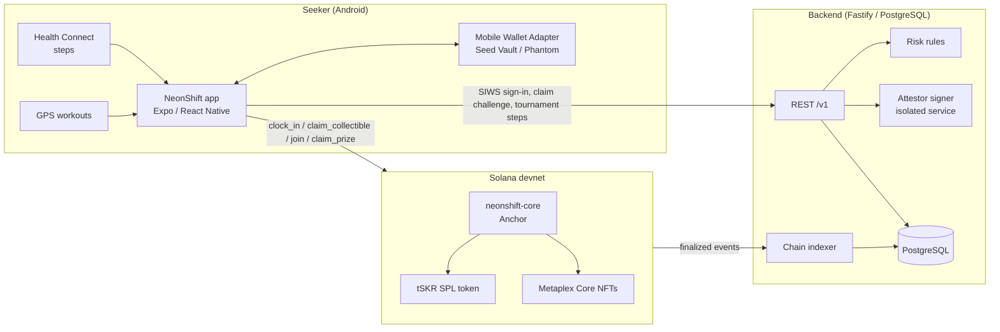

# NeonShift

[繁體中文](README.zh-TW.md)

**Move every day, prove it on Solana.** NeonShift is an Android dApp for the Solana Mobile Seeker. It turns daily running and walking into "clock-in" missions. The backend checks a Health Connect / GPS workout summary and signs an attestation. The on-chain program verifies that signature, then pays out tSKR test tokens and XP that level up your running shoe. Hitting a level or milestone unlocks free Metaplex Core achievement NFTs.

> **Devnet only.** tSKR is a devnet test token with **no monetary value** and is **not** the official SKR. Supported devices: Android / Solana Mobile Seeker (Android 14+). iOS is out of scope. Supported activities: running and walking.

| | |
|---|---|
| Network | Solana **devnet** |
| Program ID | `6MhVoQHdEpY2hqkaNJMkT2vHWakfnGfEYDgCtJzh6ENA` |
| tSKR mint | `2itshf7Xup3WZeeDRSXbstv4nbPcjfiLhdDpcQjU7RtZ` |
| API | `https://api.neonshift.cc/v1` |
| Android package | `cc.neonshift.app` |
| Website | [neonshift.cc](https://neonshift.cc) |

## For judges

| Deliverable | Link |
|---|---|
| Android APK (release, signed) | [NeonShift-v0.1.0-build24-devnet-arm64.apk](https://github.com/stan0714/neonshift/releases/download/v0.1.0-build24/NeonShift-v0.1.0-build24-devnet-arm64.apk) · [release notes and SHA-256](https://github.com/stan0714/neonshift/releases/tag/v0.1.0-build24) |
| Demo video (2:02) | [youtu.be/hFUhFfC1sb0](https://youtu.be/hFUhFfC1sb0) |
| Pitch deck (PDF) | [NeonShift-Pitch-EN.pdf](https://github.com/stan0714/neonshift/releases/download/v0.1.0-build24/NeonShift-Pitch-EN.pdf) |
| Judges' quick guide | [docs/store/judges-guide.md](docs/store/judges-guide.md) (Traditional Chinese) |

To try it, you need a Seeker or another Android 14+ phone with an MWA wallet (Seed Vault Wallet, Phantom, Solflare) on **devnet**, plus a little devnet SOL for fees (for example from [faucet.solana.com](https://faucet.solana.com)).

## What works today

**Verified on a Seeker** (release build, devnet). Evidence is in [`docs/evidence/`](docs/evidence/):

- **Wallet:** wallet connection and Sign-In With Solana through Mobile Wallet Adapter, including:
  - cancel and timeout handling;
  - switching accounts with data kept separate per wallet;
  - a clear "no compatible wallet" state ([RC record](docs/evidence/2026-10-02-rc-v17.md)).
- **Workouts:** GPS run/walk recording with splits and a summary, sync to the backend, and an Activity history with week/month/year views.
- **Daily clock-in:** the backend attests, the wallet signs, and the program pays tSKR and XP. Each wallet can claim once per UTC day, and this is enforced on-chain by a receipt PDA.
- **Achievement NFTs:** free Metaplex Core collectibles such as "First 5K", minted to the player's wallet.
- **Genesis Mint frame:** a cosmetic frame bought with a **devnet test SKR mint**. It covers the order, the wallet signature, on-chain verification and the OWNED state ([evidence](docs/evidence/2026-10-01-skr-devnet-payment.md)). A payment with official SKR on mainnet has **not** been made.

**Implemented with automated tests, partially device-tested:** weekly staked step tournaments (Arena), partner events with staff check-in ([evidence](docs/evidence/2026-09-24-events.md)), the public player gallery, and share cards.

**Planned, not built:** SKR staking that boosts mission rewards by shoe level, with 10% of the boost going to a separately tracked wildlife conservation pool (rates not final, no returns promised; [design](docs/design/skr-staking-boost.md)); a personal running coach that tracks fitness, weekly volume, heart-rate and HRV trends from Health Connect on the phone and suggests whether to train, go easy or rest ([design](docs/design/ai-running-coach.md)); mainnet deployment; pattern-route challenges ([design](docs/design/pattern-route-challenges.md)); more shoe series.

## Architecture



**Trust boundaries:**

- **On the phone:** raw health records and GPS routes never leave the device.
- **On the backend:** only per-day summaries, kept for at most 30 days.
- **On-chain:** whether a mission was met and the amount paid. No health values.

**Attestations:**

- Each attestation is 164 canonical bytes (`NEONSHIFT_ATTEST_V1`), pinned by shared test vectors across Rust, TypeScript and Python.
- It is valid for 10 minutes and uses a single-use nonce.
- It is bound to the program ID, cluster, wallet and task day.
- Every claim also needs the wallet to sign a one-time challenge.

**Anti-cheat (summary):**

- **Source filtering:** only device-recorded steps count. Manual and third-party entries are excluded.
- **Caps:** 250 steps per minute and 40,000 steps per day.
- **GPS checks:** speed-spike and teleport detection.
- **Versioned rules:** the rules version is bound into every attestation.
- **Tournament settlement:** a rolling-hash commitment with a vault balance reconciliation.

## Repository layout

| Path | Contents |
|---|---|
| `app/` | React Native Android app (Expo SDK 57 custom dev client; Kotlin modules for Health Connect and motion sensors) |
| `backend/` | Attestor backend (Node 24, Fastify 5, PostgreSQL): SIWS/JWT, challenges, risk engine, attestation, tournaments, indexer, gallery |
| `programs/` | Anchor workspace: `attestation-core` (shared canonical bytes) and `neonshift-core` (config, player, clock-in, collectibles, tournaments), with LiteSVM tests |
| `tools/` | Chain admin CLI and NFT metadata/image generator |
| `web/` | Static site for neonshift.cc (NFT metadata, privacy policy) |
| `scripts/`, `deploy/` | Environment, build, deploy and test scripts. Public parameters only; keys never live in this repo |
| `docs/` | Requirements, analysis, design, UI style guide, progress tracking and device evidence. Most of it is in Traditional Chinese |

## Build and test

```bash
source scripts/env.sh        # Node 24, JDK 17, Android SDK, Solana CLI, Anchor
scripts/env-check.sh         # check the toolchain
scripts/test-all.sh          # Rust, vectors, DB, backend, app and LiteSVM tests (needs Docker)

# Backend (local)
cd backend && npm ci && npm run db:up && npm run db:migrate && npm run dev

# App: release APK for a device (bring your own keystore; none is in this repo)
APP_ARCHS=arm64-v8a scripts/app/build.sh demo release

# Programs
cd programs && anchor build --arch v0 && cargo test -p neonshift-core
```

The full steps are in [`docs/build-and-test.md`](docs/build-and-test.md) (Traditional Chinese). A release build writes `release-notes.txt` with the Git commit, APK SHA-256, versionCode, backend and network. Demo builds always ship with demo overrides off.

## Authorship, AI assistance and license

- **Team:** solo project by Stanley Liu. The full Git history is kept; nothing has been squashed or rewritten.
- **AI assistance:** the code, docs and some assets were produced with AI tools such as Claude Code. This includes brand concept art and the demo voice-over (TTS). The author made the design decisions, ran the acceptance tests and is responsible for the submission. AI-assisted commits are marked with `Co-Authored-By`.
- **License:** the code is [MIT](LICENSE) (app, backend and programs). The NeonShift / CLOCK IN names and logos, the wildlife shoe artwork, and the documents in `docs/` and `output/` are not covered by MIT; all rights are reserved (see the end of LICENSE).
- **Third-party licenses:** listed at [neonshift.cc/licenses](https://neonshift.cc/licenses/). Asset sources are in [docs/legal/asset-sources.md](docs/legal/asset-sources.md).
