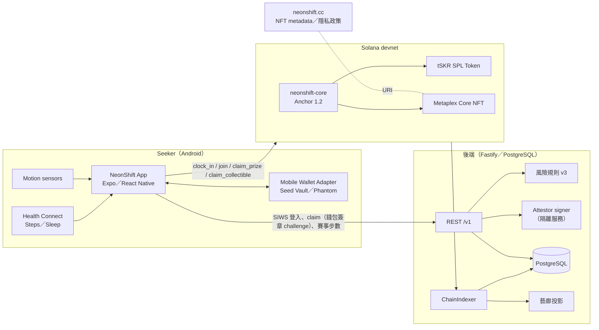

# NeonShift

Solana Mobile 健康追蹤 dApp。將每日跑步／健走與睡眠轉化為「打卡」任務，由後端驗證 Health Connect 摘要並簽發 attestation，鏈上程式驗簽後發放 tSKR 測試代幣、累積 XP、免費升級跑鞋；達成等級／里程碑可免費領取 Metaplex Core 成就 NFT，週末以質押制步數錦標賽競賽，藝廊展示全站排行。

> **tSKR 是 devnet 測試代幣，無金錢價值，不是官方 SKR。** 目標裝置 Solana Mobile Seeker（Android 14+）；iOS 不在範圍。正式網域 `neonshift.cc`，Android package `cc.neonshift.app`。

## 黑客松評審入口（準備中）

先看 [評審快速指南](docs/store/judges-guide.md)，再依需要閱讀 [三分鐘內英文 Demo 腳本](docs/store/demo-video.md)與 [活動參與流程](docs/store/event-demo-playbook.md)。APK、影片與測試活動連結尚待登錄；功能存在不代表實機端到端已驗收。

## 架構



**信任邊界**：原始健康紀錄只留在手機；後端只收到任務日摘要（最長保留 30 天）；鏈上只記錄「是否達標」與金額，不含健康數值。attestation 為 164-byte canonical bytes（`NEONSHIFT_ATTEST_V1`），Rust／TypeScript／Python 三方向量鎖定；每個 claim 需錢包對單次 challenge 簽章，JWT 只負責 session。

## Repo 結構

| 路徑 | 內容 |
|---|---|
| `app/` | React Native Android App（Expo SDK 57 custom dev client；Kotlin 模組 `modules/neonshift-health`、`modules/neonshift-sensors`） |
| `backend/` | Attestor 後端（Node 24 + Fastify 5 + PostgreSQL）：SIWS／JWT、challenge、風險引擎、attestation、賽事 API、ChainIndexer、藝廊、保留清理 |
| `programs/` | Anchor 1.2 workspace：`attestation-core`（共用 canonical bytes）、`neonshift-core`（Config／Player／clock_in／collectible／tournament）、LiteSVM 測試 |
| `tools/chain-admin/` | 鏈上管理 CLI（init-config、pause、attestor 輪替、錦標賽生命週期） |
| `tools/nft-assets/` | 成就 NFT metadata／圖片產生器 → `web/nft/` |
| `web/` | neonshift.cc 靜態站（NFT metadata、隱私政策） |
| `scripts/` | 環境、建置、部署、`test-all.sh` |
| `deploy/` | `dev.env`／`demo.env`／`local.env`（公開參數；私鑰一律在 `~/.config/neonshift/<env>/`） |
| `docs/` | BRD、SA、SD、Style、PG 進度、Runbook、實機證據截圖 |

## 文件

| 文件 | 用途 |
|---|---|
| [永續研究與共同方向](docs/sustainability-direction.md) | 運動 × 保育 × Solana、營運模式、成果驗證與 90 天試辦提案 |
| [中文募資簡報 v4](output/fundraising/NeonShift_募資簡報_中文草稿_v4.pptx)／[網頁預覽](output/fundraising/preview.html) | 2026-09-19 新增跑鞋連動、同步與 Activity 設計；含永續方向、講稿與來源，策略與數值待驗證 |
| [跑鞋連動、同步與 Activity 設計](docs/shoe-sync-activity.md) | 2026-09-19：多鞋切換、背景開關、舊到新同步及私人運動日誌（待實作） |
| `docs/brd-detailed.md` | 業務需求 |
| `docs/sa.md` | 系統分析（業務規則 BR-*） |
| `docs/sd.md` | 系統設計（帳戶、指令、API、結算協議、藝廊） |
| `docs/style.md` | UI 樣式規範（token、畫面、狀態） |
| `docs/pg.md` | 開發項目與進度追蹤（狀態規則：合入 dev 前只標 WIP） |
| `docs/build-and-test.md` | 環境安裝、實機建置、devnet 部署、賽事操作、Release APK |
| `docs/store/listing.md` | dApp Store 上架素材與送審檢查表 |
| [CLOCK IN 提交追蹤](docs/store/clock-in-submission.md) | 參賽交付清單、驗收條件、時程與 Demo 分鏡 |

## 快速開始

```bash
source scripts/env.sh                 # Node 24、JDK 17、Android SDK、solana 3.1、anchor 1.2
scripts/env-check.sh                  # 檢查工具鏈
scripts/test-all.sh                   # Rust／向量／DB／後端／App／LiteSVM 全部測試（需 Docker）

# 後端本機
cd backend && npm ci && npm run db:up && npm run db:migrate && npm run dev

# App（實機 Seeker，dev 環境參數）
scripts/app/build.sh dev debug && adb install -r app/android/app/build/outputs/apk/debug/app-debug.apk
scripts/app/start.sh dev

# 鏈上
cd programs && anchor build --arch v0 && cargo test -p neonshift-core
```

詳細步驟與工具鏈注意事項見 `docs/build-and-test.md`。

## 防作弊（摘要）

來源歸因只計裝置步數（Android legacy／current device SPN），排除手動與第三方；每分鐘 250 步、每日 40,000 步夾限；可選 20 秒動作統計（只上傳摘要）；規則版本 `rules_version` 綁進 attestation 與鏈上事件；attestation 十分鐘有效、單次 nonce、綁 program id／cluster／錢包／任務日；鏈上 receipt PDA 防重領；賽事結算以 canonical entry rolling hash 承諾，資金守恆斷言與 vault 實際餘額對帳。細節見 `docs/sd.md` 4.4、6.2 與 SA 附錄 A。
