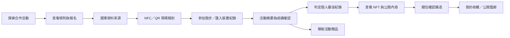

# 活動參與、跑步指標與 PB NFT 藝廊設計

版本 v0.1｜2026-09-14｜新增產品設計，尚未代表功能已實作或部署。

承接 BRD FR-09～13、免費成就收藏 FR-04.6，以及 SD 11／11A。沿用免費升級最新決策；不重新引入付費 Core。NFT 不收 tSKR，但錢包仍需顯示實際網路費與帳戶 rent。本設計的 M／S 是新增模組內優先級，排程另估。

## 1. 使用者完整旅程



### 1.1 活動前

Arena → 合作活動列表 → 活動詳情：主辦方、路線類型、距離／組別、所在地時區、日期、名額、參加條件、權益、成績來源、報到及領取截止。主要按鈕依狀態為 Register／View registration／Check in／View results。

報名確認頁列明規則版本、是否需要跑步資料、公開榜同意及 NFT 可選領取。健康權限不是一般報名的門檻；拒絕權限仍能參加以主辦方成績為來源的活動。個人自由跑由 Home → Running 進入，不必報名活動。

### 1.2 到場與參加

報名憑證顯示活動、參加者別名、組別及動態報到碼。NFC／QR 觸發活動入口，授權工作人員核驗後才成為 Checked in。離線顯示 Pending verification；不得顯示已領取或已到場。相同人員重複感應不新增報到數；卡片遺失補發仍沿用原參加者額度。

跑步資料入口提供「匯入已完成運動」；後續提供「開始跑步」，狀態 Ready → Recording ↔ Paused → Finishing → Saved／Needs review。結束需確認，避免誤觸遺失；重啟恢復同一 session，不產生重複里程。報到不等於完賽，GPS 開始也不等於主辦方認證成績。

### 1.3 完賽、PB 與收藏

摘要顯示距離、經過時間、移動時間、平均配速、步數、活動熱量與每項資料來源／估算標記。主辦方未發布時顯示 Provisional；完成審查後更新為 Organizer verified 或 Device recorded。資料不足只顯示摘要，不產生可鑄造 PB。

破紀錄卡片顯示類別、新紀錄、前紀錄、差異及來源；第一筆是 First record，不稱為「超越自己」。按 Mint achievement 開啟 NFT 預览與公開內容確認，再喚起錢包；取消回到 Eligible，已送出未確認為 Pending，確認後才進 My collection。RPC 逾時先查 receipt／原交易，不能直接重鑄。

## 2. 新增需求與驗收

| 編號 | 需求 | 優先級 | 核心驗收 |
|---|---|---|---|
| FR-14.1 | 運動 session 與來源管理 | M | 可匯入已完成跑步、顯示來源及缺欄；來源修改／刪除可追蹤；拒絕權限不阻擋非健康功能 |
| FR-14.2 | 距離、步數、配速計算 | M | 區分量測與估算；公里、秒／公里、時間單位明確；多來源不重複加總 |
| FR-14.3 | 裝置活動熱量與估算 | M | 活動熱量與總熱量分開；缺資料顯示 —，不假裝 0；估算模型版本及輸入可查 |
| FR-14.4 | App 主動記錄跑步 | S | 前景／鎖屏、暫停、定位撤銷、斷點恢復與電量測試；未允許定位提供匯入選項 |
| FR-15.1 | 最快／最遠 PB 歷史 | M | 固定類別比較、嚴格改善才新增 PB、首次單獨標記；修正與刪除重算 |
| FR-15.2 | 每次 PB 成就 NFT | M | 一個有效 achievement revision 最多一枚；不花 tSKR，需錢包核准與網路費揭露；不可偽造參數或重領 |
| FR-13.5 | 藝廊擴充：活動／PB 收藏 | M | 類型、来源、紀錄狀態、現持有人／原達成者分開；不預設公開健康數值 |
| FR-13.6 | NFT 內容與成績更正狀態 | M | 歷史／目前最佳／失效標記；索引尚未確認不顯示已鑄造；鏈下徽章不冒充 NFT |

## 3. 裝置整合與資料品質

### 3.1 接入順序

1. **第一階段：Health Connect 唯讀匯入**。讀 ExerciseSession、Steps、Distance、ActiveCaloriesBurned，必要時讀 TotalCaloriesBurned。手錶資料須由其相容伴隨 App 寫入 Health Connect；不宣稱所有品牌／型號皆支援，列出實測裝置、App 版本、可用欄位及延遲。
2. **第二階段：NeonShift 主動記錄**。使用者啟動後讀定位／感測器；精細路線僅本機處理與加密保存，後端仍不接收原始 GPS。鎖屏記錄用合規前景服務與可見通知，不以 WorkManager 代替即時定位。
3. **第三階段：合作計時系統／供應商 API**。以活動成績匯入契約與獨立授權串接；Wear OS 原生 App、直接 BLE 手錶整合另案評估，不自動納入既有平台範圍。

裝置來源是可信程度訊號，不是硬體證明。既有 FR-07.1「手機內建步數」限制仍適用每日 tSKR 任務；本模組接受的第三方運動資料只用於跑步摘要／裝置類 PB，不自動取得每日打卡、活動獎金或 XP 資格。

### 3.2 資料模型與來源選擇

每一指標保存 value、unit、source_id、method（device／organizer／gps／estimated）、quality、rules_version。每次運動建立 canonical session ID，對 `(wallet, origin, external_record_id, source_revision)` 去重；來源 ID 不足的跨 App 複本只標記可能重複，使用者／審核決定主紀錄後才計入 PB。

同場手機與手錶紀錄不相加。優先沿用選定 session 來源的同期數據；缺欄可選其他明示來源，但不能拼成不存在的最快成績。匯入時間、來源測量時間與官方完賽時間分開。總日步數用 aggregate；session 區間不同來源的能量／距離不可假設都已被平台自動去重。

品質狀態：Complete／Partial／Estimated／Needs review／Invalid。手動編輯與已知不合理值不取得 PB 鑄造資格。資料來源變更建立 revision，已確認結果不無痕覆寫。

## 4. 指標計算規格

| 指標 | 規則 | 顯示與限制 |
|---|---|---|
| 步數 | session 時間區間內、指定來源的去重步數 | 非負整數；不能把整日步數當單次跑步步數 |
| 裝置距離 | 指定來源 DistanceRecord 的有效區間總和，或主辦方賽道距離 | 內部公尺／整數毫米，UI 公里；比較前不以畫面四捨五入值判斷 |
| GPS 距離 | 本機以有效點的大圓距離加總；過濾低精度、跳點、時間倒序，缺口不以直線補成可信路線 | 品質門檻版本化；路線不完整不產生最快路段 PB |
| 估算距離 | `steps × calibrated_step_length_m / 1000` 公里 | 校準步長為「每一步」而非跨兩步 stride；無校準不套通用步長；標記 Estimated，不具 PB 鑄造資格 |
| 經過時間 | `end_timestamp − start_timestamp`，包含暫停 | 使用 UTC instant；不得依裝置時區或使用者暫停操作縮短正式計時 |
| 平均配速 | `elapsed_seconds / distance_km` 秒／公里 | 距離或時間 ≤0 顯示 —；可另列 moving pace，但不混入 PB 比較 |
| 速度 | `distance_km / (elapsed_seconds / 3600)` km/h | 瞬間速度尖峰不作「最快」PB |
| 活動熱量 | 優先讀來源 ActiveCaloriesBurned；不要與 TotalCaloriesBurned 相加 | UI 用 kcal；來源僅有總熱量時標記 Total，不能改稱 Active |

例：6,400 步 × 校準步長 0.78 m = 4.992 km（估算）。測得 5 km、經過 1,500 秒則平均配速 5:00／km；同時顯示 6,400 步不代表用步數算出該量測距離。

### 4.1 沒有裝置熱量時

僅在使用者自願提供近期體重、活動時間與適用活動分類時提供**估算**。採版本化 MET 模型：總熱量近似 `MET × 3.5 × weight_kg / 200 × minutes` kcal；活動熱量近似 `max(MET − 1, 0) × 3.5 × weight_kg / 200 × minutes`。MET 來源採 Compendium 中對應活動／速度項目，必須保存條目及版本，不硬套單一跑步係數。模型適用族群／速度分類及暫停區間處理未確認前，正式環境只顯示裝置值或 —。

暫停時段不套跑步強度；有不同強度區間時分段計算。體重不進公開 profile 或 NFT。熱量不作醫療／飲食處方，不作 PB、排名、XP 或代幣發放依據，避免鼓勵以熱量競賽。

## 5. PB 定義與比較

PB＝Personal Best（個人最佳），本期以同一錢包及目前授權／保留的有效紀錄比較，不宣稱是使用者人生全部紀錄；歷史讀取受權限／同步範圍限制，UI 顯示「自 YYYY-MM-DD 已匯入紀錄」。

| 類別 | 比較方式 | NFT 初期範圍 |
|---|---|---|
| 最快 1K／5K／10K | 同固定距離的最短經過時間，嚴格小於舊 PB | 主辦方認證組優先；裝置組須另過品質規則 |
| 最快半馬／全馬 | 21,097.5 m／42,195 m，主辦方正式賽事結果 | 首階段只接受主辦方已發布且無爭議結果 |
| 最遠單次跑步 | 同分類下單一 session 最大有效距離，嚴格大於舊 PB | 主辦方距離或合格裝置距離；不合併多天／多 session |

比較 key：wallet＋discipline（running）＋category＋environment（outdoor road／trail／treadmill）＋verification class＋timing basis（chip／gun／elapsed）＋rules major version。各組不互相覆寫；官方與裝置不得混榜，戶外與跑步機不得混比。

只有 session 總距離與總時間時，不能從 6 km 均速推算最快 5 km。裝置固定距離路段須有時間／距離序列：找完整覆蓋 D 的最短連續區間，僅在允許的短採樣间隔內做邊界插值；包含暫停，禁止跨長缺口拼接。第一階段無此序列者只有最遠資格或活動指定距離成績，不簽發最快路段。

PB 在資料審查完成且 session finalized 後產生。首次建立 Baseline；相同數值不算改善、不再鑄造；同一 session 可分別達成不同類別，但同類別只發一筆。更快／更遠成績後，舊 NFT 成為 Historical best，不回收或重複收費。

來源修正／刪除先撤銷該候選資格、重算 current PB。若已鑄造，App／registry 標為 Corrected／Invalidated，原鏈上歷史無法刪除；已超越只是歷史紀錄，與作弊失效不同。錢包轉移 NFT 不轉移原達成者的 PB。

## 6. NFT 設計與藝廊

### 6.1 作品系列

| 系列 | 視覺 | 卡片主資訊 |
|---|---|---|
| Shoe Evolution | 既有五階鞋款與幾何平台 | 鞋階、名稱、原達成者 |
| Event Finisher | 霓虹拱門、活動紋章、日期環 | 活動、組別、完賽章；未取得主辦方授權不使用其 Logo |
| Personal Best · Speed | 青藍斜向光軌、切線式計時環 | 1K／5K／10K 等類別；成績值由公開同意決定 |
| Personal Best · Distance | 紫色至青綠等高弧線、里程節點 | 單次最遠、環境、來源等級 |

不把實際 GPS 路線畫入公開 NFT；使用抽象生成圖案。固定 1:1 主圖、可讀縮圖與靜態 fallback，光暈不覆蓋文字；類型 icon＋文字均需可辨識，不能只用色彩。

### 6.2 藝廊導覽

沿用四 Tab。Home → Gallery（全站／玩家搜尋）；Gear → My collection（本人領取）；Arena → Event results → Event collection；Profile → Running history → PB cabinet。藝廊新增 Shoes／Events／Personal best 篩選及官方／裝置來源標籤。

```text
GALLERY                       搜尋玩家
[All] [Shoes] [Events] [Personal best]
我的紀錄                     查看 PB 櫃
┌────────────────┐ ┌────────────────┐
│ 霓虹速度作品     │ │ 最遠里程作品     │
│ 5K · Speed PB  │ │ Distance PB    │
│ Device recorded│ │ Organizer      │
│ Current best   │ │ Historical best│
└────────────────┘ └────────────────┘
```

NFT 詳情：作品、系列、原達成者、現持有人、鑄造日期、來源／認證描述、Current／Historical／Invalidated、network、asset address、Explorer。個人成績與熱量不因加入 Gallery 自動公開。

### 6.3 公開與領取

預設 NFT 只公開成就類別、系列及鏈上必需識別；精確時間／距離、活動日期等敏感資訊採逐次預覽與主動同意後才寫 metadata。伺服器健康原資料保留仍最長 30 天；長期私人 PB 摘要／NFT 公開成就需另列範圍與保留政策，未取得同意不延長原健康資料期限。

NFT 一經鑄造，關聯錢包與公開內容可能永久被第三方保存；退出藝廊只是停止 App 展示，不保證刪除鏈上／已公開 metadata。已鑄造成就不增加 tSKR 或 XP，不是可獲利承諾。

## 7. 系統與鑄造契約（待實作）

新增 `WorkoutSession`、`MetricProvenance`、`PBRevision`、`AchievementEligibility`、`AchievementMintReceipt`；沿用 event participant／result revision 與既有藝廊索引。指標內部使用整數毫米、毫秒、步數、毫 kcal；HTTP 大整數以十進位字串傳遞，不依 JS 浮點比較 PB。

| API（/v1） | 用途／授權 |
|---|---|
| POST `/workouts/import` | 玩家授權匯入，限流、request hash／idempotency、來源 revision 去重 |
| GET `/me/workouts`、`/me/personal-bests` | 僅本人，回傳來源、同步涵蓋範圍與目前 PB |
| POST `/me/achievements/{id}/mint-intent` | 驗證未撤銷資格與公開同意，回傳明確費用／metadata 預覽及有限期證明 |
| GET `/gallery/achievements/{asset}` | 只讀公開投影；精確健康值只在明確公開時提供 |
| POST `/partner/results/{id}/corrections` | 既有活動權限與稽核；觸發 PB 重算與資格撤銷 |

既有 `claim_collectible(kind)` 使用固定種類／每錢包一次，**不可直接用於每次 PB**。新增獨立 `claim_achievement` 與 receipt seeds `["achievement", wallet, achievement_id]`；achievement_id 是伺服器穩定分配的 32 bytes ID，不由 client 自選以绕過唯一性。每次有效破紀錄有新的 ID，重試沿用原 ID。

簽發內容需固定版本、domain `NEONSHIFT_ACHIEVEMENT_V1`、program／cluster、wallet、achievement ID、category、source revision、rules version、metadata hash、expiry 及 nonce；完整 canonical 位元組與長度另產測試向量，**不重用每日打卡 164-byte 格式**。鏈上驗證指定簽發者及簽章、時效、wallet、固定 collection、metadata binding 與 receipt 未存在，原子鑄造及 receipt 寫入。

活動／裝置 PB 是鏈下事實，簽章只表示平台認可來源與規則。為處理「證明簽出後資料被修正」競態，設計鏈上 eligibility registry（approved／revoked＋revision＋metadata hash）；鑄造必查最新 registry，更新由受控管理權限完成。不得只靠短效證明而宣稱可立即撤銷。資格撤銷交易 finalized 後才宣稱鏈上已撤銷；鑄造已先完成則更新失效狀態而非假裝 NFT 消失。

metadata canonicalization 與上傳在簽章前完成，不允許 client 替換成績／URI；公開樣板與去識別化規則版本一併綁定。URI 或 artwork 載入失敗只影響呈現，不授予第二次鑄造資格。

## 8. 分階段交付與驗收

| 階段 | 交付 | 先決條件 |
|---|---|---|
| R0 | 活動旅程／藝廊擴充、官方固定距離 PB 設計 | 明確成績來源、同意與更正政策 |
| R1 | Health Connect session 匯入、距離／熱量摘要、私人 PB | 實機支援矩陣、跨來源去重、單位／權限測試 |
| R2 | 官方及合格裝置 PB NFT、receipt／registry、藝廊狀態 | 簽章向量、撤銷競態、重放與原子性測試 |
| R3 | 主動跑步／最快路段、裝置 API、3D 藝廊選配 | 長時間定位效能、採樣品質規則與供應商授權 |

必測：同運動雙來源、部分權限、跨午夜／時區、暫停／恢复、GPS 缺口、公里／英里換算、Active／Total 熱量誤加、零距離、首次 PB／相同成績／真正改善、官方與裝置分組、刪除後重算、metadata 篡改、兩筆並發鑄造、簽出後撤銷與 NFT 已轉移。NFT 現持有不等於資格未領取。

尚待決策：首批實測裝置、官方成績合作方、MET 適用範圍與校準方法、裝置品質門檻、公開 metadata 欄位、私人 PB 保存期限、registry 管理／費用補貼與交付日期。未決項不擅自指定合作品牌或聲稱裝置認證。

## 9. 外部規格依據（2026-09-14 查核）

- [Android：Workout experiences](https://developer.android.com/health-and-fitness/health-connect/experiences/workouts)：session、相關指標、使用者權限與前景運動記錄。
- [Android：Aggregate data](https://developer.android.com/health-and-fitness/health-connect/aggregate-data)：聚合與資料重複的處理範圍；不推定所有數據型別自動去重。
- [Compendium of Physical Activities](https://pacompendium.com/)：活動強度分類來源；MET 推估屬群體模型，不代表個人精確測量。

PB 分組、NFT 發行與界面為本專案設計，不是外部機構認證標準。

## 10. 新增鞋階能力門檻（最新遊戲性設計）

依 [跑鞋權限與維持挑戰](./shoe-gameplay.md)。跑步摘要、私人 PB 與藝廊查看不限鞋階；新 PB NFT 需在達成時 Active level ≥3，活動 NFT 預設 Lv2 並於報名時承諾資格。已獲資格正常降級後仍可領取，已鑄 NFT 永久保留歷史；作弊／修正的撤銷另依 registry。

晚到裝置資料須查達成時的有效等級歷史，不用匯入時的高階鞋洗資格；查無歷史則只保存私人 PB、資格待審。PB 櫃的 Current best 與鞋款 Active level 是不同狀態；一枚歷史 NFT 也可能仍代表目前 PB，NFT 所有權不轉移原達成者權限。

## 11. 首次與紀念系列補充

新增 [首次里程碑與紀念 NFT](./commemorative-nfts.md)，與 PB 分開。第一筆 5K 可以是 First 5K 與 PB Baseline，但只有首次章為 Lv1 基礎資格；破 PB NFT 仍依 Lv3 與品質規則。新增 Milestones 篩選及首 5K／10K／半馬／全馬四款作品設計，並分期加入首次完賽、活動留念、回歸與週年。

首次類別沿用穩定終身 key，不隨每次改善或來源 revision 再發；PB 類仍為每次有效改善建立新成就。兩種 NFT 的歷史更正及公開內容均需清楚呈現。

## 12. GPS 與正式工作列補充

走路／跑步主動記錄以 [GPS 運動規格](./walk-run-tracking.md) 的 FR-18 取代 FR-14.4 早期 S 級提案；新模組核心列 M 級，仍不屬原四週承諾。Walking 不授予 Running PB／首次距離章；最高 5 秒速度僅供回顧。圈數、品質與暫停算法以該專章為準。

RUN 工作包已轉為 [PG 第 18 章](./pg.md) 的 PG-R-01～12；MEM／GAME 分別轉 PG-M／V。已有正式 TODO 與估算，尚無負責人或交付日期，不代表現有 App 已具備功能。
