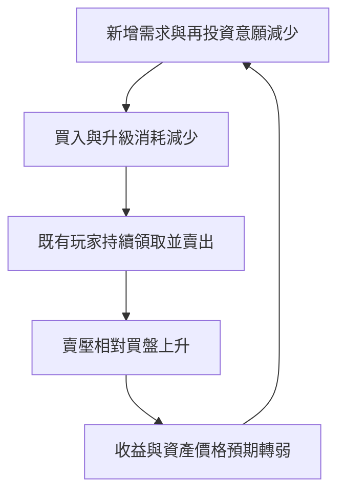

# STEPN 對照與 NeonShift 經濟風險評估

日期：2026-09-15。範圍：STEPN 2022 年的經濟設計與市場衝擊，對照本專案目前程式及規格。這是一份設計評估；建議尚未套用到合約、正式參數或既有玩家餘額。

## 1. 結論

**NeonShift 應以「即使沒有新玩家買幣、没有代幣漲價，遊戲仍能運作」為設計驗收條件。**

目前免費初始裝備、免費升級、成就型 NFT、無代幣能力加成的探索冊，是正確方向。但固定供給、單人日上限與降等規則，尚不足以形成可持續經濟。主要缺口：

1. 每人固定獎勵會隨合格帳號數擴大，缺少全站獎勵預算。
2. 高階提高代幣領取倍率，成熟玩家群的發放需求更高。
3. `clock_in` 將代幣轉帳與 XP／streak／維持進度綁在同一交易；金庫不足會讓整筆交易失敗。
4. 競技場大致重新分配玩家資金，不創造外部收入；降低退款不會自動增加總消耗。
5. 目前是沒有金錢價值的 devnet tSKR；不能把測試期可運作，當成可交易主網經濟已成立。

沒有設計能保證市場價格不跌。可以控制的是：不超額承諾、不依赖後來者接盤、遊戲成長不因獎勵預算耗盡而停擺。

## 2. STEPN 的教訓：區分已知機制與因果推論

### 有來源的機制

STEPN 在 2022-05-10 的官方文章說明：GST 沒有供給上限，運動產生 GST；升級、修理及鑄鞋會消耗代幣。文章也把新玩家加入、增加鞋子與投機列為購買動機，把完成升級後提領列為賣出動機。這是當時官方描述，不是對今日所有規則的重述。[STEPN 官方 Tokenomics at STEPN](https://stepnofficial.medium.com/tokeonomics-at-stepn-ee08604e82f1)

現行白皮書仍說明：更多／更高品質的鞋會增加 Energy，鞋等級可以增加 GST 每日領取上限，燃燒 GMT 也可提高 GST 上限。因此「有每日上限」不等於「全系統產出固定」。現行規則只能用來補充機制理解，不能全部回推到 2022 年。[STEPN GST Earning Advanced](https://whitepaper.stepn.com/tokenomics/gmt-earning)

2022 年 5 月另有整體加密市場下跌與 STEPN 中國 GPS 服務限制的衝擊。不能把當年所有下跌都歸因於單一公式，也不能把價格重挫等同公司停止營運。[CoinDesk 當時報導，2022-05-29](https://www.coindesk.com/markets/2022/05/29/first-mover-asia-bitcoin-extends-losing-streak-new-lunas-crash-like-old-lunas-stepns-china-dilemma)

### 本評估的機制推論

當大量消耗的動機是「付出代幣以便未來領更多代幣」，需求便依賴未來報酬預期。新增玩家、再投資或投機需求減弱時，既有玩家仍可產出並賣出，形成負向循環：

這是結構風險分析，不是量化證明上述每條路徑各造成多少跌幅。燒毀可以減少供給，但不能直接創造消費意願、穩定幣買盤或支付獎品所需現金。

## 3. 與本遊戲逐項對照

| 項目 | STEPN 相關機制 | NeonShift 現況 | 判斷與方向 |
|---|---|---|---|
| 入場 | NFT 鞋與運動收益相連 | 初始鞋免費、不是 NFT | 保留；不要增加買鞋才能領收益的門檻 |
| 成長 | 升級／擴充鞋可提高領取能力 | 免費升級，但 Core 倍率 1.0～2.2 | 金錢性獎勵應與等級脫鉤；讓等級影響外觀、榮耀與玩法 |
| 供給 | GST 可持續增發 | tSKR 文件設定總量 1,000,000，初始獎勵庫 200,000，撤銷鑄幣權 | 限制總量，仍有库存耗盡與流通量擴大風險 |
| 每日限制 | 能量／個人領取上限 | 每錢包每日上限 40 | 需要全站預算；多錢包可放大總申領需求 |
| 升級消耗 | 消耗代幣升級或鑄鞋 | 升級免費，舊燒毀函式保留但非現行升級流程 | 不應為製造消耗而恢復付費升收益 |
| NFT | 裝備與收益能力相關 | 成就收藏與歷史紀念；資格依紀錄 | 保留卡牌榮耀感，避免售價、回本、分紅或產幣承諾 |
| 降等 | 維修／耐久等維持機制 | 活躍等級下降，XP、NFT、代幣保留 | 作為玩法節奏；不作為保幣價或逼玩家付費的工具 |
| 競賽 | 此處不推論各期 STEPN 競賽細節 | 退款＋獎金＋國庫餘數守恆 | 守恆不等於收入；贏家的額外所得主要來自其他玩家與挹注 |
| 無幣玩法 | 官方仍以運動應用為定位 | 任務、個人最佳、探索冊與外觀 | 驗證獎金歸零後，這些玩法是否仍能留住玩家 |

本專案證據：`programs/neonshift-core/src/constants.rs`、`reward.rs`、`instructions/clock_in.rs`、`tournament_math.rs`、`instructions/tournament.rs`、`scripts/chain/token.sh`、`docs/economics/maintenance-sim.md`、`docs/sport-experience-gameplay.md`。初始資金使用文件值；本次未重新查詢鏈上餘額、authority、實際 Config 或營收。

## 4. 金庫壓力試算

可重現：`node tools/tokenomics/stress.mjs` → [stress.csv](stress.csv)。基礎獎勵與倍率從 Rust 常數讀取；不是當前部署的 RPC 讀值。

假設：獎勵庫初始 200,000 tSKR、不補庫、無資金回流，每個合格錢包每天雙任務都成功。下表是固定等級需求下的「庫存／日需求」，不是從 Lv1 成長的隊列模擬。實際按筆申領，可能在所示天數內先出現不足，不能視為保證服務時間。

| 每日合格領取錢包 | Lv1：15／人／日 | Lv5：33／人／日 | 40／人／日上限壓力情境 |
|---|---:|---:|---:|
| 100 | 133.33 天 | 60.61 天 | 50 天 |
| 1,000 | 13.33 天 | 6.06 天 | 5 天 |
| 10,000 | 1.33 天 | 0.61 天 | 0.5 天 |

40 是配置上限，不是目前預設雙任務一定能領到的數字；未啟用 streak 時滿階雙任務為 33。預設 10% streak 若啟用则為 36.3，仍低於 40。錢包不等於真人。

舊報告的約 196 天來自 100 人、30 天、混合參與率的平均日發放，不是保證；它也沒有納入後續維持規則，更不能直接代表滿階玩家占比增加後的消耗速度。維持模擬只減少約 3～18% 發放，沒有改變總需求隨玩家擴大的結構。

### 有總預算時的差異

純示例：預留 20,000，剩下 180,000 分配 180 天，每天全站最多 1,000 tSKR。若所有玩家分數一樣：

| 合格錢包 | 每人平均可分配上限 |
|---|---:|
| 100 | 10 tSKR／日 |
| 1,000 | 1 tSKR／日 |
| 10,000 | 0.1 tSKR／日 |

180 天後保留 20,000；不是無限期運作方案，預算期滿需新決策。這只保護代幣庫存，不提供法幣價值或真實支出保障，也不保證玩家接受獎勵稀釋。無人合格時不發放，未用額度留庫。

## 5. 建議的三層經濟

### A. 遊戲成長：不依賴可交易獎勵

XP、維持點、探索進度、榮耀階級綁定玩家；不可購買產出倍率、不可兌換現金。保留免費跑鞋、免費升級、NFT 揭曉、個人最佳與外觀。NFT 轉移不轉移原達成者資格或產幣能力。

最高優先實作：**驗證活動與領取經濟獎勵分離。** 遊戲打卡記錄 XP／維持點／streak 的成功，不應依賴 reward vault 可轉出的餘額。經濟獎勵另外按已公告預算結算，且必須有獨立防重領 receipt。

注意：不能只把獎勵常數設 0。現有 `clock_in` 要求 `amount > 0`，這樣會直接拒絕打卡。拆分需要合約、後端 attestation、App 狀態及防重放測試一起修改。

### B. 遊戲獎勵：有界發放

短期 devnet：維持 tSKR 測試用途，新增全站期間預算、庫存告警與清楚期限。若未來需要非交易遊戲幣，另建帳號綁定積分；現有經典 SPL tSKR 的轉帳能力不會因改文案就消失，也不應把既有資產默默重新定義。

推薦按週結算，而非「先領先得」：

- 期前鎖定已撥款的 `epoch_budget` 與規則版本。
- 期末結束驗證／申訴窗口後取得合格分數總額 `S`。
- `reward_i = min(person_cap, floor(epoch_budget × score_i / S))`；`S=0` 時不發。被 cap 截斷與整數餘數留庫，不追補成保證報酬。
- 分數每天封頂，以完成目標而非無上限步數計算；不得付費提高分數或收益權重。
- 先封存可稽核結果，再開放領取；需定義逾期申領、刪除紀錄、驗證撤銷及資金預留方式。
- 全站預算須鏈上強制，不能只有後端限流。多錢包仍可能瓜分他人份額，需另做反作弊。

### C. 有成本的獎品：收入先到，獎品後開放

企業運動挑戰、活動服務、使用者真心願付費的訂閱與外觀，可作為待驗證收入來源，不能把尚未簽約的贊助算進收入。參賽本金、出售自家代幣的收入、自家代幣帳面升值，不算可持續的外部服務收入。

獎品預算上限範例（以同一法幣計價，比例為待驗證假設）：

`可新增獎品成本 ≤ min(已撥入獎品專戶的可用現金, 20% × max(0, 已收外部收入 − 履約成本 − 退款／稅費準備 − 營運必要費用))`

例如扣除必要費用後餘額 10,000，可分配最多 2,000；降為 2,000 時最多 400；歸零則沒有新的收入型獎品預算。已承諾獎品須先保留足額成本，不因新收入歸零而取消；未來活動可以縮小或不開。啟動期補貼須另列有限的行銷預算與終止日期。

## 6. 不應採用的補救方式

- **單看 burn／emission ≥ 0.6。** 即使真的燒掉六成，仍可能淨增加流通量；更不代表有錢支付獎品。要分開記錄燒毀、國庫回收、再發放、玩家互轉、現金收入。
- **降低輸家退款救經濟。** 100 人各質押 50，30 人得獎，退款 50% 時總退款 3,250、獎金池 1,750；退款 30% 時總退款 2,550、獎金池 2,450。若池全數分給贏家，兩者仍共返回 5,000，只有微小整數餘數差異。
- **強制維修／付费保級／購買更高產幣倍率。** 重新建立投資回收循環，也讓休息變成財務壓力。
- **以延長鎖倉代替資金來源。** 鎖倉只延後出售；集中解鎖可能加重賣壓。
- **靠國庫回購承諾價格下限。** 自家代幣不能同時當足額準備金與其價值保障。
- **靠發新幣、再賣新鞋補舊獎勵。** 引入新的接盤需求，未解決遊戲服務本身的付費意願。

外觀消耗可存在，但應自願、無收益加成，且只把觀察到的實際消耗納入預算。國庫收回再發放是循環使用，不是燒毀。

## 7. 上線前工作與驗收

| 優先序 | 工作 | 驗收條件 |
|---|---|---|
| P0 | 分离打卡與獎勵轉帳 | 金庫為 0、預算關閉時，合格打卡仍能累積 XP／維持點；不產生未撥款欠款 |
| P0 | 全站期間預算、版本及預留 | 在同一期間 10 倍帳號、併發與重放下，所有發放不超過已撥款預算；個人領取不重複 |
| P0 | 對帳及庫存告警 | 已承諾未領取額、可用庫存、每期總發放、國庫回流、挹注均分列 |
| P0 | 既有紀錄的轉換設計 | 不扣玩家 XP、既有 NFT 或已得代幣；切換時間與尚未領取任務處理明確 |
| P1 | 降低成長與收益耦合 | 等級主要帶來外觀與玩法；不以買 NFT 或付費增加經濟獎勵權重 |
| P1 | 反作弊、Sybil 與申訴 | 檢查來源可信度、重複來源與關聯帳號；單錢包／單裝置限制不能宣稱等於一真人 |
| P1 | 無獎金留存實驗 | 公告新活動的無代幣組，觀察 D7／D30 留存、週任務完成、主動參賽與滿意度；不撤回既有承諾 |
| P1 | 真實收入與預撥獎品 | 贊助未到款不開承諾；獎品有庫存、運費、兌換與退款準備 |
| P2 | 主網經濟設計 | 僅在上述通過並具備持續付費需求後另行評估；不能直接搬 devnet 獎勵表 |

建議看板：token 庫存可支撐日數、現金可支撐月數（兩者不可混用）、已承諾成本覆蓋率、每合格真人估計補貼、異常帳號占比、最大單一贊助來源占比、非獎金活動留存。180／90／30 天可以作為庫存告警起始假設，需按實際支出與承諾校準；達門檻時只调整未來活動，既有承諾照常履行。

尚需情境驗證：新玩家歸零 90 天、合格申領帳號 10 倍、贊助收入減少 80%／歸零、所有玩家停買外觀、獎勵組留存惡化、多人同時兌換獎品、鏈上暫停與健康來源失效。幣價下跌 90% 時以現金計價的營運與獎品責任不得靠加發自家幣補足。

## 8. 本次完成與限制

- 完成機制對照、程式風險定位與九組確定性庫存試算。
- 試算含預算下限、發放上限及競技場總額守恆斷言；不是使用者行為、價格、流動性或現金流的預測模型。
- 更正舊經濟摘要的退款／消耗解讀與「只需參數化」描述。
- 未改合約、App 經濟行為、鏈上配置或已發放資產。以上 P0／P1 仍是待實作規格，不能對外宣稱已具有這些保障。
