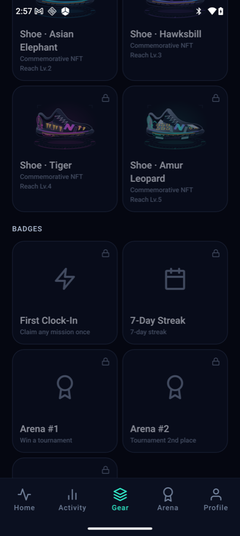
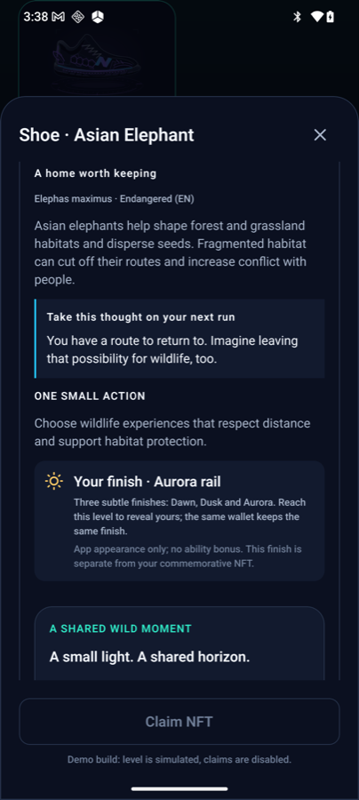
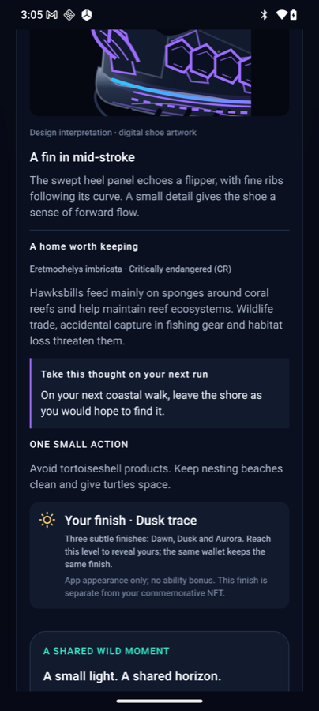
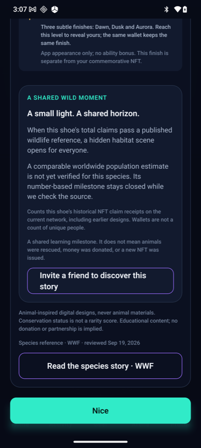
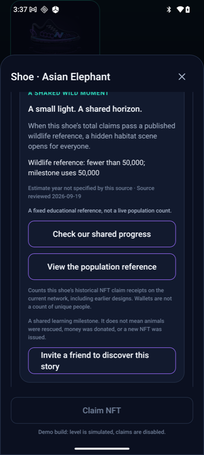

# Notice to WWF — educational references to WWF species content in NeonShift

> Draft prepared 2026-09-20. Send as an email (paste the body below; attach the five PNGs in `img/`) or as a PDF exported from this file.
> **Where to send** (checked 2026-09-20 on the WWF sites; addresses may change):
>
> | Office | Why | Channel |
> |---|---|---|
> | WWF-US (worldwildlife.org) — owner of the four species pages and two story pages we link | Primary recipient | Web form: https://help.worldwildlife.org/hc/en-us/requests/new (the Contact-us page lists no general email). Press desk: media@wwfus.org. The site-terms page names a "Copyright Agent, c/o General Counsel, World Wildlife Fund, Inc., 1250 24th Street NW, Washington, DC 20037" — for infringement notices only, not permission requests; the address is shown on https://www.worldwildlife.org/legal-notices/site-terms/. |
> | WWF International (wwf.panda.org) — owns the "WWF" trademark and publishes the content-sharing rules | cc, for trademark / attribution guidance | Sharing-content policy: https://wwf.panda.org/using_site_content/ (text is CC BY-NC 4.0; just link back; the letters "WWF" must not be used to endorse or promote products; logo needs express permission; images need photo@wwfint.org). Press: news@wwfint.org. No general enquiry mailbox is published. |
> | WWF-UK (wwf.org.uk) — source of the Amur leopard figure | cc | Supporter care: supportercare@wwf.org.uk · UK press office: press@wwf.org.uk, +44 (0)1483 412383 |
>
> Note: WWF-International's own policy already answers most of the letter — link back, no endorsement, no logo — so the letter mainly serves as notice and as a request for any preferred wording.

---

**To:** WWF — Brand, Licensing & Communications
**From:** Stanley Liu, NeonShift maintainer — support@neonshift.cc
**Date:** 20 September 2026
**Subject:** Notice of educational references to WWF species content in the NeonShift app (Solana Mobile hackathon prototype)

Dear WWF team,

I am the maintainer of NeonShift, a small, non-commercial fitness app prototype for Solana Mobile devices, currently being prepared for a hackathon submission. It runs on the Solana devnet only; the in-app token has no monetary value and nothing is sold in the app.

I am writing to (1) tell you exactly how the app refers to WWF material, (2) ask you to let us know if any of it infringes your rights or brand guidelines, and (3) ask whether there is anything you would like us to show to app users alongside these references. Screenshots of every place the WWF name appears are attached (Figures 1–5).

## 1. How WWF content is referenced

**1.1 Four animal-inspired shoe designs.** The app rewards regular walking and running with digital "shoe" designs. Four of them, the "Wild Guardians" series, are inspired by the Asian elephant, hawksbill turtle, tiger and Amur leopard (Figure 1). The designs are our own original line artwork; they do not reproduce any WWF illustration or photograph.

*Figure 1 — Gear screen: the four Wild Guardians designs, shown locked for a new account.*

**1.2 Short educational species notes.** Each design has a two-to-three-sentence note written in our own words (English and Traditional Chinese), the scientific name, the IUCN Red List status, one "thought for your next run" and one everyday conservation action (Figures 2 and 4). The notes were informed by the public species pages on worldwildlife.org; no text, photos or illustrations were copied.

*Figure 2 — Asian Elephant story card: species note, IUCN status (EN), "one small action".*

*Figure 4 — Hawksbill story card: species note, IUCN status (CR), "one small action".*

**1.3 Links to WWF pages.** Below each note there is a button labelled **"Read the species story · WWF"** and a line **"Species reference · WWF · reviewed Sep 19, 2026"** (Figure 5). The button opens the device browser at the following public pages:

| Design | Link target |
|---|---|
| Asian Elephant | https://www.worldwildlife.org/species/elephant/asian-elephant/ |
| Hawksbill | https://www.worldwildlife.org/species/sea-turtle/hawksbill-turtle/ |
| Tiger | https://www.worldwildlife.org/species/tiger/ |
| Amur Leopard | https://www.worldwildlife.org/species/amur-leopard/ |

*Figure 5 — Bottom of every story card: disclaimer text, "Species reference · WWF · reviewed …" and the "Read the species story · WWF" button.*

**1.4 Population references used as a community milestone.** For three designs the app shows a published population figure as a fixed educational reference, with the source linked via a **"View the population reference"** button (Figure 3). When the community's total number of collectible claims for that design passes the figure, a decorative habitat scene is unlocked for everyone. The app states that the number is "a fixed educational reference, not a live population count" and that reaching it "does not mean animals were rescued, money was donated, or a new NFT was issued".

| Design | Figure shown | Source linked |
|---|---|---|
| Asian Elephant | "fewer than 50,000" (year not specified by source) | https://www.worldwildlife.org/news/stories/tackling-critical-threats-facing-asian-elephants/ |
| Tiger | "about 5,574" (2023) | https://www.worldwildlife.org/news/stories/tigers-on-the-move/ |
| Amur Leopard | "about 130" (year not specified by source) | https://www.wwf.org.uk/learn/wildlife/endangered-animals |
| Hawksbill | none — the app says a comparable worldwide estimate is not yet verified and keeps this milestone closed | — |

*Figure 3 — Asian Elephant milestone: the "fewer than 50,000" reference with review date, the "View the population reference" link and the wording that it is not a live count.*

**1.5 What is not used.** We do not use the WWF panda logo, any WWF imagery, or the WWF name in the app's own name, icon, store listing, website or marketing. The WWF name appears only in the two attribution labels shown in Figure 5. The same screen carries this disclaimer:

> "Animal-inspired digital designs, never animal materials. Conservation status is not a rarity score. Educational content; no donation or partnership is implied."

## 2. Our requests

1. **Infringement or preference.** If any of the above infringes WWF's copyright, trademark or brand guidelines — or if you would simply prefer a different attribution wording, a different link target, or the removal of any reference — please tell us and we will change it promptly, before public release if you reply within the hackathon window (we can act within a few days of your reply).
2. **Guidance for third-party apps.** If WWF has standard guidance for apps that reference WWF content (attribution format, required disclaimer text, restrictions on using the WWF name in link labels, preferred landing pages, or how population figures should be cited and dated), we will follow it.
3. **Anything you would like users to see.** Is there information you would like shown next to these references — for example an official "learn more" or donation page, a statement that WWF is not affiliated with or does not endorse the app, or advice on how to support the species? We will add it verbatim, in English and Traditional Chinese.

The app is open source; the exact strings, links and review dates are in the repository and can be shared on request. Thank you for the work you do and for your time.

Kind regards,

Stanley Liu
Maintainer, NeonShift
support@neonshift.cc · https://neonshift.cc

---

## Attachments

| File | Content |
|---|---|
| `img/fig1-collection.png` | Gear screen — the four Wild Guardians designs |
| `img/fig2-elephant-story.png` | Asian Elephant story card (note, IUCN status, action) |
| `img/fig3-elephant-population-reference.png` | Asian Elephant milestone — population reference and link |
| `img/fig4-hawksbill-story.png` | Hawksbill story card |
| `img/fig5-attribution-and-link.png` | Disclaimer, "Species reference · WWF" line and link button |

Screenshots were taken on a Solana Seeker device on 2026-09-20 (English UI). Figures 2–5 come from a demo build in which the account level is simulated so that the cards can be shown; the wording is identical to the production build.

---

## Internal notes (do not send)

- Source of truth for the strings: `app/src/i18n` keys `wild.note`, `wild.source`, `wild.sourceChecked`, `guardian.snapshot`, `wild.story.*`, `wild.action.*`; links in `app/src/config/shoeCollection.ts` and `app/src/config/guardianMilestones.ts`; content review log in `docs/design/wild-guardian-shoes.md` §保育內容來源.
- If WWF asks for changes, update the strings above, bump `reviewedAt` in `guardianMilestones.ts` and the `wild.sourceChecked` date, and record the reply in `docs/design/wild-guardian-shoes.md`.
- Additional user-facing reminders worth adding regardless of the reply: the same "no affiliation / no donation" line on the store listing and website; a note in the NFT detail sheet that conservation status is not a rarity score; if a "support this species" link is ever added, route it to an official WWF page and state that NeonShift receives nothing.
