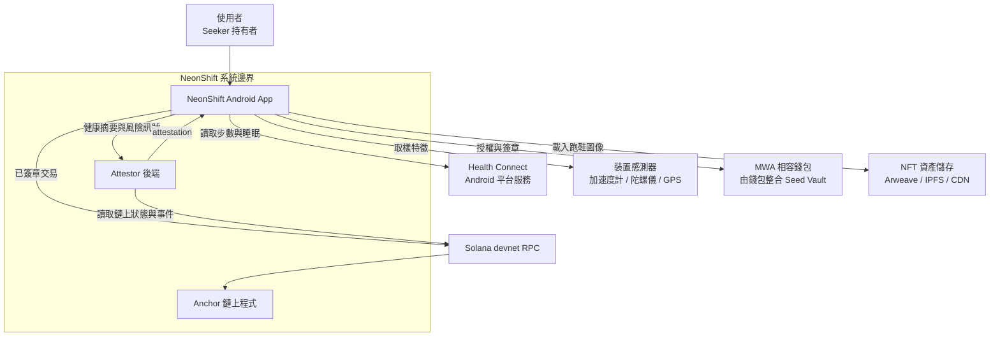
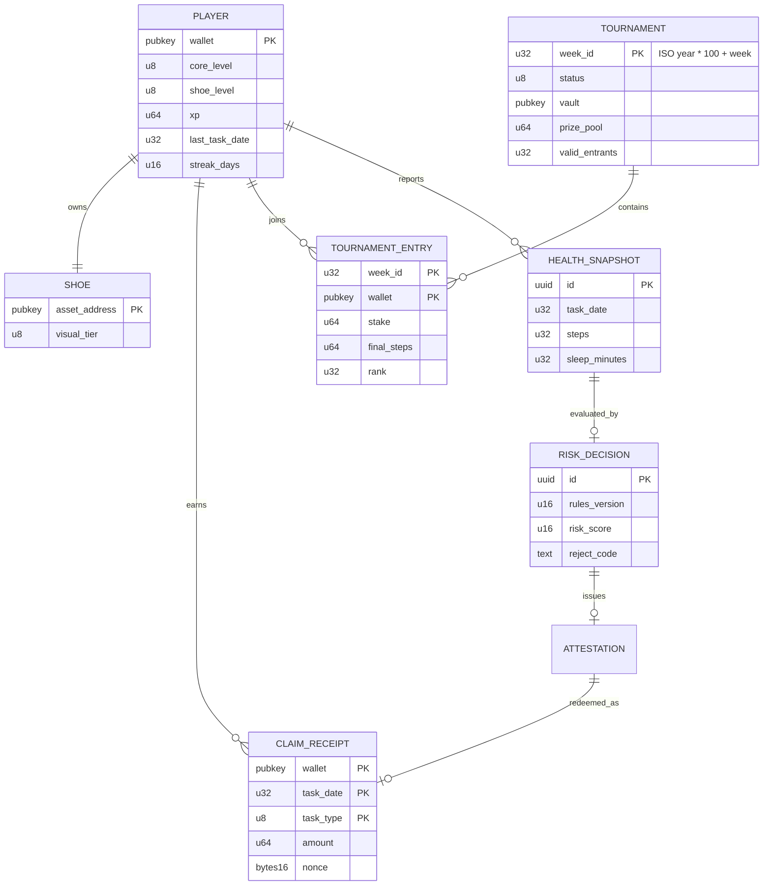
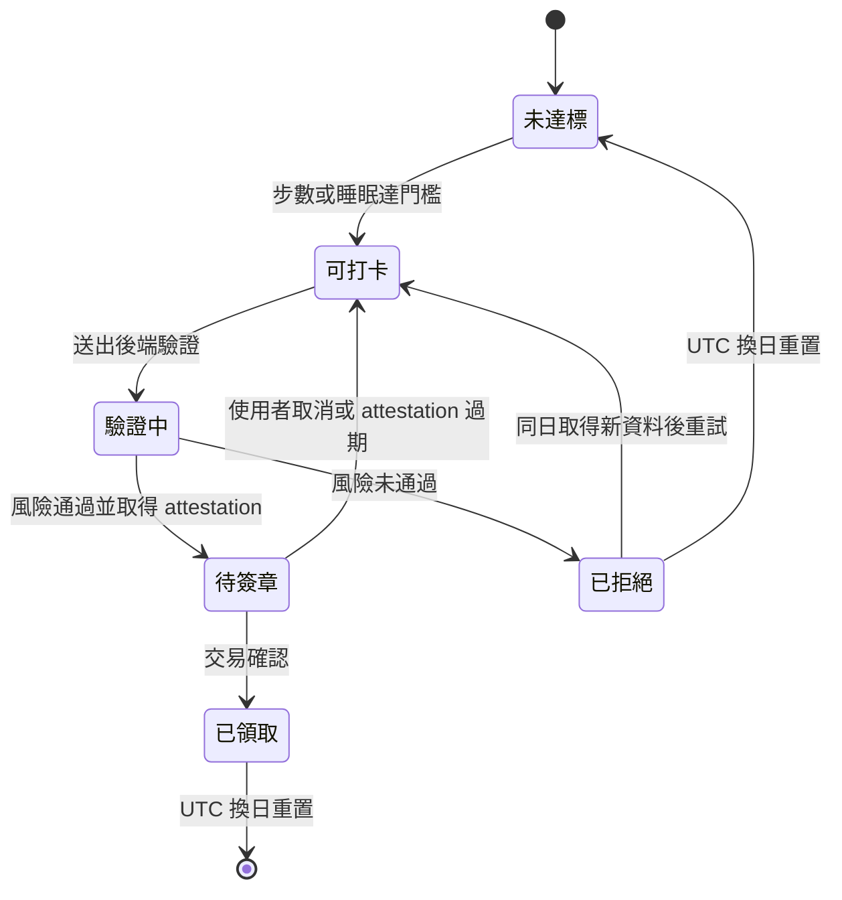
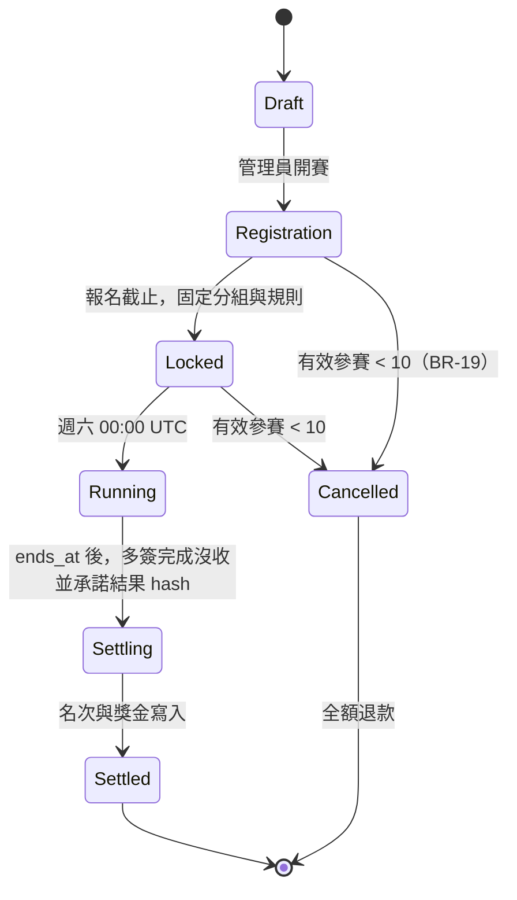
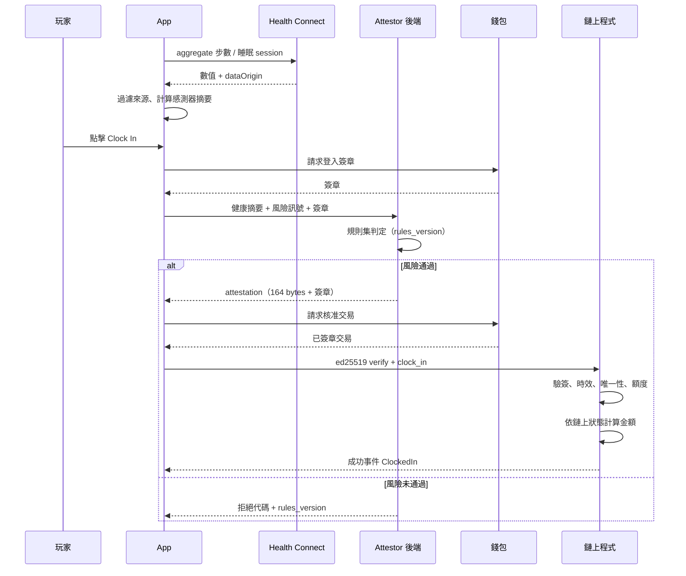

# NeonShift 系統分析文件（SA — System Analysis）

| 項目 | 內容 |
|---|---|
| 文件版本 | v0.4（新增合作活動分析） |
| 建立日期 | 2026-09-09 |
| 上游需求 | [BRD v0.6](./brd-detailed.md) |
| 下游設計 | [SD v0.4](./sd.md) |
| 目標平台 | Android only；Solana Mobile Seeker 為主要裝置 |
| 代幣命名 | 全文一律使用 `tSKR`（devnet 測試代幣，無金錢價值），不得等同官方 SKR |
| 狀態標記 | 【源自 BRD】可回溯至 BRD 條目；【分析】本文件推導所得；【待確認】需決策 |

---

## 1. 文件目的與定位

本文件把 BRD 的業務需求轉換為可實作、可測試的系統行為描述：誰使用系統、系統要做什麼、在什麼規則下做、資料如何流動與變化。

三份文件的分工如下。

| 文件 | 回答的問題 | 不回答的問題 |
|---|---|---|
| BRD | 為什麼做、做給誰、範圍與驗收標準 | 怎麼拆模組、用什麼技術 |
| **SA（本文）** | 系統要做什麼、規則是什麼、資料長什麼樣 | 用哪個框架、API 欄位怎麼定、帳戶怎麼配置 |
| SD | 怎麼實作、介面規格、部署與測試 | 為什麼要做這個功能 |

讀者：後端、鏈上與前端工程師、QA、產品負責人。

### 1.1 分析原則

1. **權威狀態在鏈上**：任何會影響代幣發放金額的狀態，分析時一律視為鏈上狀態，鏈下只做輸入驗證與呈現。
2. **鏈下驗證是風險評分，不是證明**：沿用 BRD 9.5 的信任邊界，本文一律使用「風險訊號」「拒絕理由」，不使用「杜絕」「不可偽造」。
3. **時間一律 UTC**：任務日、賽事區間、有效期皆以 UTC 計算，避免裝置時區造成重複領取。
4. **規則可版本化**：所有判定門檻都掛 `rules_version`，判定結果必須記錄當時版本。
5. **資金守恆可驗證**：每一筆代幣移動都要能由事件重算，總入等於總出。

---

## 2. 系統範圍與環境

### 2.1 系統脈絡

### 2.2 外部介面清單

| 編號 | 外部系統 | 方向 | 內容 | 失效影響 |
|---|---|---|---|---|
| EXT-01 | Health Connect | 讀 | 步數 aggregate、睡眠 session、dataOrigin | 無法打卡，App 需降級為僅檢視 |
| EXT-02 | 裝置感測器 | 讀 | 加速度計／陀螺儀取樣、粗粒度位移 | 步數任務的 live motion check 無法完成；引導重試，不宣稱歷史步數造假 |
| EXT-03 | MWA 相容錢包 | 讀寫 | 授權、交易簽章 | 無法完成任何鏈上動作 |
| EXT-04 | Solana devnet RPC | 讀寫 | 送交易、查帳戶與事件 | 打卡與賽事停擺，快取資料仍可顯示 |
| EXT-05 | 資產儲存 | 讀 | 跑鞋圖片與 metadata JSON | 顯示佔位圖，不影響獎勵 |

### 2.3 分析範圍外【源自 BRD 5.0、5.2】

iOS 與 HealthKit、主網與官方 SKR、好友／聊天／動態牆、NFT 二級市場、Wear OS、多語系。本文件不為上述保留擴充點；合作活動宣傳分享屬 FR-09 範圍。

---

## 3. 角色與權限

| 角色 | 說明 | 權限 |
|---|---|---|
| A1 玩家 | 一般使用者，以錢包公鑰識別 | 授權 App 讀取自身健康資料、發起所有自身交易；App 不寫回 Health Connect |
| A2 Attestor 後端 | 受信任服務，持有 attestor 私鑰 | 簽發 attestation；**不可**決定發放金額、不可直接動用金庫 |
| A3 管理員 | 團隊多簽 | 更新 Config、輪替 attestor 公鑰、開賽與結算 |
| A4 金庫 PDA | 無私鑰的程式衍生權限 | 只能由指定程式指令依鏈上規則轉出 tSKR；管理員不可直接簽署提款 |
| A5 審核人員 | 人工複查高風險賽事案件 | 讀取最小必要風險紀錄並提出沒收建議；最終執行仍需 A3 多簽 |
| A6 評審／觀察者 | 黑客松評審 | 讀取公開鏈上資料與事件 |

**權限分離要求【分析】**：A2 被攻陷時，攻擊者可與大量錢包協作簽發不合格 attestation；雖然單錢包每日上限、任務唯一性與鏈上金額計算仍成立，最壞損失上限仍可能是整個 reward vault，而不是「既有使用者數 × 每日上限」。因此需有金庫低餘額、異常簽發量告警與 A3 緊急 pause。A4 為 PDA 而非人員金鑰；A3 不得擁有繞過程式直接提款的權限。

---

## 4. 使用案例

### 4.1 使用案例總覽

| 編號 | 名稱 | 主要角色 | 對應 FR | 優先級 |
|---|---|---|---|---|
| UC-01 | 連線錢包 | A1 | FR-01.1、01.2 | M |
| UC-02 | 授予健康與活動權限 | A1 | FR-02.5、07.2 | M |
| UC-03 | 同步健康數據 | A1 | FR-02.1～02.4 | M |
| UC-04 | 鑄造初始跑鞋 | A1 | FR-04.1、04.2 | M |
| UC-05 | 每日打卡領取獎勵 | A1、A2 | FR-03.1～03.4、07.x | M |
| UC-06 | 升級數據核心 | A1 | FR-05.1～05.3 | M |
| UC-07 | 報名週末錦標賽 | A1 | FR-06.1 | M |
| UC-08 | 賽事期間累積步數 | A1、A2 | FR-06.2 | M |
| UC-09 | 賽事結算與領獎 | A3、A1 | FR-06.3 | M |
| UC-10 | 判定作弊並沒收質押 | A2、A3、A5 | FR-06.4、07.6 | M |
| UC-11 | 檢視打卡歷史 | A1 | FR-03.5 | S |
| UC-12 | 刪除後端個資 | A1 | NFR 隱私 | M |
| UC-13 | 輪替 attestor 金鑰 | A3 | NFR 安全 | M |

### 4.2 UC-05 每日打卡（核心案例，完整展開）

| 項目 | 內容 |
|---|---|
| 目標 | 玩家以當日健康數據換取 tSKR 獎勵 |
| 前置條件 | 已連線錢包、已授予 Health Connect 權限、已鑄造跑鞋、當日該任務尚未領取 |
| 後置條件 | 鏈上建立 ClaimReceipt、tSKR 入帳、跑鞋經驗值增加 |
| 觸發 | 玩家點擊 Clock In |

**主要流程**

1. App 以 `aggregate()` 讀取 UTC 當日步數與昨夜睡眠 session。
2. 步數任務過濾出可歸因於裝置內建來源的資料（BR-07）；睡眠採獨立來源政策（SA-Q6）。
3. 步數任務在當日首次領取前執行一次短時間 live motion check，App 只產生感測器特徵摘要，不保留原始序列；睡眠任務不要求此檢查。
4. App 判斷是否達標（BR-01）；未達標則按鈕停用並顯示進度。
5. 玩家點擊 Clock In，App 以錢包簽章向後端證明身分。
6. 後端執行風險規則集（BR-07 至 BR-12），計算風險分數。
7. 通過者由後端組 canonical bytes 並以 attestor 私鑰簽章，回傳 attestation。
8. App 組交易：ed25519 驗證指令 + `clock_in`。
9. 玩家於錢包核准並簽章。
10. 鏈上程式驗證簽章、時效、nonce、任務唯一性與每日剩餘額度。
11. 鏈上程式依 Config 與 PlayerProfile 計算金額（BR-02），自金庫轉出並更新經驗值。
12. App 監聽交易確認，播放成功特效並刷新餘額。

**例外流程**

| 編號 | 情境 | 系統行為 |
|---|---|---|
| E1 | Health Connect 權限被撤銷 | 停用打卡，導向權限說明頁（FR-02.5） |
| E2 | 資料來源無法歸因 | 拒絕並顯示「資料來源無法驗證」，附說明連結 |
| E3 | 風險分數超過門檻 | 拒絕並回傳 `rules_version` 與拒絕代碼，不揭露完整門檻 |
| E4 | attestation 過期（> 10 分鐘） | App 使用新的 idempotency key 自動重新取得一次；後端允許同任務重簽但限流，鏈上仍以 ClaimReceipt 防止重領 |
| E5 | 玩家在錢包取消簽章 | 不產生鏈上狀態，attestation 於到期後自然失效 |
| E6 | 交易送出但 RPC 逾時 | App 以 `(wallet, task_date, task_type)` 推導 ClaimReceipt PDA 並查詢；存在則視為成功，否則先查原交易簽章狀態，再決定是否重建新交易 |
| E7 | 同一 attestation 重送 | 鏈上因 ClaimReceipt 已存在而拒絕，回報「今日已領取」 |
| E8 | 金庫餘額不足 | 交易失敗，App 顯示維護中；後端發出告警 |
| E9 | 已達每日上限 40 tSKR | 允許領取剩餘額度；若剩餘為 0 則拒絕並說明 |

### 4.3 其他使用案例的關鍵例外【分析】

| UC | 關鍵例外 | 系統行為 |
|---|---|---|
| UC-04 | 鑄造交易失敗後重試 | 以 PlayerProfile 的 `shoe_asset` 是否為預設值判斷，已有則不重複鑄造 |
| UC-06 | 扣款成功但升級失敗 | 不允許發生，兩者必須同一指令內原子完成（FR-05.1） |
| UC-07 | 報名截止後送出 | 依 Tournament 狀態拒絕，質押不入池 |
| UC-09 | 結算時分配餘數 | 整數除法餘數歸國庫，並記錄於事件（BR-17） |
| UC-12 | 刪除後端資料 | 立即撤銷 session 並停止新處理；無進行中賽事時立即刪除。若已有質押賽事在進行，最長只保留結算必要摘要至該賽事完成且總保留仍不得超過 30 天，回傳預定刪除時間；明確告知鏈上資料無法刪除 |

---

## 5. 業務規則

規則以 `BR-xx` 編號，每條標註判定位置（鏈上／鏈下）與可測試性。這是 SD 與測試案例的直接來源。

### 5.1 任務與獎勵

| 編號 | 規則 | 判定位置 | 來源 |
|---|---|---|---|
| BR-01 | 步數任務門檻 8,000 步；睡眠任務門檻 7 小時。兩者為獨立任務 | 鏈下判定達標、鏈上不重複驗步數 | FR-03.1 |
| BR-02 | `獎勵 = floor(基礎最小單位 × 倍率_bps × 連續加成_bps / 10^8)`；步數 10 tSKR、睡眠 5 tSKR | 鏈上 | 8.2 |
| BR-03 | 同一 `(wallet, task_date, task_type)` 僅能領取一次 | 鏈上 ClaimReceipt | FR-03.2 |
| BR-04 | 單錢包單一 UTC 任務日累計上限 40 tSKR，於每筆發放時扣減剩餘額度 | 鏈上 | 8.2 |
| BR-05 | 任務日以 UTC 日界線劃分；睡眠 session 以**結束時間**歸屬任務日。鏈上只接受 `task_date == floor(Clock.unix_timestamp / 86400)`，不接受前一日補領，以免日額狀態倒退 | 鏈下歸屬、鏈上校驗當日 | FR-02.2、FR-03.2 |
| BR-06 | 連續加成預設停用；啟用後連續 7 個 UTC 任務日完成任一任務給 1.1 倍。同日第二項任務不得再次增加 streak；斷日後由 1 重新計算 | 鏈上 | FR-03.6 |

### 5.2 資料歸因與風險評分

| 編號 | 規則 | 判定位置 | 來源 |
|---|---|---|---|
| BR-07 | 步數任務僅接受可歸因於裝置內建步數來源的資料；手動輸入、第三方寫入、無法歸因者一律不計；不把此來源限制套用於睡眠 | 鏈下 | FR-07.1 |
| BR-08 | 裝置來源識別同時支援歷史 `android` 值與動態取得的 SPN，不得硬編碼 | 鏈下 | FR-07.1 |
| BR-09 | 步數任務以短時間引導式 live motion check 產生統計摘要（取樣率、主頻、振幅與同步步數增量），不上傳原始序列。此摘要只能驗證取樣視窗內的一致性，不能證明先前累積的整日步數；缺少樣本可提高風險或要求重試，但不得假裝為歷史步數的硬體證明 | 鏈下 | FR-07.2、BRD 9.5 |
| BR-10 | 步數速率上限每分鐘 250 步，單日上限 40,000 步，超出部分不計入 | 鏈下 | FR-07.4 |
| BR-11 | GPS 僅作輔助風險訊號，合理步幅 0.3 至 1.5 公尺。無定位權限或室內無位移不得單獨導致拒絕 | 鏈下 | FR-07.3 |
| BR-12 | 睡眠合理區間 3 至 12 小時；睡眠期間持續高步頻提高風險分數，短暫重疊不直接拒絕 | 鏈下 | FR-07.5 |
| BR-13 | 每次判定必須記錄單調遞增的 `rules_version`、完整規則檔 SHA-256 `rules_hash` 與拒絕代碼；版本號不是雜湊。規則變更不得追溯影響既有判定 | 鏈下 | NFR 可維護性 |

### 5.3 攻擊面與時效

| 編號 | 規則 | 判定位置 | 來源 |
|---|---|---|---|
| BR-14 | attestation 綁定 `program_id`、`cluster`、`wallet`、`task_date`、`task_type`，跨環境或跨帳戶重用一律失敗 | 鏈上 | FR-03.3 |
| BR-15 | attestation 有效期 ≤ 10 分鐘，且含 `not_before` 與唯一 nonce | 鏈上 | NFR 安全 |

### 5.4 經濟與資金守恆

| 編號 | 規則 | 判定位置 | 來源 |
|---|---|---|---|
| BR-16 | （作廢 2026-09-14）升級改為免費，無扣款、燒毀與入庫 | — | FR-05.3（W） |
| BR-17 | 單一賽事：總質押＋國庫挹注＝總退款＋總獎金＋歸庫餘數，結果不得為負 | 鏈上 | 8.4 |
| BR-18 | 得獎人數 `max(1, ceil(有效參賽 × 30%))`，A 組 `max(1, ceil(有效參賽 × 10%))`，分組於報名截止後固定不可變 | 鏈上 | 8.4 |
| BR-19 | 有效參賽人數低於 10 人則賽事取消，全額退款 | 鏈上 | 8.4 |
| BR-20 | 排名同分時，先依先達成時間，再依錢包位元組序決勝 | 鏈下計算、鏈上記錄結果 | FR-06.2 |
| BR-21 | 沒收質押必須引用 `rules_version` 與證據摘要並產生鏈上事件，不得由單一後端請求任意執行 | 鏈上 + 鏈下 | FR-06.4 |
| BR-22 | tSKR 部署後鑄造固定供給並撤銷 mint authority；reward／treasury／tournament vault 皆由指定 PDA 控制，管理員不得以外部金鑰直接提款 | 鏈上 | 8.2、NFR 安全 |
| BR-23 | （2026-09-14 改寫）`shoe_level` 與 `core_level` 皆由累積 XP 門檻自動、免費提升，數值恆相等；`shoe_level` 控制外觀、`core_level` 控制獎勵倍率；升級發生在打卡交易內，本次獎勵以升級前倍率計算 | 鏈上 | FR-04.2、FR-04.3、FR-05.1 |
| BR-24 | 會影響有效 attestation 金額的 Config 不得即時切換：先 pause 新簽發，等待最長 10 分鐘有效期結束，再更新並恢復 | 鏈上 + 鏈下操作 | NFR 可維護性 |
| BR-25 | 刪除請求立即撤銷 session、停止新健康處理與新 attestation。僅進行中且已質押賽事的結算必要摘要可延後刪除至結算完成，且不得突破原 30 天上限；API 必須告知實際期限 | 鏈下 | NFR 隱私、UC-12 |

---

## 6. 領域模型

### 6.1 概念實體

### 6.2 狀態存放位置分析【分析】

這是本專案最容易出錯的地方，需在設計前定案。

| 資料 | 存放 | 理由 |
|---|---|---|
| Core 等級／倍率、跑鞋等級、經驗值、連續天數、最近任務日 | **鏈上 PlayerProfile** | 直接影響獎勵或資產狀態，必須是權威來源（FR-03.4、FR-04.2） |
| 跑鞋外觀階級 | 鏈上 `shoe_level` 推導，App 內呈現 | 不鑄 NFT；`shoe_level` 與 `core_level` 同步由 XP 推導（BR-23 改寫） |
| 領取紀錄 | **鏈上 ClaimReceipt** | 唯一性與重放防護的判定依據 |
| 質押、名次、獎金 | **鏈上** | 涉及資金守恆 |
| 步數、睡眠與來源的最小必要摘要 | 鏈下 PostgreSQL，最長保留 30 天 | 不保存 Health Connect 完整原始 records；鏈上無需知道健康數值 |
| 感測器摘要、風險分數 | 鏈下 | 屬風險訊號，非權威 |
| 排行榜 | 鏈下計算，結算時上鏈 | 高頻更新不適合上鏈 |

### 6.3 主要狀態機

**每日任務狀態**

**錦標賽狀態**

---

## 7. 資料流與信任邊界

### 7.1 打卡序列

### 7.2 信任邊界分析【源自 BRD 9.5】

| 邊界 | 可信任的事 | 不可信任的事 |
|---|---|---|
| 裝置 → App | 使用者持有裝置 | App 可被 root、hook 或重新打包 |
| App → 後端 | 錢包簽章證明公鑰控制權 | 健康數值與感測器摘要皆為客戶端聲稱值 |
| 後端 → 鏈上 | attestor 簽章證明「後端認可此任務」 | 不證明健康資料真實 |
| 鏈上 | 唯一性、金額計算、資金守恆 | 無法判斷鏈下資料是否造假 |

**對外用語約束**：一律使用「多訊號驗證」「提高作弊成本」。禁止「杜絕作弊」「硬體級證明」「完全去信任」。

### 7.3 個資盤點

| 資料 | 類別 | 保留 | 是否上鏈 |
|---|---|---|---|
| 錢包公鑰 | 假名識別 | 永久 | 是，公開 |
| 步數、睡眠時長 | 健康資料 | 最長 30 天；刪除規則見 BR-25 | 否 |
| 感測器統計摘要 | 行為特徵 | 最長 30 天；刪除規則見 BR-25 | 否 |
| GPS 位移統計 | 位置衍生 | 最長 30 天，不存軌跡；刪除規則見 BR-25 | 否 |
| 風險分數與拒絕代碼 | 判定紀錄 | 最長 30 天；刪除規則見 BR-25 | 否 |
| 領取金額與交易 | 交易紀錄 | 永久 | 是，公開且不可刪除 |

---

## 8. 非功能需求分析

| 類別 | BRD 需求 | 分析所得的可測條件 |
|---|---|---|
| 效能 | 冷啟動 ≤ 3 秒（P95） | release build、Seeker、清除快取後量測 30 次取 P95 |
| 效能 | 簽章畫面出現 ≤ 3 秒；核准至 confirmed ≤ 5 秒（P95） | 依 BRD 4.1 分段量測；後者至少 50 筆並另記 RPC 異常，不把使用者操作時間混入 |
| 可用性 | 後端 ≥ 99% | 以 5 分鐘探測計算月度可用率 |
| 可用性 | 離線可看快取 | 飛航模式下儀表板顯示最後同步時間與快取值 |
| 安全 | 私鑰於 KMS | 程式碼掃描不得出現私鑰字面值；部署檢查表列入 |
| 隱私 | 30 天保留 | 每日排程刪除逾期資料，並有稽核紀錄 |
| 相容性 | 最低 Android 14 | 啟動時檢查 Health Connect 可用性與 SDK extension 版本 |
| 可觀測性 | 記錄拒絕原因 | 每次判定寫入結構化日誌，含 rules_version 與代碼 |

---

## 9. 需求追溯矩陣

| BRD FR | UC | BR | 驗證方式 |
|---|---|---|---|
| FR-01.1、01.2 | UC-01 | — | 實機操作 + 授權失效情境 |
| FR-01.3 | UC-01 | BR-22 | 與鏈上餘額比對，檢查 devnet 標示 |
| FR-02.1、02.2 | UC-03 | BR-05 | 跨午夜、時區切換測試 |
| FR-02.3 | UC-03 | — | 背景排程觀察 + 前景同步降級 |
| FR-02.4 | UC-03 | BR-07、BR-08 | 四種來源測資 |
| FR-03.1 | UC-05 | BR-01 | 邊界值 7,999 / 8,000 步 |
| FR-03.2 | UC-05 | BR-03 | 重送同一 attestation |
| FR-03.3 | UC-05 | BR-14、BR-15 | 竄改欄位、過期、跨 cluster |
| FR-03.4 | UC-05 | BR-02、BR-04 | 定點數公式與上限測試 |
| FR-04.1 | UC-04 | — | 重複鑄造測試 |
| FR-04.2、04.3 | UC-04、UC-05 | BR-23 | XP 同時提升 shoe_level 與 core_level（免費升級） |
| FR-05.1 | UC-05 | BR-23 | 免費升級於打卡交易內完成；BR-16 作廢 |
| FR-06.1、06.3 | UC-07、UC-09 | BR-17、BR-18、BR-19 | 資金守恆 property test |
| FR-06.2 | UC-08 | BR-20 | 同分決勝測試 |
| FR-06.4 | UC-10 | BR-21 | 沒收須有事件與證據摘要 |
| FR-07.1～07.5 | UC-05 | BR-07～BR-13 | 真人與搖步機資料集 |
| FR-08.1～08.4 | 全部 | — | 360dp 版面、對比度、觸覺回饋 |

---

## 10. 分析階段未決事項

| 編號 | 問題 | 阻擋對象 | 建議 |
|---|---|---|---|
| SA-Q1 | 名次權重公式（BR-18 的遞減方式） | 賽事結算實作 | 建議線性遞減，於 Tournament 建立時寫入 |
| SA-Q2 | 風險分數門檻與各訊號權重 | 風險引擎 | 第三週以真實資料集校準，先用保守值 |
| SA-Q4 | 申訴流程是否納入本次範圍 | UC-10 | 建議僅記錄，不做完整申訴系統 |
| SA-Q5 | 離線快取保留範圍 | App 儲存設計 | 建議僅快取最近 30 天摘要 |
| SA-Q6 | 睡眠允許來源、重疊去重、手動紀錄與實機取得方式 | FR-02.2、FR-07.5；PG-A-04、PG-B-08 | 第一週完成真實來源 PoC，固定測資與政策；不得套用步數 SPN 限制 |
| SA-Q7 | 沒收後人數不足／全數沒收、空組與結算失敗處置 | BR-17～BR-21；PG-C-13 至 C-16 | 與 BRD Q-09 一併定案，明定退款及補交期限 |
【v0.2 已決】MVP 不將每次賽事步數更新上鏈；後端產生最終排序 manifest，由管理員多簽承諾 final rolling hash，再以連續批次寫入結果。Merkle claim 屬超過 MVP 規模後的優化，不作為 200 人門檻的執行期切換，避免同一部署存在兩套未驗證結算路徑。

上游 BRD 的 Q-01 至 Q-09 仍然有效，其中 Q-08（SKR integration track 是否接受 tSKR）若答案為否，本文件的第 5.4 節與整個代幣模型都需要重做。

---

## 11. 第三方合作活動分析

### 11.1 範圍、角色與使用案例

活動不等同錦標賽：一個 Event 可以關聯一個 Tournament，多場活動可宣傳同一錦標賽，但活動報到、主辦方成績與 NFC 領取不會直接改變鏈上排名或獎金。公開宣傳頁可免登入；報名與領取以錢包 session 識別，不要求健康授權。平台管理員可核准合作方；合作方 owner 管理被授權活動，staff 只負責指定站點報到／交付，result editor 只能匯入草稿，publisher 確認公開版本。所有合作方角色都無權存取 attestor 私鑰或 tSKR vault。

| 使用案例 | 行為與主要例外 | 需求 |
|---|---|---|
| UC-14 | 合作方建檔、審查、發布活動；越權與未完成規則不得發布 | FR-09 |
| UC-15 | 使用者由合作宣傳連結報名；額滿、截止、取消時明確拒絕 | FR-09、FR-10 |
| UC-16 | 感應 NFC／掃 QR，現場人員核驗並確認報到；離線暫存不代表到場成功 | FR-10 |
| UC-17 | 核驗資格、預留庫存、確認贈品交付或發數位憑證；重試沿用同筆核銷 | FR-11 |
| UC-18 | 主辦方匯入成績、預覽、發布與更正；重複選手／錯誤單位需先修正 | FR-12 |
| UC-19 | 玩家查看成績冊、設定公開名稱與同意；未同意不進公開榜 | FR-12 |

### 11.2 業務規則

| 編號 | 規則 | 權威／驗收 |
|---|---|---|
| BR-26 | 每次操作皆驗證合作組織、event 與角色；不得僅隱藏 UI | 後端；跨租戶物件 ID 與 staff 越權均拒絕 |
| BR-27 | Event 時間以 UTC instant 儲存並保留 IANA 展示時區；規則版本在報名時記錄 | 後端；各報名／報到／核銷區間皆採 `[start, end)` |
| BR-28 | 每 event／wallet 一筆參加者；每 participant／checkpoint 一筆有效報到 | DB 唯一約束；取消／補登保留稽核 |
| BR-29 | 靜態 NFC、QR、UID 可被複製，只提供入口；到場須有授權工作人員核驗或另行定案的動態可信站點機制 | 後端；複製網址不能自行取得到場資格 |
| BR-30 | 每品項的預留量＋已交付量不得超過庫存；單人總量不得超限；到期釋放與交付確認互斥 | DB 交易／鎖；並發、逾時及補發測試 |
| BR-31 | 成績必須標示來源、版本、單位、發布人與更正原因；主辦方成績不冒充 Health Connect 驗證結果 | 後端；舊版可稽核、最新已發布版才可展示 |
| BR-32 | 活動角色只能見履約必要資料；公開榜需獨立同意。健康摘要 30 天上限不變，活動履歷保留依 Q-13 定案 | 權限及刪除測試；匯出亦受相同約束 |
| BR-33 | 活動取消即停止新報名／核銷；已交付紀錄保留事實，不自動追回贈品或代幣 | 後端；未交付預留釋放，已交付處置依活動規則 |

### 11.3 領域與狀態

`PartnerOrganization` 透過 `EventPartner` 參與 `Event`；`PartnerMembership` 授權成員，`EventParticipant` 關聯 wallet 與報名規則版本。`Checkpoint`／`NfcTag` 導向活動站點；`CheckIn` 表示經核驗到場。`Benefit` 定義品項及庫存，`Redemption` 記錄預留與交付。`ResultImport` 及 `ResultRevision` 記錄來源與版本，個人成績冊由已發布成績組成，不另外複製健康原始資料。

- 活動：Draft → Published → RegistrationClosed → Live → Completed → Archived；非 Archived 可依政策轉 Cancelled，Completed 後仍可發佈有原因的成績更正。
- 報名：Registered → Cancelled；是否可重新報名由規則決定，復用同一 participant。
- 核銷：Reserved → Fulfilled；Reserved → Expired／Cancelled／Failed；Fulfilled 不因重試再次扣庫存。實體品項由 staff 確認交付；數位憑證由伺服器以唯一發行紀錄完成。
- 成績：Draft → Validated → Published → Superseded；更正建立新 revision，不能覆寫已發布資料。

### 11.4 活動追溯與待決事項

FR-09 → UC-14／15、BR-26／27 → PG-E-01～03；FR-10 → UC-15／16、BR-28／29 → PG-E-03～05；FR-11 → UC-17、BR-29／30／33 → PG-E-04～06；FR-12 → UC-18／19、BR-31／32 → PG-E-07～09。PG-E-10 驗證整條旅程。

實作前需定案 BRD Q-10～Q-13，尤其實體卡片是否啟用、核銷設備與 staff 網路、成績來源及個資保留。活動可用報到測試資料開發，但正式試辦不得把測試成績或匿名化不足的資料公開。

## 附錄 A：拒絕代碼一覽【分析】

| 代碼 | 意義 | 使用者可見訊息方向 |
|---|---|---|
| `SRC_UNATTRIBUTED` | 資料來源無法歸因至裝置 | 說明需使用手機內建計步 |
| `SRC_MANUAL` | 手動輸入資料 | 說明手動資料不計入 |
| `RATE_EXCEEDED` | 步數速率夾限紀錄，非整筆拒絕 | 顯示有效步數，達標仍可申請 |
| `DAILY_CAP` | 40,000 步夾限紀錄，與 tSKR 領取上限不同 | 顯示有效步數，達標仍可申請 |
| `TASK_NOT_MET` | 過濾與夾限後未達 8,000 步或 420 分鐘睡眠 | 顯示有效進度 |
| `SLEEP_RANGE` | 睡眠時長超出合理區間 | 說明合理區間 |
| `RISK_SCORE` | 綜合風險分數過高 | 泛化訊息，不揭露門檻 |
| `NO_SENSOR` | 步數任務缺少可用的 live motion check | 引導完成短時間驗證；不得聲稱整日步數造假 |
| `LIVE_MOTION_INCOMPLETE` | 引導式取樣期間未取得足夠動作／步數增量 | 請使用者在安全環境完成短時間步行後重試，不標記為作弊 |
| `ATTEST_EXPIRED` | attestation 過期 | 自動重試一次 |
| `ALREADY_CLAIMED` | 今日該任務已領取 | 顯示已領取狀態 |

---

## 附錄 B：版本變更紀錄

| 版本 | 日期 | 變更摘要 |
|---|---|---|
| v0.1 | 2026-09-09 | 初版系統分析 |
| v0.2 | 2026-09-09 | 修正 attestor 最壞損失、當日回滾、streak 重複累加、Core／跑鞋等級混用、隱私資料範圍與賽事結果信任模型；同步 BRD v0.4 優先級 |
| v0.3 | 2026-09-14 | 分離睡眠來源、修正 shoe_asset 與夾限語意，補列結算極端情境未決事項 |
| v0.4 | 2026-09-14 | 新增 UC-14～19、BR-26～33 與合作活動角色、領域、核銷／成績狀態及追溯 |

## 12. 跑鞋成長補充分析（BRD 17）

- BR-34：成功 ClaimReceipt 對應步數 +100／睡眠 +50 XP，與代幣數量獨立；同交易更新 XP 及 shoe_level，失敗完全回滾。重放不得重複給 XP。
- BR-35：五階門檻為 [0,450,1500,3600,7500]，以最高已達門檻推導外觀；core_level 不參與 XP 計算。滿階維持 Lv5，進度顯示 MAX，不除以零。
- BR-36：前端預覽可使用設計預設，真實玩家必須讀鏈上 Config／Profile；資料載入失敗顯示未知或快取時間，不套用預覽值冒充真實等級。
- UC-20：查看五階圖鑑及下一階 XP；尚未解鎖可預覽但標示 Preview。成功交易觸發一次進化，重開畫面不重複播放；斷日不降階。
- 規則修改須版本化並評估既有玩家；提高門檻不得直接導致已取得鞋階降級。此政策需於部署／遷移前定案，不由前端自行調參。

## 13. 活動跑步與 PB 分析擴充

依 [活動／跑步／藝廊設計](./activity-running-gallery.md) 第 1～6 章擴充：UC-21 活動報名到成績／收藏；UC-22 匯入裝置跑步與檢視距離熱量；UC-23 最快／最遠 PB 判定；UC-24 領取 PB NFT；UC-25 藝廊查看成就與更正。

- BR-37：同一運動跨裝置去重，每項指標留來源；估算距離不取得 PB 鑄造資格，活動熱量與總熱量不相加。
- BR-38：PB 按 wallet／類別／環境／來源等級／計時規則比較，嚴格改善才新增；首次為 Baseline；只有總量不得推算最快路段。
- BR-39：每 achievement ID 最多鑄造一次；NFT 轉移不轉移原達成者 PB、不恢復領取額度。
- BR-40：成績修正需重算 PB 並撤銷未鑄資格；已鑄造標失效或歷史，不宣稱能刪除鏈上資料。精確健康資訊需逐次主動公開同意。

UC-21 承接 PG-E，UC-25 承接 PG-G，其餘新增工作依 PG 15 排期；不把本設計當作既有實作驗收。第 12 章 Core 分離舊敘述以 BRD FR-05 最新免費同步升級為準。

## 14. 等級能力與維持狀態模型

完整規則見 [跑鞋遊戲性設計](./shoe-gameplay.md)，新增 UC-26 查看維持挑戰、UC-27 期末降階、UC-28 恢復歷史鞋階。新 FR-16 優先於第 12 章「永久有效鞋階」舊推導。

- BR-41：XP 上限、Active level、Highest achieved 三者分離；Core 與 Active 同步，不與歷史最高同步。
- BR-42：固定 anchor 起每 7 UTC 任務日結算；計分 100／50、活躍日去重。未達雙門檻降一階；通過才可升至 XP 與本期表現同時支持的最高階。
- BR-43：結算 cursor 單調、多期離線逐期追上；不以重新登入或升級重設週期，不以 XP 自動抵消降級。
- BR-44：已取得 NFT／歷史最高保留；新能力取目前階級，已獲鑄造資格取達成／承諾時的能力快照，作弊撤銷另處理。
- BR-45：凍結與版本變更全域可稽核、不得追溯縮減資格；未結算最新狀態時不可授權受限操作。

驗收需覆蓋舊玩家遷移、睡眠來源不可用與長休復歸；維持点不是健康建議，也不以超量跑步或熱量競賽加分。
