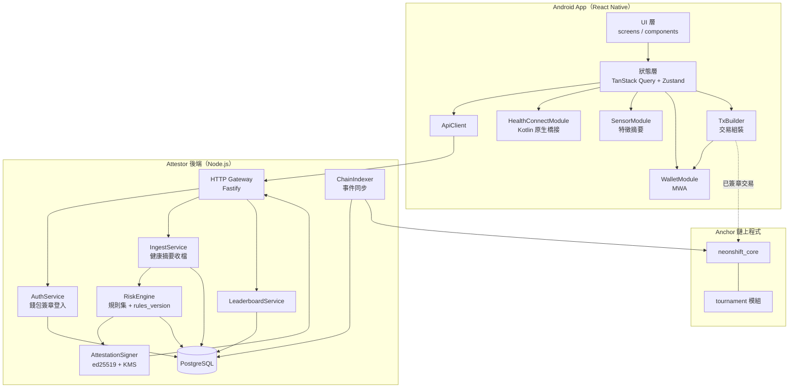
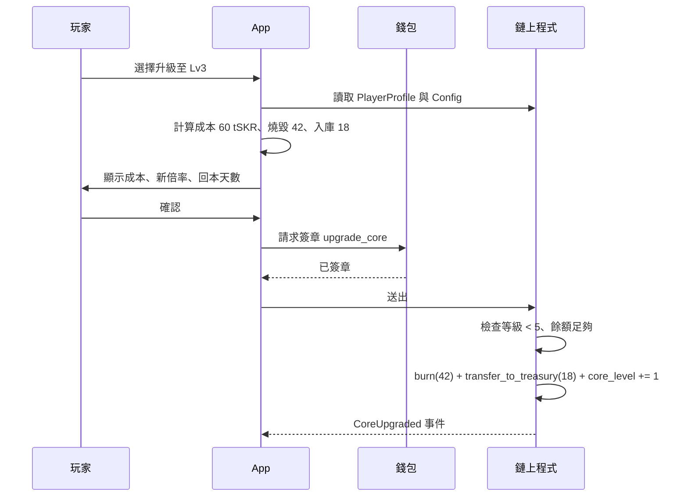
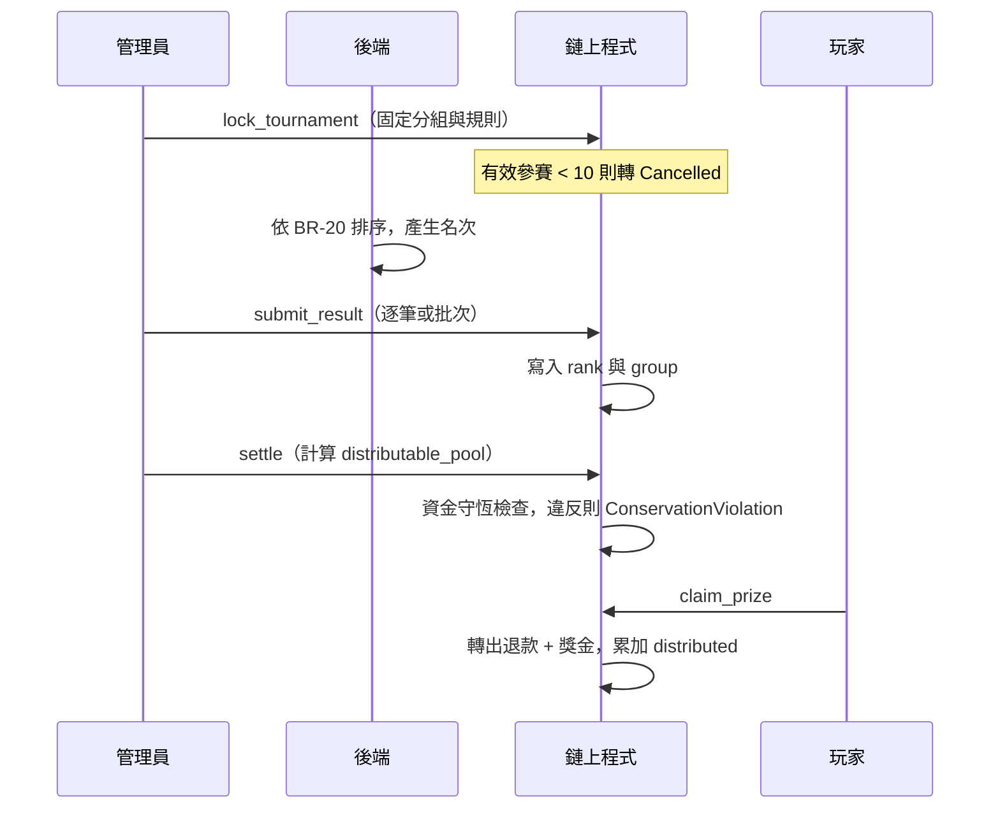

# NeonShift 系統設計文件（SD — System Design）

| 項目 | 內容 |
|---|---|
| 文件版本 | v0.1 |
| 建立日期 | 2026-09-09 |
| 上游文件 | [BRD v0.4](./brd-detailed.md)、[SA v0.1](./sa.md)、[Style Guide v0.1](./style.md) |
| 目標平台 | Android only；最低 Android 14（API 34）；Solana Mobile Seeker 為主要裝置 |
| 網路 | Solana devnet |
| 代幣 | `tSKR`，devnet 測試 SPL Token，無金錢價值，非官方 SKR |
| 狀態標記 | 【定案】可直接實作；【草案】需 review；【待確認】對應 SA-Q 或 BRD Q |

---

## 1. 設計目標與約束

本文件把 SA 的業務規則轉為可實作規格：模組邊界、介面契約、資料結構、鏈上帳戶與指令、安全機制、測試與部署。

### 1.1 設計約束

| 編號 | 約束 | 來源 |
|---|---|---|
| C-01 | Android 單一平台，不建立 iOS 抽象層 | BRD 5.0 |
| C-02 | 影響獎勵金額的狀態必須在鏈上 | SA 6.2 |
| C-03 | 後端不得決定發放金額，也不得直接動用金庫 | BRD FR-03.4 |
| C-04 | 四週交付，M 級功能優先，C 級可砍 | BRD 13 |
| C-05 | 時間一律 UTC | SA 1.1 |
| C-06 | 不上傳原始感測器序列與 GPS 軌跡 | BRD NFR 隱私 |

### 1.2 設計取捨

| 議題 | 選項 | 決定 | 理由 |
|---|---|---|---|
| 獎勵發放 | 鏈上驗證 attestation vs 後端轉帳 | **鏈上驗證**【定案】 | 後端轉帳無法對評審展示去信任成分，且違反 C-03 |
| NFT 標準 | Metaplex Core vs Token Metadata | **Core**【草案】 | 帳戶較少、屬性可更新、rent 較低 |
| 獎勵狀態 | 寫入 NFT metadata vs 獨立 PDA | **獨立 PDA**【定案】 | metadata 更新需額外簽章且可能延遲，不適合作計算來源 |
| 排行榜 | 全程上鏈 vs 鏈下計算結算時上鏈 | **鏈下計算**【定案】 | 每小時更新全程上鏈成本過高 |
| 後端語言 | Node.js vs Rust | **Node.js（TypeScript）**【草案】 | 與前端共用型別，四週內迭代快 |

---

## 2. 系統架構

### 2.1 分層與模組



### 2.2 技術選型

| 層 | 技術 | 版本策略 |
|---|---|---|
| App 框架 | React Native + Expo custom development build | 不可使用 Expo Go，需原生模組 |
| 錢包 | `@solana-mobile/mobile-wallet-adapter-protocol-web3js` | 依 MWA 2.0 |
| 鏈上互動 | `@solana/web3.js` + Anchor client | 固定次版本 |
| 健康資料 | Health Connect Jetpack SDK，經自寫 Kotlin 橋接 | 需檢查 SDK extension 可用性 |
| 感測器 | Android SensorManager，原生取樣後回傳摘要 | 取樣 50 Hz，視窗 10 秒 |
| 狀態管理 | TanStack Query（伺服器狀態）+ Zustand（UI 狀態） | — |
| 後端 | Node.js 20 + TypeScript + Fastify | — |
| 資料庫 | PostgreSQL 16 | — |
| 鏈上 | Anchor（Rust） | — |
| 金鑰 | 雲端 KMS 或受管 secrets | 禁止明文環境變數 |

---

## 3. 鏈上程式設計

### 3.1 帳戶結構

所有帳戶皆為 Anchor account，含 8 bytes discriminator。

**Config**（PDA seeds `["config"]`）

| 欄位 | 型別 | 說明 |
|---|---|---|
| `admin` | Pubkey | 多簽位址 |
| `attestor_pubkey` | Pubkey | 目前有效的 attestor 驗簽公鑰 |
| `attestor_valid_from` | i64 | 輪替生效時間，支援新舊並行 |
| `prev_attestor_pubkey` | Pubkey | 輪替寬限期內的舊公鑰 |
| `prev_attestor_valid_until` | i64 | 舊公鑰失效時間 |
| `mint` | Pubkey | tSKR mint |
| `reward_vault` | Pubkey | 獎勵金庫 token account |
| `treasury_vault` | Pubkey | 國庫 token account |
| `daily_cap` | u64 | 單日上限，最小單位 |
| `base_steps_reward` | u64 | 步數任務基礎獎勵 |
| `base_sleep_reward` | u64 | 睡眠任務基礎獎勵 |
| `streak_bonus_bps` | u16 | 連續加成，預設 10000 |
| `burn_bps` | u16 | 升級燒毀比例，預設 7000 |
| `paused` | bool | 緊急停用 |
| `bump` | u8 | — |

**PlayerProfile**（PDA seeds `["player", wallet]`）

| 欄位 | 型別 | 說明 |
|---|---|---|
| `wallet` | Pubkey | 擁有者 |
| `shoe_asset` | Pubkey | 跑鞋資產位址，預設 `Pubkey::default()` 表示未鑄造 |
| `core_level` | u8 | 1 至 5 |
| `multiplier_bps` | u16 | 由 core_level 推導並冗餘保存，便於稽核 |
| `xp` | u64 | 經驗值 |
| `last_task_date` | u32 | 最近完成任務的 UTC 日序 |
| `streak_days` | u16 | 連續天數 |
| `claimed_today` | u64 | 當日已領取量，`task_date` 變更時歸零 |
| `today_date` | u32 | `claimed_today` 對應的日序 |
| `bump` | u8 | — |

**ClaimReceipt**（PDA seeds `["claim", wallet, task_date_le, task_type]`）

帳戶存在本身即代表已領取，這是 BR-03 的實作方式。

| 欄位 | 型別 | 說明 |
|---|---|---|
| `wallet` | Pubkey | — |
| `task_date` | u32 | UTC 日序 |
| `task_type` | u8 | 1 = steps，2 = sleep |
| `amount` | u64 | 實發金額 |
| `nonce` | [u8; 16] | attestation nonce |
| `claimed_at` | i64 | — |
| `bump` | u8 | — |

**Tournament**（PDA seeds `["tournament", week_id_le]`）

| 欄位 | 型別 | 說明 |
|---|---|---|
| `week_id` | u32 | ISO 週序 |
| `status` | u8 | 0 Draft、1 Registration、2 Locked、3 Running、4 Settling、5 Settled、6 Cancelled |
| `stake_amount` | u64 | 報名質押，建立時固定 |
| `total_staked` | u64 | — |
| `treasury_injection` | u64 | 國庫挹注，建立時固定並設上限 |
| `entrant_count` | u32 | — |
| `valid_entrant_count` | u32 | 報名截止時固定 |
| `group_a_size` | u32 | 報名截止時依 BR-18 固定 |
| `group_b_size` | u32 | 同上 |
| `distributable_pool` | u64 | 結算時寫入 |
| `distributed` | u64 | 已發放累計，用於資金守恆檢查 |
| `min_entrants` | u32 | 預設 10 |
| `registration_ends_at` / `starts_at` / `ends_at` | i64 | — |
| `rules_version` | u16 | 引用的判定規則版本 |
| `bump` | u8 | — |

**TournamentEntry**（PDA seeds `["entry", tournament, wallet]`）

| 欄位 | 型別 | 說明 |
|---|---|---|
| `tournament` | Pubkey | — |
| `wallet` | Pubkey | — |
| `stake` | u64 | — |
| `final_steps` | u64 | 結算時寫入 |
| `rank` | u32 | 0 表示未排名 |
| `group` | u8 | 0 無、1 A 組、2 B 組 |
| `forfeited` | bool | 是否沒收 |
| `settled` | bool | 是否已領取 |
| `evidence_hash` | [u8; 32] | 沒收時的證據摘要 |
| `bump` | u8 | — |

### 3.2 指令清單

| 指令 | 簽章者 | 主要檢查 | 事件 |
|---|---|---|---|
| `initialize_config` | admin | 僅可執行一次 | `ConfigInitialized` |
| `update_config` | admin 多簽 | 參數範圍、不影響進行中賽事 | `ConfigUpdated` |
| `rotate_attestor` | admin 多簽 | 設定新舊並行寬限期 | `AttestorRotated` |
| `init_player` | player | 帳戶未存在 | `PlayerInitialized` |
| `mint_shoe` | player | `shoe_asset` 為預設值 | `ShoeMinted` |
| `clock_in` | player | 見 3.3 | `ClockedIn` |
| `upgrade_core` | player | 等級 < 5、餘額足夠、原子扣款 | `CoreUpgraded` |
| `open_tournament` | admin | 狀態為 Draft | `TournamentOpened` |
| `join_tournament` | player | 狀態為 Registration、未重複報名、mint 正確 | `TournamentJoined` |
| `lock_tournament` | admin | 報名截止、固定分組、人數不足則轉 Cancelled | `TournamentLocked` / `TournamentCancelled` |
| `submit_result` | admin | 狀態為 Settling、名次未寫入 | `ResultSubmitted` |
| `claim_prize` | player | 已 Settled、未領取 | `PrizeClaimed` |
| `forfeit_entry` | admin 多簽 | 需帶 `evidence_hash` 與 `rules_version` | `EntryForfeited` |
| `refund_all` | player | 賽事 Cancelled | `Refunded` |

### 3.3 `clock_in` 檢查順序【定案】

順序不可調換，前面的檢查較便宜且能擋掉多數攻擊。

1. `Config.paused == false`。
2. 由 `instructions` sysvar 讀取前一道指令，確認是 Ed25519 program 且僅有一組簽章。
3. 比對 ed25519 指令內的公鑰等於 `attestor_pubkey`，或在寬限期內等於 `prev_attestor_pubkey`。
4. 比對 ed25519 指令內的訊息 bytes 與本指令參數重建的 canonical bytes 完全一致。
5. 檢查 `program_id` 等於本程式、`cluster_id` 等於 Config 設定。
6. 檢查 `wallet` 等於簽章者。
7. 檢查 `now >= not_before` 且 `now <= expiry` 且 `expiry - issued_at <= 600`。
8. 以 PDA 建立 `ClaimReceipt`；帳戶已存在則交易失敗（BR-03、BR-14 同時成立）。
9. 若 `PlayerProfile.today_date != task_date`，將 `claimed_today` 歸零並更新 `today_date`。
10. 計算 `amount`，再以 `min(amount, daily_cap - claimed_today)` 收斂（BR-04）。
11. `amount == 0` 時回傳錯誤 `DailyCapReached`。
12. 由金庫 PDA 轉出 tSKR，更新 `claimed_today`、`xp`、`streak_days`、`last_task_date`。
13. 依 xp 門檻檢查是否升等並更新 `core_level` 與 `multiplier_bps`。
14. 發出 `ClockedIn` 事件。

### 3.4 獎勵計算（定點數）

```rust
// 全程 u128 運算後再收斂回 u64，避免中途溢位
let base: u64 = match task_type {
    TASK_STEPS => config.base_steps_reward,
    TASK_SLEEP => config.base_sleep_reward,
    _ => return err!(ErrorCode::InvalidTaskType),
};
let streak_bps: u64 = if streak_active { config.streak_bonus_bps as u64 } else { 10_000 };
let raw = (base as u128)
    .checked_mul(profile.multiplier_bps as u128).ok_or(ErrorCode::MathOverflow)?
    .checked_mul(streak_bps as u128).ok_or(ErrorCode::MathOverflow)?
    / 100_000_000u128;                       // 10_000 * 10_000
let amount = u64::try_from(raw).map_err(|_| ErrorCode::MathOverflow)?;
let remaining = config.daily_cap.saturating_sub(profile.claimed_today);
let amount = amount.min(remaining);         // BR-04
```

`multiplier_bps` 對照：Lv1 = 10000、Lv2 = 12000、Lv3 = 15000、Lv4 = 18000、Lv5 = 22000。

### 3.5 Attestation canonical bytes【定案】

固定 164 bytes，little-endian，無分隔符，避免欄位歧義造成的簽章重解讀攻擊。

| offset | 長度 | 欄位 | 說明 |
|---|---|---|---|
| 0 | 19 | domain | ASCII `NEONSHIFT_ATTEST_V1` |
| 19 | 1 | `version` | 目前為 1 |
| 20 | 32 | `program_id` | 綁定程式（BR-14） |
| 52 | 1 | `cluster_id` | 1 = devnet |
| 53 | 32 | `wallet` | 領取者 |
| 85 | 4 | `task_date` | UTC 日序 u32 |
| 89 | 1 | `task_type` | 1 steps / 2 sleep |
| 90 | 2 | `rules_version` | u16 |
| 92 | 32 | `evidence_hash` | SHA-256(判定輸入摘要) |
| 124 | 8 | `issued_at` | i64 |
| 132 | 8 | `not_before` | i64 |
| 140 | 8 | `expiry` | i64 |
| 148 | 16 | `nonce` | 隨機 |

**刻意不包含金額**。金額由鏈上依 Config 與 PlayerProfile 計算，符合 C-03。

### 3.6 錯誤碼

| 代碼 | 名稱 | 觸發 |
|---|---|---|
| 6000 | `ProgramPaused` | Config 停用中 |
| 6001 | `MissingEd25519Instruction` | 前置指令缺失或格式錯誤 |
| 6002 | `InvalidAttestorKey` | 公鑰不符且不在寬限期 |
| 6003 | `AttestationMismatch` | canonical bytes 不一致 |
| 6004 | `WrongProgramOrCluster` | 跨環境重用 |
| 6005 | `WalletMismatch` | 簽章者非 attestation 指定錢包 |
| 6006 | `AttestationNotYetValid` | 未到 `not_before` |
| 6007 | `AttestationExpired` | 已過 `expiry` |
| 6008 | `AttestationTtlTooLong` | 有效期超過 600 秒 |
| 6009 | `AlreadyClaimed` | ClaimReceipt 已存在 |
| 6010 | `DailyCapReached` | 剩餘額度為 0 |
| 6011 | `MathOverflow` | 定點數運算溢位 |
| 6012 | `ShoeAlreadyMinted` | 重複鑄造 |
| 6013 | `MaxCoreLevel` | 已達 Lv5 |
| 6014 | `InvalidTournamentState` | 狀態機不允許 |
| 6015 | `AlreadyJoined` | 重複報名 |
| 6016 | `InsufficientEntrants` | 有效參賽 < min_entrants |
| 6017 | `ConservationViolation` | 結算後總出入不符 |
| 6018 | `MissingEvidence` | 沒收未附證據摘要 |

---

## 4. 後端設計

### 4.1 API 一覽

Base path `/v1`。除登入相關外皆需 Bearer JWT。錯誤回應統一為 `{ "error": { "code": "...", "message": "...", "rules_version": 3 } }`。

| Method | Path | 用途 | 對應 UC |
|---|---|---|---|
| POST | `/auth/nonce` | 取得登入 nonce | UC-01 |
| POST | `/auth/verify` | 驗證錢包簽章，發 JWT（TTL 24h） | UC-01 |
| POST | `/health/snapshot` | 上傳健康摘要與感測器特徵 | UC-03 |
| POST | `/attestation/claim` | 申請打卡 attestation | UC-05 |
| GET | `/player/history?days=30` | 打卡歷史 | UC-11 |
| DELETE | `/player/data` | 刪除後端個資 | UC-12 |
| GET | `/tournament/current` | 目前賽事資訊 | UC-07 |
| POST | `/tournament/steps` | 賽事期間步數回報 | UC-08 |
| GET | `/tournament/{weekId}/leaderboard` | 排行榜（含 `generated_at`） | UC-08 |
| GET | `/rules/version` | 目前 rules_version 與公開說明 | 稽核 |

### 4.2 `POST /attestation/claim`

Request

```json
{
  "task_type": "steps",
  "task_date": 20706,
  "steps": 9420,
  "sleep_minutes": null,
  "data_origins": [
    { "package": "com.google.android.apps.fitness", "is_device_source": true, "steps": 9420 }
  ],
  "sensor_summary": {
    "sample_rate_hz": 50,
    "window_count": 42,
    "dominant_freq_hz": 1.87,
    "freq_variance": 0.31,
    "accel_rms": 1.24,
    "gyro_rms": 0.42,
    "zero_crossing_rate": 3.6
  },
  "motion_summary": { "displacement_m": 5120, "gps_available": true },
  "client": { "app_version": "0.4.1", "device_model": "Seeker", "os_api": 34 }
}
```

Response 200

```json
{
  "attestation": {
    "message_b64": "…164 bytes…",
    "signature_b64": "…64 bytes…",
    "attestor_pubkey": "…",
    "expires_at": 1789000600,
    "nonce": "…"
  },
  "rules_version": 3
}
```

Response 422（拒絕）

```json
{ "error": { "code": "SRC_UNATTRIBUTED", "message": "資料來源無法驗證", "rules_version": 3 } }
```

拒絕代碼沿用 SA 附錄 A。**回應不得包含風險分數與門檻數值**，避免被用來反推規則。

### 4.3 風險引擎

規則以設定檔宣告，整份設定的雜湊即為 `rules_version` 的內容綁定。

```yaml
rules_version: 3
hard_reject:
  - id: SRC_UNATTRIBUTED
    when: attributed_steps == 0
  - id: SRC_MANUAL
    when: has_manual_origin
  - id: SLEEP_RANGE
    when: task_type == "sleep" && (sleep_minutes < 180 || sleep_minutes > 720)
clamp:
  - id: RATE_EXCEEDED
    max_steps_per_minute: 250
  - id: DAILY_CAP
    max_steps_per_day: 40000
score:
  - id: freq_variance_low        # 搖步機特徵：頻率過於規律
    weight: 35
    when: sensor.freq_variance < 0.08
  - id: no_displacement_high_steps
    weight: 20
    when: motion.gps_available && motion.displacement_m < 200 && attributed_steps > 15000
  - id: stride_implausible
    weight: 25
    when: motion.gps_available && (stride < 0.3 || stride > 1.5)
  - id: sleep_overlap_stepping
    weight: 20
    when: task_type == "sleep" && overlap_minutes > 60
threshold: 60
```

設計要點。硬拒絕與夾限先執行，評分規則只在資料通過硬拒絕後計算。門檻 60 為初始保守值，第三週依 BRD 4.1 的資料集校準（SA-Q2）。每次判定寫入 `risk_decisions`，含輸入雜湊、命中規則、分數與版本，供誤判申訴查核。

### 4.4 資料庫 schema

```sql
CREATE TABLE players (
  wallet            TEXT PRIMARY KEY,
  first_seen_at     TIMESTAMPTZ NOT NULL DEFAULT now(),
  last_seen_at      TIMESTAMPTZ NOT NULL DEFAULT now(),
  deleted_at        TIMESTAMPTZ
);

CREATE TABLE health_snapshots (
  id                BIGSERIAL PRIMARY KEY,
  wallet            TEXT NOT NULL REFERENCES players(wallet),
  task_date         INTEGER NOT NULL,              -- UTC 日序
  task_type         SMALLINT NOT NULL,             -- 1 steps / 2 sleep
  attributed_steps  INTEGER,
  sleep_minutes     INTEGER,
  sensor_summary    JSONB NOT NULL,
  motion_summary    JSONB,
  client_info       JSONB NOT NULL,
  input_hash        BYTEA NOT NULL,                -- evidence_hash 來源
  created_at        TIMESTAMPTZ NOT NULL DEFAULT now()
);
CREATE INDEX ON health_snapshots (wallet, task_date, task_type);
CREATE INDEX ON health_snapshots (created_at);      -- 30 天清理

CREATE TABLE risk_decisions (
  id                BIGSERIAL PRIMARY KEY,
  snapshot_id       BIGINT NOT NULL REFERENCES health_snapshots(id) ON DELETE CASCADE,
  rules_version     SMALLINT NOT NULL,
  risk_score        SMALLINT NOT NULL,
  matched_rules     TEXT[] NOT NULL,
  decision          TEXT NOT NULL,                 -- pass / reject
  reject_code       TEXT,
  created_at        TIMESTAMPTZ NOT NULL DEFAULT now()
);

CREATE TABLE attestations (
  nonce             BYTEA PRIMARY KEY,
  wallet            TEXT NOT NULL,
  task_date         INTEGER NOT NULL,
  task_type         SMALLINT NOT NULL,
  rules_version     SMALLINT NOT NULL,
  evidence_hash     BYTEA NOT NULL,
  issued_at         TIMESTAMPTZ NOT NULL,
  expires_at        TIMESTAMPTZ NOT NULL,
  redeemed_sig      TEXT,                          -- 由 indexer 回填
  UNIQUE (wallet, task_date, task_type, rules_version)
);

CREATE TABLE tournament_steps (
  week_id           INTEGER NOT NULL,
  wallet            TEXT NOT NULL,
  verified_steps    BIGINT NOT NULL DEFAULT 0,
  first_reached_at  TIMESTAMPTZ,                   -- BR-20 決勝用
  updated_at        TIMESTAMPTZ NOT NULL DEFAULT now(),
  PRIMARY KEY (week_id, wallet)
);

CREATE TABLE chain_events (
  signature         TEXT PRIMARY KEY,
  slot              BIGINT NOT NULL,
  event_name        TEXT NOT NULL,
  payload           JSONB NOT NULL,
  ingested_at       TIMESTAMPTZ NOT NULL DEFAULT now()
);
```

保留政策：每日排程刪除 `health_snapshots` 中 `created_at` 超過 30 天者，`risk_decisions` 以 CASCADE 連帶刪除。`attestations` 僅保留 nonce 與雜湊，不含健康數值，可長期保存供稽核。

### 4.5 金鑰管理

| 金鑰 | 用途 | 保管 | 輪替 |
|---|---|---|---|
| attestor 私鑰 | 簽 attestation | KMS，簽章不出境 | `rotate_attestor` + 寬限期 |
| admin 多簽 | Config、開賽、沒收 | 團隊成員各持一把 | 依需要 |
| 金庫 PDA | 轉出 tSKR | 程式持有，無私鑰 | 不適用 |
| mint authority | 初始鑄造後撤銷 | 撤銷後不存在 | 不適用 |
| APK signing key | 商店提交 | 離線保存 + 指紋登記 | 不適用 |

---

## 5. App 設計

### 5.1 模組職責

| 模組 | 職責 | 不負責 |
|---|---|---|
| `HealthConnectModule`（Kotlin） | 權限、`aggregate()`、session 讀取、dataOrigin | 達標判定 |
| `SensorModule`（Kotlin） | 50 Hz 取樣、10 秒視窗、統計摘要 | 保存原始序列 |
| `WalletModule` | MWA 授權、token 保存、簽章 | 交易內容組裝 |
| `TxBuilder` | 組 ed25519 + 程式指令、預估費用 | 送出與重試 |
| `ChainClient` | 送交易、確認、查帳戶 | UI 狀態 |
| `ApiClient` | 後端呼叫、JWT 續期 | 業務判定 |
| `TaskEngine` | 達標判定、任務狀態機（SA 6.3） | 資料讀取 |

### 5.2 導航結構【對應 style.md 第 2 章】

```
Launch → Landing（未連線）
      └→ Onboarding：Wallet → Health → Activity → Shoe Mint
Tabs: Dashboard | Gear | Arena | Profile
```

### 5.3 關鍵前端邏輯

**交易冪等（對應 UC-05 例外 E6）**。送出交易前先由 nonce 與 wallet 推導 ClaimReceipt PDA。RPC 逾時後改為輪詢該 PDA 是否存在，存在即視為成功，**不得重送交易**。這是避免重複扣費與使用者困惑的關鍵。

**UTC 日界線**。所有任務日以 `floor(unixSeconds / 86400)` 計算，UI 顯示時再轉裝置時區並標註 UTC 換日倒數，避免使用者以為跨日重置時間有誤。

**離線降級**。無網路時 Dashboard 顯示最後同步時間與快取值，打卡按鈕停用並說明原因，不進入驗證中狀態。

**設計 token**。色彩、間距、字級一律引用 style.md 第 18 章的 token mapping，不在元件內寫死色碼。

---

## 6. 關鍵流程序列

### 6.1 升級數據核心（原子性）



三個動作在同一指令內完成，任一失敗整筆回滾，滿足 FR-05.1。

### 6.2 賽事結算



**資金守恆斷言**在 `settle` 與每次 `claim_prize` 都執行：

```
total_staked + treasury_injection
  == total_refund + total_prize + treasury_remainder
且 distributed <= total_staked + treasury_injection
```

---

## 7. 測試策略

| 層級 | 範圍 | 工具 | 重點案例 |
|---|---|---|---|
| 鏈上單元 | 指令邏輯 | Anchor + LiteSVM | 檢查順序、錯誤碼、定點數邊界 |
| 鏈上 property | 資金守恆 | proptest | 隨機參賽人數與名次，驗證 BR-17 恆成立 |
| 鏈上安全 | 攻擊情境 | 手寫測試 | 重放同一 attestation、跨 cluster、竄改 bytes、偽造 ed25519 指令、缺少前置指令 |
| 後端單元 | 風險規則 | Vitest | 每條規則的正負案例、`rules_version` 綁定 |
| 後端整合 | API + DB | Testcontainers | 拒絕碼、JWT、刪除個資後不可查 |
| App 單元 | TaskEngine、UTC 換算 | Jest | 跨午夜、時區切換、夏令時間 |
| App 原生 | Health Connect 橋接 | Android instrumented | 四種 dataOrigin、權限撤銷 |
| E2E | 打卡全流程 | Maestro + devnet | 達標打卡、重複打卡、離線、取消簽章 |
| 實機驗收 | KPI | 人工 | 冷啟動 P95、端到端秒數、真人與搖步機資料集 |

**必測的攻擊案例清單**（對應 BR-14、BR-15）：同一 attestation 重送、他人 attestation 換自己錢包、把 devnet attestation 送到另一個 program id、修改 `task_date` 前 4 bytes、把 expiry 改成一年後、ed25519 指令帶兩組簽章、ed25519 指令的訊息與參數差一個 byte。

---

## 8. 部署與環境

| 環境 | 用途 | Solana | 後端 | 資料 |
|---|---|---|---|---|
| local | 開發 | localnet | docker compose | 可重置 |
| dev | 整合 | devnet | Railway 或 Fly.io | 可重置 |
| demo | 錄影與評審 | devnet | 同 dev，獨立實例 | 保留 |

`demo` 與 `dev` 使用**不同的 program id 與 attestor 金鑰**，避免測試資料污染評審環境，同時驗證 BR-14 的跨環境隔離確實生效。

部署順序：部署程式 → `initialize_config` → 鑄造 tSKR 固定供給 → 撤銷 mint authority → 撥款至獎勵金庫 → 設定 attestor 公鑰 → 後端上線 → 發佈 APK。

**回滾**。Config 具 `paused` 旗標可即時停止發放，不需重新部署。程式升級保留 upgrade authority 至提交日後再視需要撤銷（【待確認】是否於提交前撤銷以取信評審）。

---

## 9. 可觀測性

| 訊號 | 內容 | 告警 |
|---|---|---|
| 業務指標 | 每日 attestation 簽發數、拒絕率、各拒絕碼分佈 | 拒絕率單日變動超過 20 個百分點 |
| 金庫 | 獎勵金庫餘額 | 低於 7 日預估發放量 |
| 鏈上 | 交易失敗率、各錯誤碼次數 | `ConservationViolation` 出現任一次即最高等級 |
| 效能 | API P95、RPC 延遲 | P95 超過 800 毫秒 |
| 安全 | attestation 重放嘗試次數 | 單一錢包單日超過 10 次 |

---

## 10. 設計未決事項

| 編號 | 問題 | 阻擋 | 建議 |
|---|---|---|---|
| SD-Q1 | NFT 採 Metaplex Core 或 Token Metadata | 第二週鑄造實作 | Core |
| SD-Q2 | 名次權重公式（承 SA-Q1） | `submit_result` | 線性遞減，建立賽事時寫入 |
| SD-Q3 | 步數上鏈逐筆或 Merkle（承 SA-Q3） | 結算成本 | 先逐筆，超過 200 人再改 |
| SD-Q4 | 提交前是否撤銷 program upgrade authority | 部署流程 | 建議撤銷並於 Pitch 說明 |
| SD-Q5 | 後端託管（承 BRD Q-07） | 第一週建置 | Railway |
| SD-Q6 | 風險門檻初始值與權重（承 SA-Q2） | 第三週校準 | 先用 60，資料集校準後定案 |

---

## 附錄 A：對應關係速查

| SD 章節 | 實作的 SA 規則 | 滿足的 BRD 需求 |
|---|---|---|
| 3.3 檢查順序 | BR-03、BR-14、BR-15 | FR-03.2、FR-03.3 |
| 3.4 獎勵計算 | BR-02、BR-04 | FR-03.4 |
| 3.5 canonical bytes | BR-14、BR-15 | FR-03.3、NFR 安全 |
| 4.3 風險引擎 | BR-07～BR-13 | FR-07.1～07.5 |
| 4.4 保留政策 | SA 7.3 | NFR 隱私 |
| 6.1 升級原子性 | BR-16 | FR-05.1、FR-05.3 |
| 6.2 資金守恆 | BR-17～BR-19 | FR-06.3 |
| 5.3 UTC 日界線 | BR-05 | FR-02.2 |
