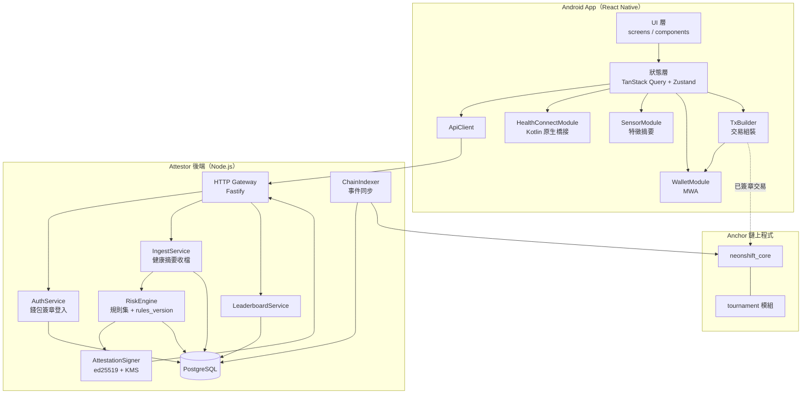
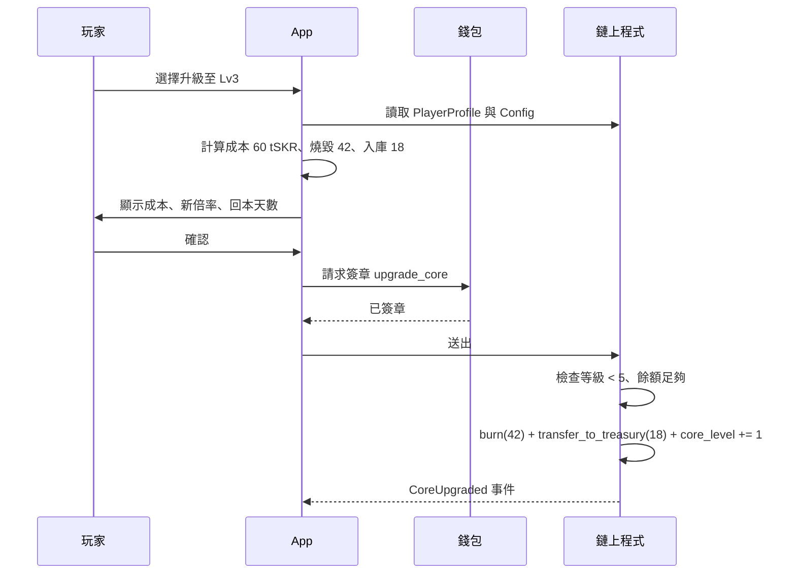
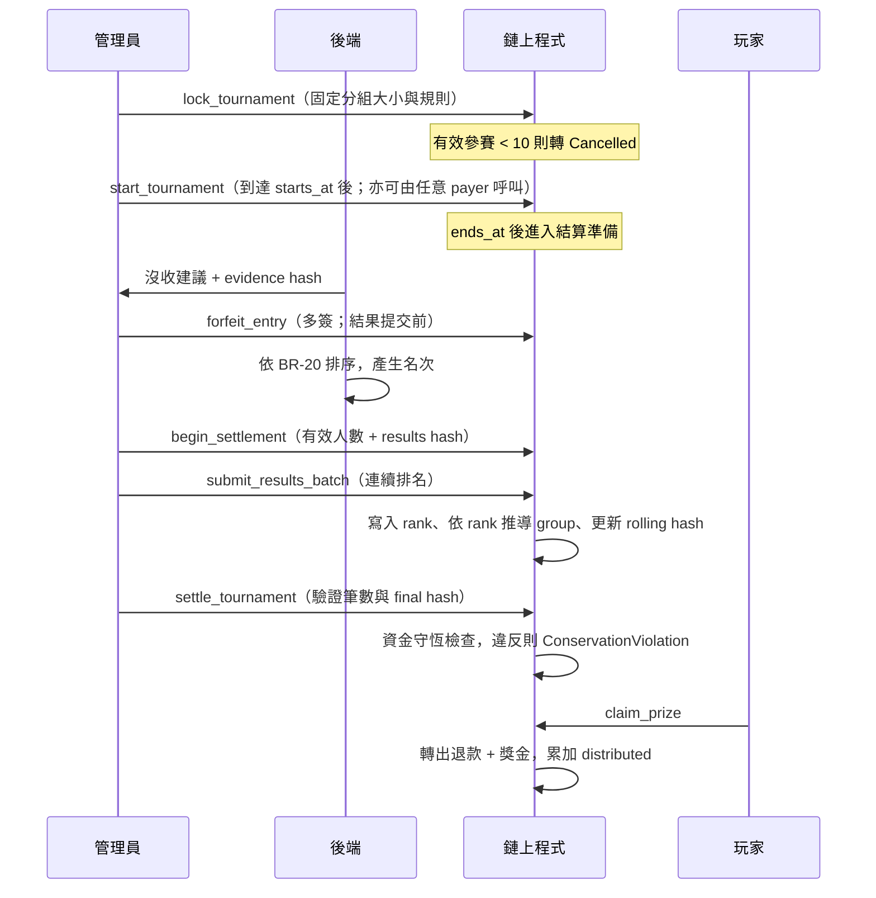

# NeonShift 系統設計文件（SD — System Design）

| 項目 | 內容 |
|---|---|
| 文件版本 | v0.36（GPS 防弊分層） |
| 建立日期 | 2026-09-09 |
| 上游文件 | [BRD v0.6](./brd-detailed.md)、[SA v0.4](./sa.md)、[Style Guide v0.1](./style.md) |
| 目標平台 | Android only；最低 Android 14（API 34）；Solana Mobile Seeker 為主要裝置 |
| 網路 | Solana devnet |
| 代幣 | `tSKR`，devnet 測試 SPL Token，無金錢價值，非官方 SKR |
| 狀態標記 | 【定案】可直接實作；【草案】需 review；【待確認】對應 SA-Q 或 BRD Q |

---

## 1. 設計目標與約束

本文件把 SA 的業務規則轉為可實作規格：模組邊界、介面契約、資料結構、鏈上帳戶與指令、安全機制、測試與部署。

### 1.1 設計約束

| 編號 | 約束 | 來源 |
|---|---|---|
| C-01 | Android 單一平台，不建立 iOS 抽象層 | BRD 5.0 |
| C-02 | 影響獎勵金額的狀態必須在鏈上 | SA 6.2 |
| C-03 | 後端不得決定發放金額，也不得直接動用金庫 | BRD FR-03.4 |
| C-04 | 四週交付，M 級功能優先，C 級可砍 | BRD 13 |
| C-05 | 時間一律 UTC | SA 1.1 |
| C-06 | 不上傳原始感測器序列與 GPS 軌跡 | BRD NFR 隱私 |

### 1.2 設計取捨

| 議題 | 選項 | 決定 | 理由 |
|---|---|---|---|
| 獎勵發放 | 鏈上驗證 attestation vs 後端轉帳 | **鏈上驗證**【定案】 | 後端轉帳無法對評審展示去信任成分，且違反 C-03 |
| 跑鞋資產 | NFT（Metaplex Core）vs 純 PDA 狀態 | **等級＝純 PDA 狀態；NFT＝成就收藏**【2026-09-14 定案】 | Lv.1 跑鞋隨 `init_player` 直接贈與、外觀由 XP 推導；達等級／里程碑後玩家以 `claim_collectible` 免費鑄造 Metaplex Core NFT 作收藏與藝廊展示（FR-04.6、FR-13） |
| 獎勵狀態 | 寫入 NFT metadata vs 獨立 PDA | **獨立 PDA**【定案】 | metadata 更新需額外簽章且可能延遲，不適合作計算來源 |
| 排行榜 | 全程上鏈 vs 鏈下計算結算時上鏈 | **鏈下計算**【定案】 | 每小時更新全程上鏈成本過高 |
| 後端語言 | Node.js vs Rust | **Node.js（TypeScript）**【草案】 | 與前端共用型別，四週內迭代快 |
| tSKR token program | SPL Token vs Token-2022 | **經典 SPL Token、6 decimals、無 extensions**【定案】 | MVP 不需要 transfer hook／fee 等 extension，降低 CPI 與錢包相容風險 |

---

## 2. 系統架構

### 2.1 分層與模組



### 2.2 技術選型

| 層 | 技術 | 版本策略 |
|---|---|---|
| App 框架 | React Native + Expo custom development build | 不可使用 Expo Go，需原生模組 |
| 錢包 | `@solana-mobile/mobile-wallet-adapter-protocol-web3js` | 依 MWA 2.0 |
| 鏈上互動 | `@solana/web3.js` + Anchor client | 固定次版本 |
| 健康資料 | Health Connect Jetpack SDK，經自寫 Kotlin 橋接 | 需檢查 SDK extension 可用性 |
| 感測器 | Android SensorManager，原生取樣後回傳摘要 | 取樣 50 Hz，視窗 10 秒 |
| 狀態管理 | TanStack Query（伺服器狀態）+ Zustand（UI 狀態） | — |
| 後端 | Node.js 24 LTS + TypeScript + Fastify | 鎖定 major／minor、持續更新 patch；Node.js 20 已於 2026-03-24 EOL，不得使用 |
| 資料庫 | PostgreSQL 16 | — |
| 鏈上 | Anchor（Rust） | — |
| 金鑰 | 支援 Solana 相容 Ed25519 的 KMS／HSM；否則使用受管 secret + 隔離 signer service | 啟用版本化、存取稽核與輪替；禁止明文環境變數 |

---

## 3. 鏈上程式設計

### 3.1 帳戶結構

所有帳戶皆為 Anchor account，含 8 bytes discriminator。

**Config**（PDA seeds `["config"]`）

| 欄位 | 型別 | 說明 |
|---|---|---|
| `admin` | Pubkey | 多簽位址 |
| `cluster_id` | u8 | canonical attestation 的環境識別；devnet = 1 |
| `attestor_pubkey` | Pubkey | 目前有效的 attestor 驗簽公鑰 |
| `attestor_valid_from` | i64 | 輪替生效時間，支援新舊並行 |
| `prev_attestor_pubkey` | Pubkey | 輪替寬限期內的舊公鑰 |
| `prev_attestor_valid_until` | i64 | 舊公鑰失效時間 |
| `mint` | Pubkey | tSKR mint |
| `mint_decimals` | u8 | 初始化時要求等於 mint 的 6 decimals，後續金額皆使用最小單位 |
| `reward_vault` | Pubkey | 獎勵金庫 token account |
| `treasury_vault` | Pubkey | 國庫 token account |
| `daily_cap` | u64 | 單日上限，最小單位 |
| `base_steps_reward` | u64 | 步數任務基礎獎勵 |
| `base_sleep_reward` | u64 | 睡眠任務基礎獎勵 |
| `streak_enabled` | bool | FR-03.6 功能開關，MVP 預設 false |
| `streak_bonus_bps` | u16 | 啟用後加成，預設 11000；停用時一律使用 10000 |
| `burn_bps` | u16 | 保留（升級改為免費後不使用） |
| `core_multiplier_bps` | [u16; 5] | Core 1～5 倍率，預設 `[10000,12000,15000,18000,22000]` |
| `core_upgrade_costs` | [u64; 4] | 保留（升級改為免費後不使用） |
| `shoe_xp_thresholds` | [u64; 5] | 跑鞋 Lv1～5 的累積 XP 門檻 |
| `paused` | bool | 緊急停用 |
| `paused_at` | i64 | 最近一次進入 pause 的時間（實作期新增）；BR-24 以 `now - paused_at >= 600` 判斷有效 attestation 已全部過期 |
| `bump` | u8 | — |

**PlayerProfile**（PDA seeds `["player", wallet]`）

| 欄位 | 型別 | 說明 |
|---|---|---|
| `wallet` | Pubkey | 擁有者 |
| `core_level` | u8 | 1 至 5，控制獎勵倍率；2026-09-14 起與 `shoe_level` 同步由 XP 推導（免費升級） |
| `shoe_level` | u8 | 1 至 5，由 XP 門檻提升，控制外觀 |
| `xp` | u64 | 經驗值 |
| `last_task_date` | u32 | 最近完成任務的 UTC 日序 |
| `max_streak_days` | u16 | 歷史最高連續天數（實作期新增，供連續 7 天徽章資格；斷日不下降） |
| `streak_days` | u16 | 連續天數 |
| `claimed_today` | u64 | 當日已領取量，`task_date` 變更時歸零 |
| `today_date` | u32 | `claimed_today` 對應的日序 |
| `bump` | u8 | — |

**ClaimReceipt**（PDA seeds `["claim", wallet, task_date_le, task_type]`）

帳戶存在本身即代表已領取，這是 BR-03 的實作方式。

| 欄位 | 型別 | 說明 |
|---|---|---|
| `wallet` | Pubkey | — |
| `task_date` | u32 | UTC 日序 |
| `task_type` | u8 | 1 = steps，2 = sleep |
| `amount` | u64 | 實發金額 |
| `nonce` | [u8; 16] | attestation nonce |
| `claimed_at` | i64 | — |
| `bump` | u8 | — |

**Tournament**（PDA seeds `["tournament", week_id_le]`）

| 欄位 | 型別 | 說明 |
|---|---|---|
| `week_id` | u32 | `ISO week-based year × 100 + ISO week`，例如 202641；不可只存 1～53 |
| `status` | u8 | 0 Draft、1 Registration、2 Locked、3 Running、4 Settling、5 Settled、6 Cancelled |
| `vault` | Pubkey | 本賽事專用 tSKR token account，由 Tournament PDA 控制 |
| `stake_amount` | u64 | 報名質押，建立時固定 |
| `total_staked` | u64 | — |
| `treasury_injection_cap` | u64 | 國庫挹注上限，建立時固定（≤ 程式常數 `MAX_TREASURY_INJECTION` = 5,000 tSKR；實作期新增） |
| `treasury_injection` | u64 | lock 時實際轉入 vault 的挹注 = min(cap, 國庫餘額)；之後不可變 |
| `entrant_count` | u32 | — |
| `valid_entrant_count` | u32 | 報名截止時通過報名格式／資金檢查的人數，據此固定得獎組大小 |
| `forfeited_count` | u32 | 結果提交前已多簽沒收的人數 |
| `group_a_size` | u32 | 報名截止時依 BR-18 固定 |
| `group_b_size` | u32 | 同上 |
| `distributable_pool` | u64 | 結算時寫入 |
| `distributed` | u64 | 已發放累計，用於資金守恆檢查 |
| `total_refund` | u64 | 所有 entry 的應退款總額 |
| `total_prize` | u64 | 所有得獎者獎金總額 |
| `treasury_remainder` | u64 | 整數餘數與結算後歸庫額 |
| `results_submitted` | u32 | 已提交的連續排名筆數 |
| `results_hash` | [u8; 32] | 多簽在開始結算時承諾的最終 rolling hash |
| `results_rolling_hash` | [u8; 32] | 鏈上依排名順序逐筆更新的 rolling hash |
| `min_entrants` | u32 | 預設 10 |
| `registration_ends_at` / `starts_at` / `ends_at` | i64 | — |
| `rules_version` | u16 | 引用的判定規則版本 |
| `prize_a_bps` / `prize_b_bps` / `loser_refund_bps` | u16 | BRD 8.4 的 60%／40%／50%，建立時寫入後不可變（實作期新增） |
| `created_at` | i64 | — |
| `bump` | u8 | — |

**TournamentEntry**（PDA seeds `["entry", tournament, wallet]`）

| 欄位 | 型別 | 說明 |
|---|---|---|
| `tournament` | Pubkey | — |
| `wallet` | Pubkey | — |
| `stake` | u64 | — |
| `final_steps` | u64 | 結算時寫入 |
| `rank` | u32 | 0 表示未排名 |
| `group` | u8 | 0 無、1 A 組、2 B 組 |
| `forfeited` | bool | 是否沒收 |
| `settled` | bool | 是否已領取 |
| `evidence_hash` | [u8; 32] | 沒收時的證據摘要 |
| `joined_at` | i64 | 實作期新增 |
| `bump` | u8 | — |

### 3.2 指令清單

| 指令 | 簽章者 | 主要檢查 | 事件 |
|---|---|---|---|
| `initialize_config` | 程式 upgrade authority | 僅可執行一次（Config PDA `init`）；簽章者必須等於 ProgramData 的 upgrade authority，`admin`（多簽）由參數指定。參數範圍：cluster_id ∈ {1,2}、基礎獎勵 > 0、daily_cap ≥ 最大基礎獎勵、streak_bonus 10000～20000、burn ≤ 10000、core 倍率 [0]=10000 且單調不減 ≤ 50000、升級成本 > 0、XP 門檻 [0]=0 且嚴格遞增、mint 為 6 decimals、reward vault owner = Config PDA | `ConfigInitialized` |
| `set_paused` | admin 多簽 | 進入 pause 時記錄 `paused_at`（重複 pause 不重設）。pause 範圍【2026-09-14 定案】：`clock_in`、`join_tournament` 拒絕（6000）；`claim_prize`、`refund_all` 與管理指令不受影響，使用者永遠能取回資金 | `PauseChanged` |
| `update_config` | admin 多簽 | 全欄位可選、整筆以 `initialize_config` 同一套規則驗證。`daily_cap`、`base_*_reward`、`streak_*`、`core_multiplier_bps` 為 BR-24 受控欄位，只能在 `paused && now - paused_at >= 600` 時更新（否則 6025）；`admin`、`burn_bps`、`core_upgrade_costs`、`shoe_xp_thresholds` 可即時更新。不影響已簽發證明或進行中賽事（賽事金額在建立時固定） | `ConfigUpdated` |
| `rotate_attestor` | admin 多簽 | `grace_seconds` 0～600：>0 時舊鑰保留至 `now + grace`，0 表示立即失效（外洩處置）；新鑰不得為 default 或與現行相同 | `AttestorRotated` |
| `init_player` | player | 帳戶未存在（PDA `init`）；需 Config 已初始化；不受 pause 影響（無資金流，onboarding 不中斷）；core／shoe level 起始 1、其餘欄位 0。**即為初階跑鞋的贈與**：不鑄造 NFT，事件含 `shoe_level` | `PlayerInitialized` |
| `claim_collectible` | player | 成就收藏 NFT（FR-04.6）。參數 `kind`（u8：1～5 = 跑鞋 Lv1～5；101 首次打卡；102 連續 7 天；110+n 錦標賽名次 n）。資格以鏈上狀態驗證：跑鞋 kind ≤ `PlayerProfile.shoe_level`；首次打卡 `xp > 0`；連續 7 天 `streak_days ≥ 7`（曾達成即永久可領，以 PlayerProfile 新增 `max_streak_days` 記錄）；名次由 TournamentEntry。`CollectibleReceipt` PDA `["collectible", wallet, kind]` `init` 保證每種一枚；CPI Metaplex Core `create` 鑄造到玩家錢包，玩家付 rent；不收 tSKR；受 pause 影響（避免暫停期間大量鑄造） | `CollectibleClaimed` |
| `clock_in` | player | 見 3.3。需 PlayerProfile 存在（跑鞋隨 profile 贈與，無獨立鑄鞋檢查）；`ClaimReceipt` 不用 Anchor `init`，於步驟 10 手動建立以回報 6009 並保證排在 attestation 驗證之後；步驟 9 的 mint／vault／收款帳戶／token program 約束由 Anchor 在進入 handler 前檢查 | `ClockedIn` |
| `create_tournament` | admin | 【實作期新增，PG-C-11】建立 Tournament PDA（Draft）與專用 vault（PDA `["vault", tournament]`，owner = Tournament PDA，BR-22）。參數 `week_id`（202601～210053 且週 1～53）、`stake_amount > 0`、`treasury_injection_cap ≤ 5,000 tSKR`、`min_entrants ≥ 1`、`rules_version > 0`、`now < registration_ends_at ≤ starts_at < ends_at`（否則 6031）；A／B 組占比與未得獎退款比例由常數寫入 | `TournamentCreated` |
| `open_tournament` | admin | 狀態為 Draft 且尚未截止報名 | `TournamentOpened` |
| `join_tournament` | player | 受 pause 影響；狀態為 Registration 且 `now < registration_ends_at`（否則 6032）；`TournamentEntry` PDA `init` 擋重複報名；玩家 token account owner／mint 正確（6021）；轉 `stake_amount` 到 vault | `TournamentJoined` |
| `lock_tournament` | admin | 狀態為 Registration 且 `now ≥ registration_ends_at`；`valid_entrant_count = entrant_count`（join 已逐筆驗證）；人數 < `min_entrants` → Cancelled 且不挹注；否則依 BR-18 固定 `group_a_size`／`group_b_size`（B 可為 0），由 admin 以國庫 owner 身分轉入 `min(cap, 國庫餘額)`，並 **對帳 vault 實際餘額 = total_staked + treasury_injection**（否則 6017）→ Locked | `TournamentLocked` / `TournamentCancelled` |
| `start_tournament` | 任意 payer | 已到 starts_at 且狀態為 Locked；只推進為 Running，不可改規則 | `TournamentStarted` |
| `begin_settlement` | admin 多簽 | Running 且已過 ends_at；`expected_count` 必須等於 `valid_entrant_count - forfeited_count`（6022）；寫入承諾 `results_hash`，並以 `tournament_math::budget` **預算** `total_refund`／`total_prize`／`treasury_remainder`／`distributable_pool`（見 6.2）；轉為 Settling 後禁止新增沒收 | `SettlementBegan` |
| `submit_results_batch` | admin 多簽 | Settling；`items: Vec<{wallet, final_steps, first_reached_at}>`，對應 entry 依序放 remaining_accounts（PDA 位址、writable 逐筆核對）；rank 從 `results_submitted + 1` 連續配發，entry 已排名（rank ≠ 0）或已沒收拒絕；group 由 rank 與 lock 時的組大小推導；逐筆更新 rolling hash | `ResultsBatchSubmitted` |
| `settle_tournament` | admin 多簽 | Settling；筆數 = 有效人數（6022）、rolling hash = 承諾（6035）、帳面守恆（6017）且 **vault 實際餘額 = total_staked + treasury_injection**；把 `treasury_remainder` 由 Tournament PDA 簽章轉回國庫 → Settled | `TournamentSettled` |
| `claim_prize` | player | 已 Settled、未領取（6033）、未沒收（6034）、已排名；金額 = `refund_for(rank) + prize_for(rank)`（與 begin_settlement 預算同一函式）；累加 `distributed` 並重跑守恆斷言；不受 pause 影響 | `PrizeClaimed` |
| `forfeit_entry` | admin 多簽 | Running 且 `now ≥ ends_at`、`begin_settlement` 前；需非零 `evidence_hash`（6018）與相符 `rules_version`（6036）；重複沒收 6034 | `EntryForfeited` |
| `cancel_tournament` | admin 隨時；任何人於 `ends_at + 7 天` 後 | 【實作期新增】Registration／Locked／Running／Settling → Cancelled：挹注 + 沒收者質押由 PDA 簽章歸庫，`total_refund` = 可退質押；保證質押不會無限期鎖住（BRD P0） | `TournamentCancelledLate` |
| `refund_all` | player | 賽事 Cancelled、未領取、未沒收；退回全額質押；不受 pause 影響 | `Refunded` |

### 3.3 `clock_in` 檢查順序【定案】

順序不可調換，前面的檢查較便宜且能擋掉多數攻擊。

1. `Config.paused == false`。
2. 由 `instructions` sysvar 取得目前 instruction index 並讀取緊鄰的前一道指令；index 為 0 時直接拒絕。確認前一道是 Ed25519 program、僅有一組簽章，signature／pubkey／message 的 instruction index 皆為該指令自身（其實際 index 或 `0xFFFF`）、message 長度恰為 164、三段 offset 落在合法邊界且不落在 header 區。任一不符為 6001。
3. 比對 ed25519 指令內的公鑰等於 `attestor_pubkey`，或在寬限期內等於 `prev_attestor_pubkey`。
4. 比對 ed25519 指令內的訊息 bytes 與本指令參數重建的 canonical bytes 完全一致。
5. 檢查 `program_id` 等於本程式、`cluster_id` 等於 Config 設定。
6. 檢查 `wallet` 等於簽章者。
7. 檢查 `issued_at <= not_before <= expiry`（否則 6027）、`expiry - issued_at <= 600`（checked，否則 6008）、`now >= not_before`（否則 6006）、`now <= expiry`（否則 6007）。
8. 計算 `current_task_date = floor(Clock.unix_timestamp / 86400)` 並要求 `task_date == current_task_date`；禁止前一日補領或讓 `today_date` 倒退。
9. 驗證 PlayerProfile、reward vault、收款 token account 的 wallet／mint／PDA seeds 與 token program 全部符合 Config。
10. 以 PDA 建立 `ClaimReceipt`，rent 由 player 支付；帳戶已存在則交易失敗（BR-03、BR-14 同時成立）。
11. 若 `PlayerProfile.today_date < task_date`，將 `claimed_today` 歸零並更新 `today_date`；若大於則拒絕為狀態錯誤。
12. 從 `Config.core_multiplier_bps[core_level - 1]` 取得倍率並計算 `amount`，再以 `min(amount, daily_cap - claimed_today)` 收斂（BR-04）。
13. `amount == 0` 時回傳錯誤 `DailyCapReached`。
14. 由 reward vault PDA 轉出 tSKR，更新 `claimed_today` 與 `xp`。streak 只在 `last_task_date < task_date` 時更新，同日第二項任務不重複增加。
15. 依 `shoe_xp_thresholds` 更新等級：`shoe_level` 與 `core_level` 一起設為推導值（2026-09-14 免費升級定案；本次獎勵已在步驟 12 以舊倍率計算，新倍率自下次打卡生效）。
16. 發出 `ClockedIn` 事件，包含 `shoe_level`、`core_level` 與實發金額。

### 3.4 獎勵計算（定點數）

```rust
// 全程 u128 運算後再收斂回 u64，避免中途溢位
let base: u64 = match task_type {
    TASK_STEPS => config.base_steps_reward,
    TASK_SLEEP => config.base_sleep_reward,
    _ => return err!(ErrorCode::InvalidTaskType),
};
let multiplier_index = profile.core_level
    .checked_sub(1)
    .ok_or(ErrorCode::InvalidCoreLevel)? as usize;
let multiplier_bps = config.core_multiplier_bps
    .get(multiplier_index)
    .ok_or(ErrorCode::InvalidCoreLevel)?;
let effective_streak_days = if profile.last_task_date == task_date {
    profile.streak_days
} else if profile.last_task_date.checked_add(1) == Some(task_date) {
    profile.streak_days.checked_add(1).ok_or(ErrorCode::MathOverflow)?
} else {
    1
};
let streak_bps: u64 = if config.streak_enabled && effective_streak_days >= 7 {
    config.streak_bonus_bps as u64
} else {
    10_000
};
let raw = (base as u128)
    .checked_mul(*multiplier_bps as u128).ok_or(ErrorCode::MathOverflow)?
    .checked_mul(streak_bps as u128).ok_or(ErrorCode::MathOverflow)?
    / 100_000_000u128;                       // 10_000 * 10_000
let amount = u64::try_from(raw).map_err(|_| ErrorCode::MathOverflow)?;
let remaining = config.daily_cap.saturating_sub(profile.claimed_today);
let amount = amount.min(remaining);         // BR-04
```

倍率索引對應 `core_level`；免費升級後它與 `shoe_level` 恆相等，皆由 XP 推導。預設 Lv1～5 分別為 10000、12000、15000、18000、22000 bps。
`effective_streak_days` 必須在計算第 7 個連續任務日的獎勵前先推導，再於成功轉帳後寫回；同日第二項任務沿用同一值，不可累加兩次。

所有 Config 金額與帳戶欄位皆使用 tSKR 最小單位；UI 才依固定 6 decimals 格式化。（升級分配公式因免費升級作廢；`split_upgrade_cost` 保留供未來付費功能。）

### 3.5 Attestation canonical bytes【定案】

固定 164 bytes，little-endian，無分隔符，避免欄位歧義造成的簽章重解讀攻擊。

| offset | 長度 | 欄位 | 說明 |
|---|---|---|---|
| 0 | 19 | domain | ASCII `NEONSHIFT_ATTEST_V1`，無零結尾 |
| 19 | 1 | `version` | 目前為 1 |
| 20 | 32 | `program_id` | 綁定程式（BR-14） |
| 52 | 1 | `cluster_id` | 1 = devnet |
| 53 | 32 | `wallet` | 領取者 |
| 85 | 4 | `task_date` | UTC 日序 u32 |
| 89 | 1 | `task_type` | 1 steps / 2 sleep |
| 90 | 2 | `rules_version` | u16 |
| 92 | 32 | `evidence_hash` | SHA-256(判定輸入摘要) |
| 124 | 8 | `issued_at` | i64 |
| 132 | 8 | `not_before` | i64 |
| 140 | 8 | `expiry` | i64 |
| 148 | 16 | `nonce` | 隨機 |

**刻意不包含金額**。金額由鏈上依 Config 與 PlayerProfile 計算，符合 C-03。

**2026-09-14 契約核對**：以 ASCII 編碼確認 domain 為 19 bytes，現有 164-byte layout 與 offsets 正確，不增加零結尾。時效須驗證 `issued_at <= not_before <= expiry`；Rust／TypeScript `validate` 已於 2026-09-14 補上第一個不等式並加入負向測試與向量（`invalid_issued_at_after_not_before` 等 5 組），鏈上以 6027 拒絕。

`evidence_hash` 的輸入只包含實際參與判定的欄位、資料來源摘要及 `rules_hash`，先依固定 schema 排序，再以 RFC 8785 JSON Canonicalization Scheme 產生 bytes 並做 SHA-256。伺服器保存相同 canonical bytes 的 hash，不保存一份不同排序的 request JSON 作為稽核依據。

### 3.6 錯誤碼

| 代碼 | 名稱 | 觸發 |
|---|---|---|
| 6000 | `ProgramPaused` | Config 停用中 |
| 6001 | `MissingEd25519Instruction` | 前置指令缺失或格式錯誤 |
| 6002 | `InvalidAttestorKey` | 公鑰不符且不在寬限期 |
| 6003 | `AttestationMismatch` | canonical bytes 不一致 |
| 6004 | `WrongProgramOrCluster` | 跨環境重用 |
| 6005 | `WalletMismatch` | 簽章者非 attestation 指定錢包 |
| 6006 | `AttestationNotYetValid` | 未到 `not_before` |
| 6007 | `AttestationExpired` | 已過 `expiry` |
| 6008 | `AttestationTtlTooLong` | 有效期超過 600 秒 |
| 6009 | `AlreadyClaimed` | ClaimReceipt 已存在 |
| 6010 | `DailyCapReached` | 剩餘額度為 0 |
| 6011 | `MathOverflow` | 定點數運算溢位 |
| 6012 | `Reserved6012` | 保留（原 ShoeAlreadyMinted，NFT 取消後不用） |
| 6013 | `MaxCoreLevel` | 保留（免費升級後不使用） |
| 6014 | `InvalidTournamentState` | 狀態機不允許 |
| 6015 | `AlreadyJoined` | 重複報名 |
| 6016 | `InsufficientEntrants` | 有效參賽 < min_entrants |
| 6017 | `ConservationViolation` | 結算後總出入不符 |
| 6018 | `MissingEvidence` | 沒收未附證據摘要 |
| 6019 | `InvalidTaskDate` | task_date 不是鏈上目前 UTC 日序 |
| 6020 | `InvalidCoreLevel` | Core level 超出 Config 陣列範圍 |
| 6021 | `InvalidTokenAccount` | mint、owner、vault PDA 或 token program 不符 |
| 6022 | `InvalidResultBatch` | 排名非連續、重複或與 manifest 不符 |
| 6023 | `InvalidConfigParam` | `initialize_config`／`update_config` 參數超出允許範圍（實作期新增） |
| 6024 | `NotUpgradeAuthority` | `initialize_config` 的簽章者不是程式 upgrade authority（實作期新增） |
| 6025 | `RewardParamsChangeRequiresPause` | BR-24：未 pause 或 pause 未滿 600 秒即更新影響獎勵金額的參數（實作期新增） |
| 6026 | `Unauthorized` | 管理指令簽章者不是 `Config.admin`（實作期新增） |
| 6027 | `InvalidAttestationWindow` | attestation 時間欄位不滿足 `issued_at <= not_before <= expiry`（實作期新增；步驟 7 的前半） |
| 6028 | `InvalidTaskType` | task_type 不是 1／2（實作期新增；SD 3.4 程式片段原引用此名稱） |
| 6029 | `CollectibleNotEligible` | `claim_collectible`：尚未達成該 kind 的資格（含錦標賽名次在 C-14 接入前一律不合格） |
| 6030 | `InvalidCollectibleKind` | `claim_collectible`：kind 不在 1～5／101／102／111～119 |
| 6031 | `InvalidTournamentParam` | `create_tournament` 參數超出範圍（實作期新增） |
| 6032 | `TournamentTimingViolation` | open／join／lock／start／forfeit／begin_settlement／非 admin cancel 不在時間窗內（實作期新增） |
| 6033 | `EntryAlreadySettled` | claim_prize／refund_all 重複領取 |
| 6034 | `EntryForfeited` | 沒收者不得排名、領獎或退款；重複沒收 |
| 6035 | `ResultsHashMismatch` | settle_tournament：最終 rolling hash ≠ begin_settlement 承諾 |
| 6036 | `RulesVersionMismatch` | forfeit_entry 的 rules_version ≠ Tournament.rules_version |

---

## 4. 後端設計

### 4.1 API 一覽

Base path `/v1`。除登入相關外皆需 Bearer JWT。錯誤回應統一為 `{ "error": { "code": "...", "message": "...", "rules_version": 3, "request_id": "..." } }`；`rules_version` 僅在風險判定相關錯誤出現，驗證、限流或系統錯誤不得填入虛構版本；`request_id`（Fastify req.id，2026-09-14 新增）一律附上，App 以 Style 14 的 reference ID 顯示供客服對照 audit log。

| Method | Path | 用途 | 對應 UC |
|---|---|---|---|
| POST | `/auth/nonce` | 取得登入 nonce | UC-01 |
| POST | `/auth/verify` | 驗證錢包簽章，發 15 分鐘 access JWT 與最長 24 小時 refresh session | UC-01 |
| POST | `/auth/refresh` | 以 refresh token 輪替 session；不要求尚未過期的 access JWT | UC-01 |
| POST | `/auth/logout` | 撤銷目前 session family，重複登出仍成功 | UC-01 |
| POST | `/auth/challenge` | 取得綁定 wallet、purpose 與 request hash 的單次敏感操作 challenge | UC-05、UC-08 |
| POST | `/attestation/claim` | 上傳單次任務的最小必要健康摘要並申請 attestation | UC-05 |
| GET | `/player/history?days=30` | 打卡歷史 | UC-11 |
| DELETE | `/player/data` | 刪除後端個資；無延後項目回 204，有進行中賽事需依 BR-25 延後時回 202 與 `deletion_due_at` | UC-12 |
| GET | `/tournament/current` | 目前賽事資訊 | UC-07 |
| POST | `/tournament/steps` | 賽事期間步數回報 | UC-08 |
| GET | `/tournament/{weekId}/leaderboard` | 排行榜（含 `generated_at`） | UC-08 |
| GET | `/rules/version` | 目前 rules_version 與公開說明 | 稽核 |

### 4.2 Wallet authentication

`POST /auth/nonce` 產生 32-byte CSPRNG nonce，保存雜湊、wallet、建立時間與 5 分鐘到期時間；nonce 僅能成功使用一次。`POST /auth/verify` 採 Sign In With Solana 格式，至少綁定 domain、URI、wallet、statement、nonce、issued-at、expiration-time、request-id 與 devnet chain id，並驗證簽章地址等於請求 wallet。

驗證成功後簽發短期 access JWT（最長 15 分鐘）及可撤銷 refresh session（最長 24 小時）。【實作 2026-09-14】SIWS `statement` 固定為「Sign in to NeonShift. This request will not trigger a blockchain transaction or cost any gas fees.」；`/auth/nonce` 回傳完整訊息供 App 直接簽；access JWT 以 HS256（`JWT_SECRET`）簽發，`sid` claim 指向 refresh session，Bearer 驗證同時檢查 session 未撤銷與玩家未刪除；驗簽先於 nonce 消耗，壞簽章不會燒掉 nonce。JWT 固定 `iss`、`aud`、`sub=wallet`、`jti`、`iat`、`nbf`、`exp`，API 嚴格限制允許的簽章演算法。refresh token 每次使用都輪替並偵測舊 token 重用，發現重用時撤銷該 session family。登出、刪除資料或 wallet 切換時撤銷 refresh session；高風險操作不得只依賴舊 JWT。

申請 attestation 前，App 先對 claim body（不含 `claim_authorization`）做與 3.5 相同的 canonicalization 及 SHA-256，再呼叫 `/auth/challenge`（`purpose=claim`）。後端回傳 32-byte 隨機 nonce 與 5 分鐘 expiry，並綁定 JWT wallet、purpose、task_date、task_type、request_hash。App 透過 MWA 簽署 `NEONSHIFT_CLAIM_V1 || nonce || request_hash || expiry_le`。`/attestation/claim` 必須驗證此簽章與單次 challenge，符合 BRD 9.2「以錢包簽署請求」；JWT 只負責 session，不可取代本次 claim 授權。

API 共通要求：TLS only、request body 上限、schema validation、wallet／IP rate limit、結構化 audit log；不得記錄 JWT、完整簽章或健康 request body。伺服器只信任驗證後 JWT 的 `sub`，不信任 body 內另傳的 wallet。

### 4.3 `POST /attestation/claim`

Header `Idempotency-Key` 為 client 產生的 UUID。相同 wallet、key 與 request hash 在 10 分鐘內重試時回傳相同結果；相同 key 搭配不同 payload 回 `409 IDEMPOTENCY_CONFLICT`。attestation 過期後重簽必須使用新 key，並受 wallet／task rate limit；鏈上 ClaimReceipt 仍是最終唯一性依據。

同 idempotency key 的重試應先查既有結果再檢查 challenge，因此網路中斷後可取得原回應；首次處理或使用新 key 時，challenge 必須有效、內容相符且未使用。

前述快取查詢仍須先驗證身分、session 未撤銷及玩家未刪除；不可繞過刪除或登出。首次處理須以資料庫交易／唯一約束原子消耗 challenge 並保留處理狀態；相同 key 的並發請求只允許一個處理者。保存完整成功回應（message、signature、key）及拒絕結果至重試期限，不能只存 nonce 再重新簽章。現有 4.5 SQL 尚缺 idempotency result／processing 狀態，PG-B-02／B-11 須以 migration 補齊，並測試 signer 成功後 process crash 的恢復。

Request

```json
{
  "task_type": "steps",
  "task_date": 20706,
  "claim_authorization": {
    "challenge_b64": "…32 bytes…",
    "expires_at": 1789000300,
    "signature_b64": "…64 bytes…"
  },
  "steps": 9420,
  "sleep_minutes": null,
  "step_rate_summary": {
    "bucket_minutes": 1,
    "buckets": [[412, 96], [413, 131], [414, 142]]
  },
  "data_origins": [
    {
      "package": "com.android.healthconnect.phone.<app-scoped-spn>",
      "source_kind": "current_device_spn",
      "steps": 9420
    }
  ],
  "sensor_summary": {
    "sample_rate_hz": 50,
    "window_count": 2,
    "window_seconds": 10,
    "step_delta": 34,
    "dominant_freq_hz": 1.87,
    "freq_variance": 0.31,
    "accel_rms": 1.24,
    "gyro_rms": 0.42,
    "zero_crossing_rate": 3.6
  },
  "motion_summary": { "displacement_m": 5120, "gps_available": true },
  "client": {
    "app_version": "0.4.1",
    "device_model": "Seeker",
    "os_api": 34,
    "sdk_extension": 20
  }
}
```

Response 200

```json
{
  "attestation": {
    "message_b64": "…164 bytes…",
    "signature_b64": "…64 bytes…",
    "attestor_pubkey": "…",
    "expires_at": 1789000600,
    "nonce": "…"
  },
  "rules_version": 3
}
```

Response 422（拒絕）

```json
{ "error": { "code": "SRC_UNATTRIBUTED", "message": "資料來源無法驗證", "rules_version": 3 } }
```

拒絕代碼沿用 SA 附錄 A。**回應不得包含風險分數與門檻數值**，避免被用來反推規則。

`source_kind` 與 package 皆為不可信 client input。後端只把它們當風險訊號；App 必須以 Android framework `getCurrentDeviceDataSource()` 動態取得目前 SPN，並兼容歷史 `android`，不得以 Google Fit 或其他第三方 package 冒充裝置來源。

`POST /tournament/steps` 涉及已質押資產，沿用 4.2 的 request-specific wallet signature、challenge、request hash 與 idempotency 規則，但使用獨立 domain `NEONSHIFT_TOURNAMENT_STEPS_V1`；僅有 Bearer JWT 不足以提交或覆寫賽事分數。更新後的 `verified_steps` 必須單調不減，且只能計入 `starts_at <= record interval <= ends_at` 的資料。

### 4.3A 賽事 API【實作 2026-09-14，PG-B-14】

賽事狀態、時段、質押金額與報名事實一律讀鏈上（`ChainReader`：`Tournament` PDA 與 `TournamentEntry` PDA，RPC 結果快取 15 秒），後端不持有第二份真相；`RPC_URL` 設定只讀節點。

- `GET /tournament/current`：本 ISO 週（`week_id = ISO 年×100+週`，UTC）的賽事；本週不存在或已 settled／cancelled 且過 `ends_at` 則回下一週。回 `tournament`（狀態、時段、`stake_amount`、分組大小、占比、`registration_open`、結算數字）、`player {joined, verified_steps, rank}` 與 `server_time`；無賽事時 `tournament: null`。
- `POST /tournament/steps`（Idempotency-Key 必填）：body `{week_id, steps, reached_at, data_origins, step_rate_summary{bucket_minutes: 60, buckets:[[hour_from_starts_at, steps]]}, client, claim_authorization}`；challenge `purpose = tournament_steps`、`task_date = week_id`、`task_type = 1`。檢查順序：schema → idempotency → challenge 驗簽並消耗 → 賽事存在（404）→ 狀態 Running（409 `TOURNAMENT_NOT_RUNNING`）→ 鏈上 entry 存在（403 `NOT_ENTERED`）→ `starts_at ≤ reached_at < ends_at` 且不在未來（422 `OUTSIDE_WINDOW`）→ 來源歸因（只計 `android_legacy`／`current_device_spn`）、每小時桶夾限 250×60、桶總和 = 歸因、上限 40,000×天數 → `verified = min(steps, 歸因, 夾限, 上限)`。`verified_steps` 單調不減（DB `ON CONFLICT … WHERE < EXCLUDED`），提升時 `first_reached_at = reached_at`。回 `{week_id, verified_steps, submitted_steps, accepted, first_reached_at, rank}`。
- `GET /tournament/{weekId}/leaderboard`：前 100 名，`ORDER BY verified_steps DESC, first_reached_at ASC NULLS LAST, wallet COLLATE "C"`（BR-20：「錢包位元組序」定義為 base58 字串位元組序，Memory／PostgreSQL 一致）；含 `generated_at`、`total_players` 與 `you {rank, verified_steps}`；地址遮罩由 App 負責（本人 row 需完整地址）。
- BR-25 延後刪除：`DELETE /player/data` 以鏈上 entry 判斷已質押，`deletion_due_at = min(賽事 ends_at, 請求時間 + 30 天)`。
- `GET /tournament/{weekId}/manifest`（ops，`OPS_TOKEN` Bearer；未設定回 404）【PG-B-15】：`ends_at` 後、Running／Settling 時產生結算 manifest。名單 = 鏈上全部 `TournamentEntry`（`getProgramAccounts` memcmp discriminator + tournament）去掉已沒收者，未回報者以 0 步、`first_reached_at = 0` 排最後；依 BR-20 排序配發連續 rank；每筆附 85-byte canonical hex 與累計 rolling hash，`results_hash_hex` 即 `begin_settlement` 承諾值；`chain_expected_count`／`consistent` 標示與鏈上 `valid - forfeited` 是否一致（不一致代表有沒收尚未上鏈或反之，不得結算）。三方向量（Python／Rust／TS）`e6f93404…8157` 鎖定編碼。

### 4.4 風險引擎

規則以設定檔宣告。`rules_version` 是單調遞增的 u16 識別碼；完整 canonicalized 設定另計算 SHA-256 `rules_hash`，兩者共同保存，不得把截斷雜湊直接當版本號。

```yaml
rules_version: 3
rules_hash: "sha256:<computed-from-canonical-config-without-this-field>"
hard_reject:
  - id: SRC_UNATTRIBUTED
    when: task_type == "steps" && attributed_steps == 0
  - id: SRC_MANUAL
    when: task_type == "steps" && accepted_steps_include_manual_origin
  - id: SLEEP_RANGE
    when: task_type == "sleep" && (sleep_minutes < 180 || sleep_minutes > 720)
  - id: NO_SENSOR
    when: task_type == "steps" && sensor == null
  - id: LIVE_MOTION_INCOMPLETE
    when: task_type == "steps" && sensor.step_delta < 10
clamp:
  - id: RATE_EXCEEDED
    max_steps_per_minute: 250
  - id: DAILY_CAP
    max_steps_per_day: 40000
score:
  - id: freq_variance_low        # 搖步機特徵：頻率過於規律
    weight: 35
    when: task_type == "steps" && sensor.step_delta >= 10 && sensor.freq_variance < 0.08
  - id: no_displacement_high_steps
    weight: 20
    when: motion.gps_available && motion.displacement_m < 200 && attributed_steps > 15000
  - id: stride_implausible
    weight: 25
    when: motion.gps_available && (stride < 0.3 || stride > 1.5)
  - id: sleep_overlap_stepping
    weight: 20
    when: task_type == "sleep" && overlap_minutes > 60
threshold: 60
```

設計要點。硬拒絕與夾限先執行，評分規則只在資料通過硬拒絕後計算。門檻 60 為初始保守值，第三週依 BRD 4.1 的資料集校準（SA-Q2）。每次判定寫入 `risk_decisions`，含輸入雜湊、命中規則、分數與版本，供誤判申訴查核。

**任務分流與達標檢查**：步數先排除不允許來源，再夾限速率與每日總量；排除資料的存在不應使其餘合格資料整筆被拒。後端必須自行檢查有效步數 ≥ 8,000 或合格睡眠 ≥ 420 分鐘，未達回 `TASK_NOT_MET`，不得只依賴 App 按鈕。睡眠不要求步數、SPN 或 live motion；其允許來源及重疊去重政策待 SA-Q6 定案。本 YAML 是規則示意，不能直接視為完整可部署規則。GPS 規則僅適用步數且有同時段位移資料時；夾限後仍達標可簽發。

**摘要可重算性【2026-09-14 定案】**：`step_rate_summary` 為分鐘桶 `buckets: [[minute_of_utc_day, steps], …]`（升冪、不重複、只含允許來源）。App 端把每筆 StepsRecord 的步數均勻攤到它涵蓋的分鐘（整數除法，餘數由前往後每分鐘 +1；裁到任務日區間），之後丟棄 records。後端 `attributeAndClampSteps`：桶總和必須等於允許來源步數總和（否則 400 VALIDATION，不簽發）；逐桶 `min(steps, 250)` 相加為有效步數（記 `RATE_EXCEEDED`），再夾單日 40,000（記 `DAILY_CAP`）；沒有桶時有效步數為 0，不假裝已夾限。`observed_minutes`／`max_steps_per_minute` 由桶推導，不再由 client 傳。

### 4.5 資料庫 schema

```sql
CREATE TABLE players (
  wallet            TEXT PRIMARY KEY,
  first_seen_at     TIMESTAMPTZ NOT NULL DEFAULT now(),
  last_seen_at      TIMESTAMPTZ NOT NULL DEFAULT now(),
  deleted_at        TIMESTAMPTZ
);

CREATE TABLE auth_challenges (
  nonce_hash        BYTEA PRIMARY KEY,
  wallet            TEXT NOT NULL,
  purpose           TEXT NOT NULL,                 -- login / claim / tournament_steps
  request_hash      BYTEA,                         -- claim 時必填
  task_date         INTEGER,
  task_type         SMALLINT,
  expires_at        TIMESTAMPTZ NOT NULL,
  used_at           TIMESTAMPTZ
);

CREATE TABLE auth_sessions (
  jti               UUID PRIMARY KEY,
  family_id         UUID NOT NULL,
  wallet            TEXT NOT NULL REFERENCES players(wallet),
  refresh_hash      BYTEA NOT NULL UNIQUE,
  expires_at        TIMESTAMPTZ NOT NULL,
  used_at           TIMESTAMPTZ,
  rotated_to        UUID,
  revoked_at        TIMESTAMPTZ
);
CREATE INDEX ON auth_sessions (family_id);

CREATE TABLE rule_sets (
  rules_version     INTEGER PRIMARY KEY CHECK (rules_version BETWEEN 0 AND 65535),
  rules_hash        BYTEA NOT NULL UNIQUE,
  config            JSONB NOT NULL,
  created_at        TIMESTAMPTZ NOT NULL DEFAULT now(),
  CHECK (octet_length(rules_hash) = 32)
);

CREATE TABLE health_snapshots (
  id                BIGSERIAL PRIMARY KEY,
  wallet            TEXT NOT NULL REFERENCES players(wallet),
  task_date         INTEGER NOT NULL,              -- UTC 日序
  task_type         SMALLINT NOT NULL,             -- 1 steps / 2 sleep
  attributed_steps  INTEGER,
  sleep_minutes     INTEGER,
  source_summary    JSONB NOT NULL,
  step_rate_summary JSONB,
  sleep_overlap_minutes INTEGER,
  sensor_summary    JSONB,                         -- steps 任務 live check；sleep 可為空
  motion_summary    JSONB,
  client_info       JSONB NOT NULL,
  input_hash        BYTEA NOT NULL,                -- evidence_hash 來源
  created_at        TIMESTAMPTZ NOT NULL DEFAULT now()
);
CREATE INDEX ON health_snapshots (wallet, task_date, task_type);
CREATE INDEX ON health_snapshots (created_at);      -- 30 天清理

CREATE TABLE risk_decisions (
  id                BIGSERIAL PRIMARY KEY,
  snapshot_id       BIGINT NOT NULL REFERENCES health_snapshots(id) ON DELETE CASCADE,
  rules_version     INTEGER NOT NULL CHECK (rules_version BETWEEN 0 AND 65535),
  risk_score        SMALLINT NOT NULL,
  matched_rules     TEXT[] NOT NULL,
  decision          TEXT NOT NULL,                 -- pass / reject
  reject_code       TEXT,
  created_at        TIMESTAMPTZ NOT NULL DEFAULT now()
);

CREATE TABLE attestations (
  nonce             BYTEA PRIMARY KEY,
  idempotency_key   UUID NOT NULL,
  request_hash      BYTEA NOT NULL,
  wallet            TEXT NOT NULL,
  task_date         INTEGER NOT NULL,
  task_type         SMALLINT NOT NULL,
  rules_version     INTEGER NOT NULL CHECK (rules_version BETWEEN 0 AND 65535),
  evidence_hash     BYTEA NOT NULL,
  issued_at         TIMESTAMPTZ NOT NULL,
  expires_at        TIMESTAMPTZ NOT NULL,
  redeemed_sig      TEXT,                          -- 由 indexer 回填
  UNIQUE (wallet, idempotency_key),
  CHECK (octet_length(nonce) = 16),
  CHECK (octet_length(evidence_hash) = 32),
  CHECK (octet_length(request_hash) = 32)
);

CREATE TABLE tournament_steps (
  week_id           INTEGER NOT NULL,
  wallet            TEXT NOT NULL,
  verified_steps    BIGINT NOT NULL DEFAULT 0,
  first_reached_at  TIMESTAMPTZ,                   -- BR-20 決勝用
  updated_at        TIMESTAMPTZ NOT NULL DEFAULT now(),
  PRIMARY KEY (week_id, wallet)
);

CREATE TABLE chain_events (
  signature         TEXT NOT NULL,
  event_index       INTEGER NOT NULL,
  slot              BIGINT NOT NULL,
  blockhash         TEXT NOT NULL,
  commitment        TEXT NOT NULL,                 -- confirmed / finalized
  orphaned_at       TIMESTAMPTZ,
  event_name        TEXT NOT NULL,
  payload           JSONB NOT NULL,
  ingested_at       TIMESTAMPTZ NOT NULL DEFAULT now(),
  PRIMARY KEY (signature, event_index)
);
```

**保留清理實作（2026-09-14，PG-B-17）**：`backend/src/retention/service.ts` — `purgeExpired(cutoff = now − 30 天)` 刪除 `health_snapshots.created_at`（CASCADE `risk_decisions`）、`attestations.issued_at`、`claim_results.created_at`、`tournament_steps.updated_at` 早於 cutoff 的資料，順帶清過期 `auth_challenges` 與過期／撤銷逾 30 天的 `auth_sessions`；再執行 `deletion_due_at <= now` 的延後刪除（同 `DELETE /player/data` 路徑，保留最初 `deleted_at`）。以 `RETENTION_ENABLED`／`RETENTION_INTERVAL_MS`（預設 1 小時）同 process 執行，或 `npm run retention:once` 交給外部 cron。

保留政策：健康摘要與其衍生資料依 BR-25 最長保留 30 天，包括 `health_snapshots`、`risk_decisions`、`tournament_steps`、可關聯健康輸入的 attestation／idempotency 快取與稽核紀錄。每日批次只能作清理補強；查詢及處理路徑須拒用逾期資料，刪除工作須在期限內完成，不能額外多留一天。`risk_decisions` 以 CASCADE 刪除；其他表須有明確清理路徑。雜湊與 wallet 仍可關聯，不能以「不可逆」自動認定可永久保存。刪除請求同步撤銷 session、禁止新處理，依 BR-25 刪除或排定期限；`players.deletion_requested_at`／`deletion_due_at` 由 migration 0003 補入（2026-09-14）。刪除後以 SIWS 重新登入視為新的同意，`deleted_at` 清除，舊資料不復原。公開鏈上資料保留與後端健康資料刪除分開處理，不因重新索引復原已刪健康資料。

ChainIndexer 以 `(signature, event_index)` 冪等寫入，先記錄 `confirmed` 供 UI 快速顯示，再追蹤至 `finalized`。若交易在 finalization 前不再位於 canonical fork，標記 `orphaned_at` 並回滾其衍生 projection；不可刪除原 row 或把 `confirmed` 當永久事實。排行榜與結算輸入只採用已 `finalized` 且未 orphaned 的鏈上事件。

**實作（2026-09-14，PG-B-16）**：`backend/src/indexer/`。事件以 IDL（`backend/idl/neonshift_core.json`，build.sh 複製）驅動解碼，log 解析追蹤 CPI 深度、只取本程式層級的 `Program data:`（Metaplex Core 等 CPI 的資料不會被誤判）。`syncConfirmed()` 以 `getSignaturesForAddress(confirmed)` 由 `chain_cursor` 游標分頁抓新簽章（失敗交易只推進游標），寫入 commitment = confirmed；`finalize()` 對 pending row 查 `getSignatureStatuses`：finalized → 升級並執行 projection；狀態為 null 且超過 `orphanAfterSlots`（300）→ `orphaned_at`。**projection 只在 finalized 執行**（redeemed_sig 回填、藝廊投影），因此 orphan 不需回滾 projection；confirmed row 僅供 UI 快速顯示。與 API 同 process 以 `INDEXER_ENABLED`／`INDEXER_INTERVAL_MS` 啟動（單一 replica），需 PostgreSQL（migration 0004 `chain_cursor`）。

### 4.6 金鑰管理

| 金鑰 | 用途 | 保管 | 輪替 |
|---|---|---|---|
| attestor 私鑰 | 簽 attestation | 優先使用支援 raw Ed25519 且輸出與 Solana Ed25519 program 相容的 KMS／HSM；否則使用受管 secret + 隔離 signer，金鑰不得進入 API process 記憶體 | `rotate_attestor` + 寬限期 |
| admin 多簽 | Config、開賽、沒收 | 團隊成員各持一把 | 依需要 |
| 金庫 PDA | 轉出 tSKR | 程式持有，無私鑰 | 不適用 |
| mint authority | 初始鑄造後撤銷 | 撤銷後不存在 | 不適用 |
| APK signing key | 商店提交 | 離線保存 + 指紋登記 | 不適用 |

---

## 5. App 設計

### 5.1 模組職責

| 模組 | 職責 | 不負責 |
|---|---|---|
| `HealthConnectModule`（Kotlin） | 權限、`aggregate()`、session 讀取、dataOrigin | 達標判定 |
| `SensorModule`（Kotlin） | 步數任務當日首次領取前執行 20 秒引導式 live motion check，以前景 50 Hz、兩個 10 秒視窗產生統計摘要與同步步數增量 | 推論視窗外的歷史步數、背景持續錄製、保存或上傳原始序列 |
| `WalletModule` | MWA 授權、token 保存、簽章 | 交易內容組裝 |
| `TxBuilder` | 組 ed25519 + 程式指令、預估費用 | 送出與重試 |
| `ChainClient` | 送交易、確認、查帳戶 | UI 狀態 |
| `ApiClient` | 後端呼叫、JWT 續期 | 業務判定 |
| `TaskEngine` | 達標判定、任務狀態機（SA 6.3） | 資料讀取 |

`HealthConnectModule` 在 Android 14 啟動時先檢查 SDK extension：裝置內建步數需 extension 20 以上；目前裝置 SPN 透過 framework `HealthConnectManager.getCurrentDeviceDataSource()` 動態取得，並兼容歷史 `android`。總步數以對應 `DataOrigin` filter 呼叫 `aggregate()`；為執行每分鐘速率規則，可另讀允許來源的 StepsRecord intervals，在本機彙總成 `step_rate_summary` 後立即丟棄 records。不可先聚合所有來源後再把第三方來源標成裝置來源。

2026-09-14 依 [Android 官方讀取文件](https://developer.android.com/health-and-fitness/health-connect/read-data) 再核對：SPN 查詢 API 的門檻為 extension 11，內建計步則為 20，須分開檢查。所有分頁均須讀完，permission、API 不可用與無資料狀態分開呈現。

2026-09-16 Seeker（Android 16、extension 22）實機：Health Connect「手機追蹤步數」（Devices › 本機 › Allowed to write › Steps）寫入的 `DataOrigin` 為 `com.android.healthconnect.phone.<device-id>`，而 `getCurrentDeviceDataSource()` 反射取值為 null，導致 6,349 步被歸為第三方、App 顯示 0。修正：`HealthReader.classify` 將 `com.android.healthconnect.phone.` 前綴視同 `current_device_spn`（此裝置本身的計步，符合 BR-07／08 的「裝置來源」定義；後端白名單不變）。

### 5.2 導航結構【對應 style.md 第 2 章】

```
Native Launch → Bootstrap Loading → Landing（未連線）
      └→ Onboarding：Wallet → Health → Activity → Shoe Mint
Tabs: Dashboard | Gear | Arena | Profile
```

### 5.3 關鍵前端邏輯

**交易冪等（對應 UC-05 例外 E6）**。送出交易前以 `(wallet, task_date, task_type)` 推導 ClaimReceipt PDA，並保存 transaction signature、blockhash 與 `lastValidBlockHeight`。RPC 逾時後先查 receipt 與原簽章；receipt 存在即成功。只有在原交易已確定失敗，或 block height 超過 `lastValidBlockHeight` 且 receipt 仍不存在時，才可取得新 attestation／blockhash 重建交易；不可盲目重送同一 signed transaction。

**UTC 日界線**。所有任務日以 `floor(unixSeconds / 86400)` 計算，UI 顯示時再轉裝置時區並標註 UTC 換日倒數，避免使用者以為跨日重置時間有誤。

**離線降級**。無網路時 Dashboard 顯示最後同步時間與快取值，打卡按鈕停用並說明原因，不進入驗證中狀態。

**設計 token**。色彩、間距、字級一律引用 style.md 第 18 章的 token mapping，不在元件內寫死色碼。

**本機敏感資料**。MWA authorization token、access／refresh token 使用 Android Keystore-backed encrypted storage，不得放入 AsyncStorage、log、crash report 或 analytics。健康快取只保存 UI 所需的最近摘要與同步時間，採加密儲存；登出或刪除資料時清除。App 不保存 attestor 私鑰、wallet seed phrase 或原始感測器序列。

---

## 6. 關鍵流程序列

### 6.1 升級數據核心（原子性）



三個動作在同一指令內完成，任一失敗整筆回滾，滿足 FR-05.1。

### 6.2 賽事結算



**資金守恆斷言**在 `settle_tournament` 與每次 `claim_prize` 都執行：

```
total_staked + treasury_injection
  == total_refund + total_prize + treasury_remainder
且 results_submitted == valid_entrant_count - forfeited_count
且 distributed <= total_refund + total_prize
```

**Canonical entry【2026-09-14 定案，PG-C-13】**：85 bytes = `tournament(32) ‖ wallet(32) ‖ final_steps u64 LE ‖ first_reached_at i64 LE ‖ rank u32 LE ‖ forfeited u8`；rolling hash = `SHA-256(previous_hash ‖ canonical_entry)`，初始 32 bytes zero；沒收者不進批次（forfeited 欄位恆為 0，保留供未來擴充）。後端 B-15 產生 manifest 時必須用同一編碼（`programs/neonshift-core/src/tournament_math.rs`）。

**分配公式【實作定案，對應 SA-Q7／BRD Q-09，待專案負責人確認】**（`tournament_math.rs`，單元測試涵蓋 8 種人數／挹注／沒收組合的守恆）：
- `ranked = valid_entrant_count - forfeited_count`；實際得獎 `filled_a = min(ranked, group_a_size)`、`filled_b = min(ranked - filled_a, group_b_size)`。
- 退款：得獎者 100% 質押、未得獎者 `loser_refund_bps`（50%）、沒收者 0。
- `pool = total_staked + treasury_injection - total_refund`；`pool_a = pool × 60%`、`pool_b = pool × 40%`（floor）。
- 組內線性遞減：k 個實際得獎者中第 i 名權重 `k - i + 1`，獎金 = `pool_g × w / (k(k+1)/2)`（floor）。整組無人 → 該組份額歸 `treasury_remainder`；所有 floor 餘數歸 `treasury_remainder`（UC-09）。
- 全數沒收：`expected_count = 0`、承諾 hash = 零值，settle 把全部歸庫。
- 錯誤承諾／結算中斷：admin 可 `cancel_tournament` 走全額退款；超過 `ends_at + 7 天` 未 Settled 則任何人可取消。`submit_results_batch` 只接受從 `results_submitted + 1` 開始的連續 rank，entry 不可重複，並逐筆累加應退款與應得獎金；group 必須由 rank 與鎖定時的 group size 在鏈上推導，不接受管理員自報。`settle_tournament` 要求提交筆數等於 `valid_entrant_count - forfeited_count` 且 rolling hash 等於 `begin_settlement` 承諾值，再把 `treasury_remainder` 轉回 treasury vault。這使管理員提交可稽核且不可在批次中途偷換，但健康分數與排序本身仍信任後端及管理員多簽，不得宣稱為去信任排行榜。

---

## 7. 測試策略

| 層級 | 範圍 | 工具 | 重點案例 |
|---|---|---|---|
| 鏈上單元 | 指令邏輯 | Anchor + LiteSVM | 檢查順序、錯誤碼、定點數邊界 |
| 鏈上 property | 資金守恆 | 自寫 xorshift 隨機（不引 proptest，避免 SBF 相依） | `tournament_math` 2,000 組隨機人數／質押／挹注／沒收／退款比例，驗證 BR-17 恆成立且逐筆加總 = 預算 |
| 鏈上安全 | 攻擊情境 | 手寫測試 | 重放同一 attestation、跨 cluster、竄改 bytes、偽造 ed25519 指令、缺少前置指令 |
| 鏈上狀態 | 任務日／等級 | Anchor + LiteSVM | 前一日補領、午夜前後亂序、同日雙任務 streak、XP 不得提升 Core、Core 升級不得改 Shoe level |
| 賽事結算 | 批次與金庫 | property test + 整合測試 | rank 缺號／重複、rolling hash 不符、forfeit 時序、專用 vault mint／owner、全額退款 |
| 後端單元 | 風險規則 | Vitest | 每條規則的正負案例、`rules_version` 綁定 |
| 後端整合 | API + DB | Testcontainers | 拒絕碼、JWT、刪除個資後不可查 |
| App 單元 | TaskEngine、UTC 換算 | Jest | 跨午夜、時區切換、夏令時間 |
| App 原生 | Health Connect 橋接 | Android instrumented | 四種 dataOrigin、權限撤銷 |
| E2E | 打卡全流程 | Maestro + devnet | 達標打卡、重複打卡、離線、取消簽章 |
| 實機驗收 | KPI | 人工 | 冷啟動 P95、端到端秒數、真人與搖步機資料集 |

**必測的攻擊案例清單**（對應 BR-14、BR-15）：同一 attestation 重送、他人 attestation 換自己錢包、把 devnet attestation 送到另一個 program id、修改 `task_date` 前 4 bytes、前一日證明在午夜後送出、把 expiry 改成一年後、`issued_at > expiry`、ed25519 指令帶兩組簽章、offset 指向其他 instruction、訊息與參數差一個 byte、替換 reward vault／mint／token program。

---

## 8. 部署與環境

| 環境 | 用途 | Solana | 後端 | 資料 |
|---|---|---|---|---|
| local | 開發 | localnet | docker compose | 可重置 |
| dev | 整合 | devnet，dev program id | Railway 或 Fly.io | 可重置 |
| demo | 錄影與評審 | devnet，demo program id | 與 dev 分離的後端實例及資料庫 | 保留 |

`demo` 與 `dev` 使用**不同的 program id、attestor 金鑰、資料庫與 App build configuration**，避免測試資料污染評審環境，同時驗證 BR-14 的跨環境隔離。API base URL、program id 與 cluster id 必須在 build-time 成組選擇，禁止各自以可被使用者修改的 production runtime flag 混搭；attestor key 則以鏈上 Config 為權威並支援輪替，後端啟動時必須比對自身 public key 與 Config。

**網域與識別（2026-09-14 定案）**：正式網域 `neonshift.cc`。

| 項目 | 值 | 說明 |
|---|---|---|
| Android applicationId | `cc.neonshift.app` | 反向網域；dApp Store 送審後不可更改 |
| API base URL（dev） | `https://api.neonshift.cc/v1` | build-time 寫入 dev build；後端在 `l1.neonshift.cc:6080`，nginx（另一台）反代；`/healthz` |
| API base URL（demo） | `https://api.neonshift.cc/v1` | 目前與 dev 共用主機；正式 demo 時分離 |
| SIWS `domain`／JWT `iss` | `neonshift.cc` | 4.2 登入訊息綁定；後端拒絕其他 domain |
| App Links | `https://neonshift.cc/e/<slug>` | 11.4 NFC／App Links；`assetlinks.json` 需列 release 簽章指紋 |
| 隱私政策 | `https://neonshift.cc/privacy` | dApp Store 提交必填（BRD 14） |
| 深層連結 scheme | `neonshift://` | 保留給 MWA 回呼與 dev client |

部署順序：部署程式 → `initialize_config` → 鑄造 tSKR 固定供給 → 撤銷 mint authority → 撥款至獎勵金庫 → 設定 attestor 公鑰 → 後端上線 → 發佈 APK。

**回滾**。Config 具 `paused` 旗標可即時停止發放，不需重新部署。程式 upgrade authority 在未完成獨立安全審查前不建議撤銷；MVP 以團隊多簽持有、記錄部署 buffer／program data 位址與可重現 build hash。若日後撤銷，必須先確認程式無法再修補且由負責人接受不可逆風險。

---

## 9. 可觀測性

| 訊號 | 內容 | 告警 |
|---|---|---|
| 業務指標 | 每日 attestation 簽發數、拒絕率、各拒絕碼分佈 | 拒絕率單日變動超過 20 個百分點 |
| 金庫 | 獎勵金庫餘額 | 低於 7 日預估發放量 |
| 鏈上 | 交易失敗率、各錯誤碼次數 | `ConservationViolation` 出現任一次即最高等級 |
| 效能 | API P95、RPC 延遲 | P95 超過 800 毫秒 |
| 安全 | attestation 重放嘗試次數 | 單一錢包單日超過 10 次 |
| 安全 | attestation 簽發量與唯一錢包成長 | 15 分鐘簽發量超過移動基線 3 倍，或新錢包異常暴增時自動告警並可 pause |

---

## 10. 設計未決事項

**本版補充的實作前置條件**：賽事 Q-09／SA-Q7 尚未定案，6.2 不是完整結算協議。須固定 canonical entry 的欄位順序／位寬／endianness、名次權重與空組公式、`first_reached_at` 的可信時間來源、零人提交、錯誤 commitment 的恢復／退款流程及 vault 實際餘額對帳；不得只用帳面等式聲稱資金守恆。另需定義（`initialize_config` 首次授權已於 2026-09-14 定案為 upgrade authority；pause 範圍見 `set_paused`；跑鞋改為隨 `init_player` 贈與、不鑄 NFT，故「未鑄鞋拒絕」與「NFT 轉移後歸屬」兩題作廢，皆見 3.2）。這些需求分別列入 PG-C-01、C-05、C-02 與 C-13～C-16 的完成條件，未通過前不可標 DONE。

| 編號 | 問題 | 阻擋 | 建議 |
|---|---|---|---|
| SD-Q2 | 名次權重公式（承 SA-Q1） | `submit_results_batch`／`settle_tournament` | 線性遞減，建立賽事時寫入 |
| SD-Q4 | 何時撤銷 program upgrade authority | 部署治理 | MVP 不撤銷，以多簽和 build hash 控制；完成審查後另行決策 |
| SD-Q5 | 後端託管（承 BRD Q-07） | 第一週建置 | Railway |
| SD-Q6 | 風險門檻初始值與權重（承 SA-Q2） | 第三週校準 | 先用 60，資料集校準後定案 |

---

## 11. 合作活動模組設計【草案，對應 FR-09～FR-12】

### 11.1 模組與權限

沿用 Fastify／PostgreSQL，新增 PartnerService、EventService、CheckInService、RedemptionService、ResultService 與 CampaignService。Android Arena 增加「合作活動」入口，提供詳情／報名／報到／領取；Profile 增加成績冊。合作方以獨立管理介面操作活動、名單、庫存與成績，管理介面不要求 Health Connect。Style 頁面細節由 PG-E-02／03 補充，既有四 Tab 導航不增加第五 Tab。

所有非公開 API 沿用 wallet session，操作時查 DB 的有效組織／活動角色，不把 org_id 或 role 的 client input／過期 JWT 當授權。owner 管理合作成員；staff 僅限授權 event／checkpoint；result editor 匯入，publisher 發布。發布／更正／核銷／成員權限變更需近期登入及 audit log；停權立即生效。跨組織、資源枚舉、CSV 匯出都使用相同權限檢查。合作方無鏈上 admin 權限。

**實作（2026-09-14，PG-E-01）**：migration 0006 建立 11.3 全部表（含複合 FK、狀態／庫存／成績邊界約束、`events.revision` 樂觀鎖、`event_rule_revisions` 只增不改）。`partner/authz.ts`：`accessFor`／`requireEventRole(allowed, {checkpointId})`／`requireOrgOwner` 由 DB 有效資料推導角色（成員未撤銷、組織未停權、活動角色未撤銷；owner 全權；staff 可限定 checkpoint）；無權者對不存在或無角色的活動一律 404、角色不足 403 `ROLE_FORBIDDEN`；`requireRecentLogin`（登入時間 = session family 起點，30 分鐘）回 403 `RECENT_LOGIN_REQUIRED`；`audit` 寫 `event_audit_logs`（含 request id，不含核銷 token／健康資料）。Store 介面 `PartnerStore`（Memory／PostgreSQL 同行為）。

### 11.2 API 契約

下列路徑加 `/v1`。UUID 作資源 ID；寫入 API 使用 SD 4.3 的 idempotency 規則；時間為 UTC RFC 3339，數量及成績只接受有界非負整數。GET 公開投影不回傳內部名單、wallet、聯絡資料或核銷 token。

| Method／Path | 授權 | 行為 |
|---|---|---|
| GET `/events`、`/events/{id}` | 公開 | 分頁讀已發布活动及可公開規則／合作品牌 |
| POST `/partner/events`；PATCH `/partner/events/{id}` | owner | 建立／編輯草稿，採 revision 樂觀鎖避免互相覆寫 |
| POST `/partner/events/{id}/publish`、`/cancel` | publisher／owner | 發布規則版本或取消，原因必填 |
| POST `/events/{id}/registrations`；DELETE `/events/{id}/registration` | participant | 原子檢查容量、記錄規則同意，取消復用同一 participant |
| POST `/events/{id}/check-in-challenges` | participant | 回傳綁定 participant／event／checkpoint 的短期隨機 challenge，預設 120 秒 |
| POST `/partner/events/{id}/check-ins` | staff | 驗證 challenge、站點與名單後確認到場，原子消耗 challenge |
| GET `/events/{id}/benefits`；POST `/events/{id}/redemptions` | participant | 依資格預留一個品項，回傳 redemption_id 及期限 |
| POST `/partner/redemptions/{id}/fulfill` | staff | 實體交付確認；逾期／取消者不可交付，重試返回原結果 |
| POST `/partner/events/{id}/tags`、`/tags/{tagId}/revoke` | owner／staff 依授權 | 登記與停用 NFC 載具；補發沿用 participant 與額度 |
| POST `/partner/events/{id}/result-imports` | result editor | CSV staging、逐列錯誤及預覽，不直接發布 |
| POST `/partner/events/{id}/result-imports/{importId}/publish` | publisher | 原子發布有效版本；更正引用 previous_revision_id 並附原因 |
| GET `/events/{id}/results` | 公開 | 只讀同意公開者的最新發布成績，支援分頁與組別 |
| GET `/me/event-history` | participant | 本人報名、報到、權益及成績版本 |
| PATCH `/events/{id}/registration/privacy` | participant | 更新公開同意／顯示名稱；撤回後移出公開投影 |
| GET `/partner/events/{id}/campaign-summary` | owner | 去識別彙總來源及轉換，不匯出健康歷史 |

錯誤碼：`EVENT_NOT_OPEN`、`EVENT_FULL`、`EVENT_CANCELLED`、`ROLE_FORBIDDEN`、`CHECKIN_CHALLENGE_EXPIRED`、`NOT_ELIGIBLE`、`OUT_OF_STOCK`、`REDEMPTION_EXPIRED`、`RESULT_VALIDATION_FAILED`、`REVISION_CONFLICT`。未登入回 401，越權 403 或一致的 404，狀態／版本衝突 409，資料格式錯誤 422。重複成功請求回傳原結果，不當成再次交付。

**實作（2026-09-14，PG-E-02）**：`partner/routes.ts` — `POST /partner/orgs`（OPS_TOKEN；建立組織與第一位 owner）、`GET /partner/me`、`POST／DELETE /partner/orgs/{orgId}/members`（owner、近期登入；不可撤銷自己 `LAST_OWNER`）、`GET /partner/orgs/{orgId}/events`、`POST /partner/events`（owner）、`GET /partner/events/{id}`（任一活動角色；含 rule_revisions 與 your_roles）、`PATCH /partner/events/{id}`（owner；`revision` 樂觀鎖 → `REVISION_CONFLICT`；cancelled／completed 拒改 `EVENT_CANCELLED`；容量不得低於既有報名）、`POST /partner/events/{id}/rule-revisions`（publisher；版本只增、`rules_hash` = SHA-256(RFC 8785)）、`POST /partner/events/{id}/publish`（publisher、近期登入、需 revision_id 與起訖時間；可重複發布切換規則版本）、`POST /partner/events/{id}/cancel`（原因必填）、`POST／DELETE /partner/events/{id}/roles`（owner、近期登入）、`GET /partner/events/{id}/audit`（owner）。公開 `GET /events`、`GET /events/{id|slug}` 只回已發布／已取消活動的公開投影（無 org_id、created_by、revision、名單）。合作方管理介面（網頁）待後續；目前以 API + curl／Postman 操作。

**實作（2026-09-14，PG-E-03）**：報名 API — `GET /events/{id}/registration`、`POST /events/{id}/registrations?source=`（需已發布、報名窗口內、`accepted_rule_revision` 必須等於目前 `current_rule_revision` 否則 `REVISION_CONFLICT`；Store `registerParticipant` 在同一交易鎖 events 列檢查容量並 +1，取消後復用同一 participant；已報名回 200 `already: true`；額滿 `EVENT_FULL`）、`DELETE /events/{id}/registration`（開賽後不可自助取消）、`PATCH /events/{id}/registration/privacy`、`GET /me/event-history`、`GET /partner/events/{id}/campaign-summary`（owner；`campaign_aggregates` 依 `?source=` 計 views／registrations，去識別）。App：Arena「Partner events」入口 → `EventsScreen`／`EventDetailScreen`（規則版本顯示與同意、公開成績同意開關、容量、窗口、報名／取消、需登入／額滿／規則變更／已取消狀態）；App Links `https://neonshift.cc/e/<slug>?source=` 直達詳情。

### 11.3 資料結構與交易約束

以下是新增 migration 的契約，不代表 4.5 的既有 SQL 已包含活動功能。所有活動子表帶 event_id，以複合 FK 防止跨活動誤綁。

| Table | 主要欄位／約束 |
|---|---|
| `partner_organizations`、`partner_memberships` | org_id、wallet、role、revoked_at；唯一 org／wallet；活動層權限另存 event_roles |
| `events`、`event_partners`、`event_rule_revisions` | 主辦組織、協辦／贊助角色、state、timezone、各時間窗、capacity、registration_count、規則版本、可空 tournament_address；活動規則快照不可覆寫 |
| `event_participants` | event_id、wallet、status、accepted_rule_revision、display_name、public_consent_at、retention_due_at；唯一 event／wallet |
| `checkpoints`、`nfc_tags`、`checkin_challenges`、`event_checkins` | tag opaque_ref、用途、可空 participant、revoked_at；challenge 只存 hash、expires_at、used_at；唯一 participant／checkpoint |
| `event_benefits` | kind=`physical`／`digital_badge`、stock_total、reserved_count、fulfilled_count、per_person_limit、eligibility_rule_revision、claim_deadline |
| `event_redemptions` | participant、benefit、quantity、status、reserved_until、fulfilled_by／at、idempotency_key；唯一 participant／key；單人額度以鎖定統計列控制 |
| `event_badge_issues` | redemption_id 唯一、credential_id、issued_at、revoked_at；徽章是鏈下憑證，不稱為 NFT |
| `result_imports`、`result_revisions` | event、來源檔 hash、source_kind、import_version、published_at／by；participant、division、distance_m、elapsed_ms、rank、finish_status、previous_revision_id、reason；唯一 import／participant／discipline |
| `event_audit_logs`、`campaign_aggregates` | 事件、操作人、動作、revision／request ID、時間；來源計數不存核銷 token 或完整健康資料 |

庫存交易：先鎖 benefit 與 participant-benefit counter，檢查活動、資格、每人上限、`reserved + fulfilled + requested <= total`，同交易建立 Reserved 並加計預留量。交付與 expiry worker 都鎖同一 redemption，只有 Reserved 可轉移；Fulfilled 時由預留轉已交付，Expired／Cancelled 才釋放預留。數位徽章寫入與狀態轉移在同 DB 交易完成。實體品項 staff 先確認交易成功再交付，回應丟失時查詢原紀錄，禁止再次交付；誤操作用獨立更正流程，不無痕回滾已交付數。

容量、報到及取消使用同樣的行鎖／唯一性控制；取消活動與新預留需鎖同一 event，避免取消後仍發放。活動關聯 Tournament 不觸發任何鏈上寫入。未來鏈上權益需另設 EventClaim domain、預算／receipt 及確認補償協議，不能把 DB 預留成功當成鏈上完成。

### 11.4 NFC 與現場流程

第一階段使用 NDEF HTTPS URI 指向受控活動域名及 opaque tag reference；採 Android App Links，未安裝時落到活動網頁。標籤不存 JWT、私鑰、健康資料或可直接花用的兌換密碼。App 僅接受允許的 scheme／host／path，解析後向後端讀取目前 tag 狀態，不信任標籤提供的資格或金額。

參加者感應後選擇報到，取得短期 challenge；staff 掃描參加者畫面並依名單核驗，再於已登入的工作介面確認到場。領取時後端檢查到場資格並預留，staff 確認實體交付。QR／人工入口使用相同驗證，不降低權限。離線只可保留待處理 UI，回線重新核驗；不先顯示已報到／已領取。卡片／手環補發須停用舊 reference，但複製標籤仍不能靠 UID 自行證明身分或到場。

依 [Android NFC basics](https://developer.android.com/develop/connectivity/nfc/nfc) 與 [App Links 文件](https://developer.android.com/training/app-links)（2026-09-14 核對）：使用 NDEF 並處理不同 Android 版本的 URI dispatch，HTTPS NFC 在 Android 16 起可由 ACTION_VIEW 處理；實作以實機 OS／target SDK 驗證。NFC 可用性執行期檢查，未支援／關閉提供 QR；不以 NFC 硬體作整個 App 的安裝必要條件。

**實作（2026-09-14，PG-E-04）**：標籤內容只有 `https://neonshift.cc/e/<slug>?tag=<opaque_ref>`（24 bytes 隨機 base64url，`nfc_tags.opaque_ref` 唯一）；`POST /partner/events/{id}/tags`（staff，限授權 checkpoint；participant 載具需為已報名者，補發自動停用同人舊載具）、`POST …/tags/{tagId}/revoke`、`POST／GET /partner/events/{id}/checkpoints`；參加者感應後 `GET /events/{id}/tags/{ref}` 只回 `active｜revoked｜not_yours`（active 附站點名稱／用途與本人是否已報名），不回資格、金額或內部欄位。Android：`AndroidManifest` 加 App Links（`autoVerify`、`https://neonshift.cc/e/*`）與 `NDEF_DISCOVERED` 同 URI 的 intent-filter、`android.hardware.nfc required=false`；`web/.well-known/assetlinks.json`（debug 指紋已填，release 指紋待 Runbook 8.4）。App：`EventDetail` 解析 `?tag=` 後向後端查狀態顯示 TagBanner；未安裝時同一 URL 落到活動網頁；QR 為同一 URL 由相機 App 開啟，不需 App 內掃描器。報到／核銷動作於 E-05／E-06 接上。

**實作（2026-09-14，PG-E-05）**：參加者 `POST /events/{id}/checkpoints/{cpId}/check-in-challenge`（需 session、已報名、站點用途 check_in、活動 published／live）取得 8 碼代碼（字母表去 0/O/1/I）與 `qr_payload = neonshift-checkin:<slug>:<code>`，效期 120 秒；DB 只存 `sha256(eventId|code)`，同人同站點重取即覆蓋舊 challenge。Staff `POST /partner/events/{id}/check-ins`：`{code, checkpoint_id, method:'qr'}` 由 hash 單次消耗 challenge（過期 410 `CHECKIN_CHALLENGE_EXPIRED`）；`{wallet, checkpoint_id, method:'manual', reason}` 為補登，需 `requireRecentLogin` 且理由寫入稽核；兩者皆限授權 checkpoint、報名狀態需 registered（否則 403 `NOT_ELIGIBLE`），成功把 `event_registrations.status` 設為 checked_in 並寫 `event_check_ins`；重複報到回 200 `already:true`（首次 201）。`GET /partner/events/{id}/check-ins` 供現場對帳；`/me/event-history` 附本人 `check_ins`。App：`EventDetail` 在已報名時顯示「顯示報到代碼」（感應到 check_in 站點標籤時直接帶站點，否則列站點供選）→ `CheckInCode` 顯示 QR＋代碼＋倒數與重取；有 staff／owner 角色時顯示「工作人員報到」入口 → `StaffCheckIn`（只列本人授權的 check_in 站點、代碼輸入或手動補登、結果以 InlineState 呈現、已報到計數）。相機掃描 QR 為後續項目，目前以輸入代碼取代。

**實作（2026-09-14，PG-E-06）**：migration 0007 加 `event_redemptions.claim_code`（同活動唯一，僅查找鍵）。owner `POST /partner/events/{id}/benefits`（kind physical｜digital_badge、stock_total、per_person_limit、requires_checkin 預設 true、claim_deadline；eligibility_rule_revision 記發布中的規則版本）；`GET /events/{id}/benefits` 公開只回品項與 remaining；`GET /partner/events/{id}/benefits` 回 reserved／fulfilled 對帳。參加者 `POST /events/{id}/redemptions {benefit_id, quantity, idempotency_key}`：`reserveRedemption` 單一交易依序鎖 event → benefit → participant，檢查 published、名單、requires_checkin（需 checked_in）、截止、每人上限（reserved+fulfilled+requested ≤ limit）、庫存（reserved+fulfilled+requested ≤ total）；同 (event, wallet, key) 回原紀錄 200；實體品項建立 reserved（保留 15 分鐘、8 碼 claim_code、QR `neonshift-redeem:<slug>:<code>`），digital_badge 同交易直接 fulfilled 並寫 `event_badge_issues.credential_id`（鏈下憑證，不稱 NFT）。staff `POST /partner/events/{id}/redemptions/fulfill {claim_code｜redemption_id, checkpoint_id?}` 與 `POST /partner/redemptions/{id}/fulfill`：只有 reserved 可轉 fulfilled（reserved_count → fulfilled_count），重試回 200 `already:true`，逾期 410 `REDEMPTION_EXPIRED`、取消 409 `REDEMPTION_CANCELLED`，皆寫稽核。逾期釋放採 lazy：預留／交付／對帳前先 `expireRedemptions(now)`（reserved 且 reserved_until 已過 → expired、釋放 reserved_count）。活動取消（BR-33）在同一請求內 `releaseEventReservations`：reserved → cancelled，已交付保留。`GET /partner/events/{id}/redemptions` 分開計 reserved／fulfilled／expired／cancelled（FR-11.4）；`/me/event-history` 附本人 redemptions。App：`Perks`（EventDetail 內；品項與剩餘量、未報名提示、未報到停用並說明、預留後 QR＋代碼＋保留倒數、徽章已發放＋憑證、逾期提示、錯誤碼對應文案）；`StaffCheckIn` 加「權益交付」模式（代碼輸入、交付確認、庫存對帳列）。已知限制：checkpoint 限定的 staff 交付時未強制帶 checkpoint_id（BR-29 只約束報到站點）；相機掃描仍以輸入代碼取代。

### 11.5 成績、隱私與測試

CSV schema v1：`participant_ref, discipline, division, finish_status, distance_m, elapsed_ms, rank`；來源、event、版本與更正原因由匯入 metadata 提供。FINISHED 要求可用成績；DNS／DNF／DSQ 不以零秒排進正常榜。欄位單位固定、缺值用 null、未知選手或重複列阻止發布；rank 若由主辦方提供即標記為來源排名，不跨不同組別／賽制混排。限制檔案大小、列數與欄位長度，CSV 匯出防試算表公式注入。發布以原子切換 current revision，並發更正以 revision 檢查；結果更正不自動追回已交付權益。

**實作（2026-09-14，PG-E-07／E-08）**：`partner/csv.ts` 解析 RFC 4180 子集並逐列驗證（表頭必須完全等於 schema v1；participant_ref 為錢包且需在名單、取消者拒絕；finish_status ∈ finished|dnf|dns|dq；distance_m／elapsed_ms 只收整數（`hh:mm:ss` 明確報錯）；finished 需距離與時間 > 0；非 finished 不可有名次；同 (wallet, discipline) 重複列；檔案 ≤ 512 KB、≤ 5000 列）。result_editor／publisher `POST /partner/events/{id}/result-imports {csv}` 建 staging（`result_imports.staged_rows = {rows, errors}`、`file_hash = sha256(csv)`、同活動 `import_version` 交易內遞增）並回預覽與逐列錯誤，永不直接發布；`GET …/result-imports`、`GET …/result-imports/{importId}`。publisher `POST …/result-imports/{importId}/publish {reason?}`：需近期登入、活動 published、`error_count = 0`、未發布；任一列已有發布版即視為更正並要求 reason（BR-31）；交易內鎖 event 後逐列建立 `result_revisions`（`previous_revision_id` 指向同 (event, wallet, discipline) 最新版、更正列帶 reason），再標記 import 已發布；稽核 `results.stage`／`results.publish`／`results.correct`。公開 `GET /events/{id}/results?discipline&division&limit&offset`：只回 `public_consent` 者的顯示名稱（無名稱顯示 Anonymous runner）、最新版；finished 依主辦方名次（`rank_source: organizer`）再依時間排序，DNF／DNS／DQ 列於 `non_finishers` 不排名；回應標 `source: organizer`，不含 wallet。`/me/event-history.results` 回本人全部版本（新到舊，含 reason 與 previous_revision_id）。`PATCH /events/{id}/registration/privacy` 沿用 E-03。App：`Results`（EventDetail 內；公開榜、本人最新成績與更正原因／版本數、未公開提示、公開同意開關與顯示名稱編輯，撤回即移出公開榜）。CSV 匯出（E-09）將使用 `csvSafeCell` 防公式注入。

API／webhook 屬後續 S 級串接：每合作方獨立 secret、簽章與時間窗、event ID mapping、唯一 external_message_id 及來源版本，重放與過期版本不得覆寫已發布結果；需人工發布的活動不由 webhook 自動公開。

活動履歷、匯入原檔、核銷與公開同意需各有 retention_due_at；試辦前依 Q-13 定案並同步 DELETE /player/data。不得因合作方匯出繞過刪除與公開同意；公開榜只回同意的顯示名稱。原始健康摘要仍限 30 天；活動留存政策未配置則禁止發布正式活動。

**實作（2026-09-14，PG-E-09）**：宣傳彙總 `GET /partner/events/{id}/campaign-summary` 加 `conversion`（views→registrations→checkins 比率）與 `?format=csv`（`csvSafeCell` 防公式注入）。保留：migration 0008 `events.purged_at`；`RetentionService` 每輪呼叫 `purgeEventData(now − EVENT_RETENTION_DAYS)`（預設 180 天，環境變數可調；Q-13／DEC-06 定案後更新）：對 `COALESCE(cancelled_at, ends_at)` 早於 cutoff 且未清理的活動，在單一交易內釋放未交付預留、刪除 badge_issues／redemptions／checkins／challenges／result_revisions／participant 載具／participants，並清空 `result_imports.staged_rows.rows`（保留 hash 與版本紀錄），最後標記 `purged_at`；活動、規則版本、品項計數、稽核與 `campaign_aggregates` 保留。`DELETE /player/data`（立即刪除路徑）同步對該錢包所有活動執行同樣清理（`deleteWalletEventData`）。Runbook 7.8 提供合作活動 API 操作流程。

驗收包含：跨租戶越權、容量並發、複製 NFC URL、停用／補發卡、過期 challenge 重放、無 NFC、離線後重試、庫存最後一件並發、交付／expiry 競態、活動取消競態、CSV 重複／錯誤單位、成績更正、撤回公開同意及資料到期刪除。端到端 Demo 使用一場合作活動完成報名至成績冊及品項對帳；測試數據標示為測試。

## 附錄 A：對應關係速查

| SD 章節 | 實作的 SA 規則 | 滿足的 BRD 需求 |
|---|---|---|
| 3.3 檢查順序 | BR-03、BR-14、BR-15 | FR-03.2、FR-03.3 |
| 3.4 獎勵計算 | BR-02、BR-04 | FR-03.4 |
| 3.5 canonical bytes | BR-14、BR-15 | FR-03.3、NFR 安全 |
| 4.4 風險引擎 | BR-07～BR-13 | FR-07.1～07.5 |
| 4.5 保留政策 | SA 7.3 | NFR 隱私 |
| 6.1 升級原子性 | BR-16 | FR-05.1、FR-05.3 |
| 6.2 資金守恆 | BR-17～BR-19 | FR-06.3 |
| 5.3 UTC 日界線 | BR-05 | FR-02.2 |

---

## 附錄 B：外部技術基準（2026-09-09 核對）

- [Node.js release schedule](https://nodejs.org/en/about/previous-releases)：Node.js 24 為 LTS；Node.js 20 已 EOL。
- [Android Developers：Read data from Health Connect](https://developer.android.com/health-and-fitness/health-connect/read-data)：裝置步數 SPN、SDK extension 與 `getCurrentDeviceDataSource()` 規則。
- [Solana Mobile：React Native installation](https://docs.solanamobile.com/get-started/react-native/installation)：MWA React Native 與 custom development build 基準。

外部套件版本應在建立 lockfile 時再次核對；文件不直接鎖死尚未實際安裝驗證的套件 patch 版本。

---

## 附錄 C：版本變更紀錄

| 版本 | 日期 | 變更摘要 |
|---|---|---|
| v0.1 | 2026-09-09 | 初版系統設計 |
| v0.2 | 2026-09-09 | 升級 Node.js 24 LTS；修正 UTC 額度回滾、streak 第 7 日、Shoe／Core 等級混用、attestation 重簽、登入防重放、SPN 範例、賽事專用 vault／批次結果 commitment 與 upgrade authority 策略 |
| v0.3 | 2026-09-14 | 核對 164-byte layout 並補時效驗證缺口、達標檢查與任務分流、refresh／logout、原子冪等與保留政策，列出尚缺的實作前置契約 |
| v0.4 | 2026-09-14 | 新增 SD 11：合作組織權限、活動 API／資料結構、NFC 報到與原子核銷、成績匯入與更正、隱私與驗收 |
| v0.35 | 2026-09-15 | PG-U-04：探索冊 schema（migration 0017）、任務判定與領取／撤銷、API |
| v0.34 | 2026-09-15 | PG-U-01：workout intent／goal_snapshot（migration 0016）、三模式與目標流程 |
| v0.33 | 2026-09-15 | PG-V-05：IncidentFreeze PDA、set_incident_freeze、凍結期不升不降、6044 |
| v0.32 | 2026-09-15 | PG-V-04：藝廊 board=lifetime、App 維持儀表與收藏分區 |
| v0.31 | 2026-09-15 | PG-V-03：level_history 投影、PB NFT Lv3 達成日門檻與能力快照 |
| v0.30 | 2026-09-15 | PG-V-02：PlayerProfile 維持欄位、settle_player_epochs／migrate_player、clock_in 期末結算、EpochSettled |
| v0.29 | 2026-09-15 | PG-M-04：活動留念章（events.badges、報名鞋階快照、category 12–13、migration 0014） |
| v0.28 | 2026-09-15 | PG-M-01／M-02：里程碑判定、穩定 key 併入 achievements、category 7–11、migration 0013 |
| v0.27 | 2026-09-15 | PG-R-12：跑道模式 trackLapMm、即時等效圈、恢復沿用 |
| v0.26 | 2026-09-15 | PG-R-09：藝廊 PB 投影、NFT 詳情、退出藝廊、作品 |
| v0.25 | 2026-09-14 | PG-R-08：成就證明格式、registry、claim_achievement、簽發與鑄造流程 |
| v0.24 | 2026-09-14 | PG-R-07：PB 版本鏈、分組與更正重算 |
| v0.23 | 2026-09-14 | PG-R-03／R-06：WorkoutRecorder、LocalWorkoutStore、前景服務定位、恢復與同步 |
| v0.22 | 2026-09-14 | PG-R-04／R-05：GpsMetricsEngine 規則與分段／圈數實作 |
| v0.21 | 2026-09-14 | PG-R-01：運動 session 摘要 schema、去重／版本、匯入 API 與 App 清單 |
| v0.20 | 2026-09-14 | PG-E-09：宣傳轉換、活動保留清理與 player 刪除同步 |
| v0.19 | 2026-09-14 | PG-E-07／E-08：CSV staging、發布與更正歷史、公開榜／成績冊實作說明 |
| v0.18 | 2026-09-14 | PG-E-06：品項庫存、原子預留／交付、數位徽章實作說明 |
| v0.17 | 2026-09-14 | PG-E-05：報到 challenge 與 staff 報到實作說明 |
| v0.16 | 2026-09-14 | PG-E-04：NFC／App Links 與載具登記實作說明 |
| v0.15 | 2026-09-14 | PG-E-03：報名 API 與 App 活動畫面 |
| v0.14 | 2026-09-14 | PG-E-02：合作管理 API 實作說明 |
| v0.13 | 2026-09-14 | PG-E-01：合作活動 schema 與授權服務實作說明 |
| v0.12 | 2026-09-14 | PG-G-01／G-02：藝廊投影與 API 實作說明 |
| v0.11 | 2026-09-14 | PG-B-17：保留清理實作說明 |
| v0.10 | 2026-09-14 | PG-B-16：ChainIndexer 實作說明（IDL 驅動解碼、confirmed→finalized、orphan、projection 只吃 finalized）；ClockedIn 事件加 `max_streak_days` |
| v0.9 | 2026-09-14 | PG-B-15：結算 manifest 端點與三方向量；ChainReader.listEntries |
| v0.8 | 2026-09-14 | PG-B-14：賽事 API 4.3A（鏈上為真相、步數夾限與單調、BR-20 排序定義、BR-25 接 ends_at）；新增 `RPC_URL` |
| v0.7 | 2026-09-14 | PG-C-13～C-16：canonical entry 85 bytes、分配公式（線性遞減／空組／餘數）、cancel_tournament 與 7 天期限、錯誤 6033～6036；settle／claim 以 vault 實際餘額對帳 |
| v0.6 | 2026-09-14 | PG-C-11／C-12：新增 `create_tournament`、Tournament 欄位 `treasury_injection_cap`／占比／`created_at`、Entry `joined_at`、錯誤 6031／6032；lock 對帳 vault 實際餘額 |
| v0.5 | 2026-09-14 | PG-C-09 實作定案：手組 Metaplex Core CreateV1 CPI（無 crate）、MVP 無 collection、update_authority = Config PDA、常數 base URI、錯誤 6029／6030、PlayerProfile.max_streak_days 由 clock_in 維護 |

## 11A. 成就 NFT 與藝廊（2026-09-14 新增，對應 FR-04.6、FR-13）

**鏈上**：`claim_collectible` 見 3.2；`CollectibleReceipt { wallet, kind, asset, claimed_at, bump }`。NFT 為 Metaplex Core asset；名稱／URI 由程式依 `kind` 組成（`<base>/<kind>.json`），metadata JSON 與圖片由 `neonshift.cc/nft/` 靜態託管（style.md 16.2 五階視覺、徽章另出圖）。屬性只作呈現，不作獎勵計算來源。

**實作定案（PG-C-09 PoC，2026-09-14）**：
- `mpl-core` crate 0.12 只支援 Anchor 0.31／0.32（solana-program 2.x），與 Anchor 1.2／solana 3.x 不相容 → **不引入 crate**，在 `programs/neonshift-core/src/mpl_core.rs` 手組 `CreateV1`（discriminator 0 + borsh `{data_state: 0, name, uri, plugins: None}`；帳戶順序 asset／collection／authority／payer／owner／update_authority／system_program／log_wrapper，可選帳戶以 `MPL_CORE_ID` 占位）。升級 Core 版本需重新核對佈局。玩家自己簽（保持原設計，不改後端代鑄）。
- asset 為本程式 PDA `["asset", wallet, kind]`（`invoke_signed`，signer 權限經 Core → system program 巢狀 CPI 傳遞）：位址可由 App／索引器直接推導，App 不必產生一次性 keypair 也不需 MWA 部分簽章；`CollectibleReceipt.asset` 仍記錄以便查詢。
- MVP **不建 collection**（省一次 admin 交易與 CollectionV1 的 authority 管理），`update_authority = Config PDA`（Address 型，程式可日後以 PDA 簽章更新 metadata）；上線前若要在錢包／市集歸類為同一系列，於 C-18 補 `CreateCollectionV1` 並將 `collection` 改為必填。
- `COLLECTIBLE_BASE_URI` 為程式常數 `https://neonshift.cc/nft/`（非 Config 欄位；改網址需升級程式，MVP 可接受）。
- 名稱：跑鞋 `NeonShift Shoe · Origin／Pulse／Phase／Surge／Zenith`（Lv1～5）、徽章 `NeonShift Badge · First Clock-In`／`7-Day Streak`／`Arena #n`。
- 資格：kind 1～5 ⇒ `shoe_level ≥ kind`；101 ⇒ `xp > 0`；102 ⇒ `max_streak_days ≥ 7`；111～119 ⇒ 待 C-14 `TournamentEntry` 接入，目前回 6029。重複領取由 receipt PDA `init` 擋（system program AccountAlreadyInUse），不另設錯誤碼。
- 測試：LiteSVM 載入 devnet dump 的 Core 程式 `tests/fixtures/mpl_core.so`（`solana program dump CoREENxT6tW1HoK8ypY1SxRMZTcVPm7R94rH4PZNhX7d`），驗證 AssetV1 佈局（key／owner／update_authority／name／uri）、rent 花費 < 0.01 SOL、tSKR 不變。

**後端（藝廊 API，讀鏈上）**：ChainIndexer（B-16）同步 `PlayerInitialized`／`ClockedIn`／`CollectibleClaimed` 事件到 `gallery_players (wallet, shoe_level, xp, streak_days, max_streak_days, last_task_date, updated_at)` 與 `gallery_collectibles (wallet, kind, asset, claimed_at)`；每小時（或每次事件）重算排行。

**素材（2026-09-14，PG-G-04）**：`web/nft/`（由 `tools/nft-assets/build.mjs` 產生）：`<kind>.json` 依 Metaplex JSON 標準，`image` 指向 1024px PNG、`properties.files` 併列 SVG；圖片 520×520 viewBox、品牌色與 ShoeHero 同源；部署到 neonshift.cc 後 URI 不得搬移（程式常數 `COLLECTIBLE_BASE_URI`）。

**實作（2026-09-14，PG-G-01／G-02）**：migration 0005 `gallery_players`（+ `core_level`、`collectible_count`、`first_seen_slot`／`updated_slot`）與 `gallery_collectibles`（PK (wallet, kind)，含 signature／slot）。`gallery/projection.ts` 只吃 finalized 事件：PlayerInitialized 建立（已存在不重置）、ClockedIn 以 `updated_slot <= 新 slot` 才覆寫（重放／亂序安全）、CollectibleClaimed `ON CONFLICT DO NOTHING` 並遞增 `collectible_count`。排行不另行重算，直接以索引 `(shoe_level DESC, xp DESC, wallet COLLATE "C")` 查詢（`row_number()` 取本人名次）。API：`GET /gallery/players?limit≤50&cursor=offset`（含 `generated_at`、`total`、`next_cursor`、`you.rank`）、`GET /gallery/players/{wallet}`（`player`、`is_you`、`collectibles`）、`GET /gallery/search?q=base58 前綴≥2`；皆需 JWT；回應不含任何健康數值；BR-25 刪除個資不影響藝廊（純鏈上公開資料）。

| Method | Path | 用途 |
|---|---|---|
| GET | `/gallery/players?sort=xp&limit=50&cursor=` | 排行（等級 → XP → 錢包位元組序），含 `generated_at` |
| GET | `/gallery/players/{wallet}` | 玩家公開頁：等級、XP、連續／最高連續、最近打卡日、收藏清單 |
| GET | `/gallery/search?q=<wallet prefix>` | 錢包地址前綴搜尋 |

藝廊端點不需登入（公開資料），受一般速率限制；不回任何健康數值。

**App**：Gear 頁下半部「My collection」（已領取／可領取／未解鎖；可領取者按 `Claim` 走 MWA 簽 `claim_collectible`）；Arena 排行榜與新的 Gallery 入口（Home 次要入口，不新增 tab）列出玩家，點進玩家頁（`GalleryPlayerScreen`）。NFT 圖片以 URI 載入，失敗顯示品牌 placeholder（Style 14）。

**已決（原「未決」）**：mpl-core crate 不相容 → 手組 CPI（見上「實作定案」），玩家自簽；不採後端代鑄。

## 12. 跑鞋成長與素材替換契約

設計預設詳 BRD 17；Config 新增 `steps_xp: u64 = 100`、`sleep_xp: u64 = 50`，`shoe_xp_thresholds = [0,450,1500,3600,7500]`。初始化要求首項為 0、其餘嚴格遞增，XP 加法 checked；`clock_in` 成功路徑以 task_type 決定 XP，不以 tSKR amount 換算。每日任務唯一性沿用 ClaimReceipt。Config 變更與既有玩家遷移依 BR-24／SA 12，不得默默降階。

App `config/shoeProgression.ts` 集中管理五階名稱、材質色、預覽門檻及純計算函式；僅用於 Demo。真實狀態接入後由鏈上資料提供 XP／等級／門檻。`ShoeHeroProps` 保持 level／size／active，預留以內部 renderer 替換 SVG；不让頁面依賴 SVG path。

素材優化時新增版本化 manifest，包含 level、revision、renderer、local asset、static fallback 及檔案 hash。先做靜態本機素材映射，再增 Lottie；載入失敗回退同階 SVG，減少動態／低效能裝置顯示同階靜態版。所有素材沿用 260×208 viewBox 的視覺錨點、鞋底及平台位置，切換不改容器尺寸。只預載當前階／下一階，不同時啟動五個動畫；Demo 圖鑑固定靜態。尚未加入未使用的 Lottie／3D runtime 或遠端素材下载。

驗收：各門檻前一點／等於門檻／滿階、無效 XP、重複 claim／失敗交易、Shoe／Core 分離、五階灰階辨識、Reduce Motion、素材失敗同階 fallback。正式動畫須在 Seeker 記錄 frame time／記憶體與耗電，確定預算後才啟用 3D。

## 13. 跑步指標／PB NFT 設計擴充

[活動／跑步／藝廊設計](./activity-running-gallery.md) 第 3～8 章為新增設計契約，與既有 SD 11 活動及 11A 成就 NFT 共同使用。WorkoutSession、PBRevision、AchievementEligibility 和新的 claim_achievement 需獨立實作，不把未知 PB kind 傳入目前 claim_collectible。

Health Connect 先唯讀匯入；原始路線不上傳，估算距離／熱量只作私人參考。PB 簽章、eligibility registry、成績 revision、metadata hash 與唯一 receipt 須一起驗證，不能只新增藝廊卡片就宣稱具備可信 PB 鑄造。精確公開資訊與私人長期 PB 摘要要有獨立同意及保存政策。

第 12 章素材替換契約保留；其中 Core 分離的舊驗收以最新免費同步升級規格為準。此次不變更既有免費升級鏈上程式。

**實作（2026-09-14，PG-R-01）**：migration 0009 `workout_sessions`（整數毫米／毫秒／步數／毫 kcal；`UNIQUE (wallet, origin, external_record_id)`；sport 只允許 run｜walk；品質／狀態／方法 CHECK；`request_hash` sha256 canonical 請求）。`backend/src/workouts/schema.ts`：匯入 schema（大整數收十進位字串或安全整數、`.strict()` 拒絕伺服器衍生欄位）與 `derive()`：經過時間＝end−start（含暫停）、估算距離只在有校準步長時 `steps × step_length_mm`（不套通用步長）、每分鐘 250 步與 25／12 km/h（跑／走）上限超過即 needs_review、`energy_method=total` 且填 active 標記、manual 不具資格；品質 complete／partial／estimated／needs_review／invalid；`pb_eligible`＝run＋complete＋量測距離＋非手動（供 R-07／08）。API：`POST /workouts/import`（≤ 50 筆、敏感限流；每筆回 created｜superseded｜same｜stale｜deleted｜invalid）、`GET /me/workouts`、`GET／DELETE /me/workouts/{id}`（tombstone）。Store：同 (wallet, origin, external_record_id) 以 `source_revision` 決定 same／stale／superseded（revision+1、衍生重算）；tombstone 擋 ≤ 已刪 revision 的重建；跨來源時間重疊 ≥ 50% 的另一筆標 `possible_duplicate_of`（不合併、不相加，PG 以 advisory lock 序列化同錢包）；`DELETE /player/data` 一併刪除。App：`domain/workouts.ts`（Health Connect ExerciseSession → payload：RUNNING／RUNNING_TREADMILL／WALKING 才接受、m→mm、kcal→mkcal、Active／Total 分開、record id 缺時 `origin:start` 組鍵）、`services/workouts/importer.ts`（30 天、分批 50、原生模組未提供 `readExerciseSessions` 時回 unavailable）、`WorkoutsScreen`（Style 23.1）。原生 Health Connect ExerciseSession 讀取屬 PG-R-02：`HealthReader.readExerciseSessions(start, end)` 讀結束時間落在區間、exerciseType ∈ {RUNNING, RUNNING_TREADMILL, WALKING} 的 session，對每筆以 `dataOriginFilter = session.dataOrigin`、`TimeRangeFilter(session.start, session.end)` aggregate `DistanceRecord.DISTANCE_TOTAL`／`StepsRecord.COUNT_TOTAL`／`ActiveCaloriesBurnedRecord.ACTIVE_CALORIES_TOTAL`／`TotalCaloriesBurnedRecord.ENERGY_TOTAL`（各自依已授予權限；缺者 null 並 `partialPermissions`），`version` 取 `clientRecordVersion`（無則 lastModifiedTime 秒）作 source_revision；`recordId = metadata.id`。權限：`READ_EXERCISE` 必要，其餘可選；拒絕只影響匯入。

**實作（2026-09-14，PG-R-07）**：migration 0010 `pb_revisions`（唯一 (wallet, key…, source_kind, source_id)；status current｜historical｜invalidated；previous_pb_id 鏈）。`backend/src/pb/compute.ts` 純函式：`candidatesFromWorkout`（需 `pb_eligible`；`longest_run` ≥ 1 km；`fastest_1k／5k／10k` 只在 extras.splits 有完整、非 uncertain 的連續分段覆蓋 D 時取最短區間，只有總量不推算（BR-38）；半馬／全馬不從裝置簽發）、`candidatesFromResult`（finished 且距離與標準值誤差 ≤ 1% 歸固定距離；verification_class organizer、timing_basis elapsed）、`buildChains`（依 key 分組，achieved_at 排序，首筆 Baseline、嚴格改善才新增、相同不算、最後一筆 current）。`PersonalBestService.recompute(wallet)` 讀有效 workouts（排除 deleted）與本人各活動最新成績 → `syncPbRevisions`（同 (key, source) 保留 pb_id；不再出現者 invalidated、reason `source_removed_or_corrected`；重現恢復；PG 以 advisory lock 序列化）。觸發：`/workouts/import`（created／superseded）、`DELETE /me/workouts/{id}`、成績發布／更正（每個受影響錢包）；`DELETE /player/data` 刪除。`GET /me/personal-bests` 讀取時重算並回 groups（current／history）與 `imported_since`。R-08 的 achievement 簽發以 pb_id 為穩定 ID。

**實作（2026-09-14，PG-R-08）**：證明格式 `attestation-core::achievement`（domain `NEONSHIFT_ACHIEVEMENT_V1`、194 bytes：domain 24｜version｜program_id｜cluster_id｜wallet｜achievement_id 32｜category u8｜verification_class u8｜source_revision u32｜rules_version u16｜metadata_hash 32｜issued_at i64｜expiry i64｜nonce 16；TTL ≤ 900 s；向量 `backend/src/lib/achievement-vectors.json`、TS 鏡像 `lib/achievement.ts`），與 164-byte 打卡格式不互通。鏈上：`AchievementEligibility` PDA `["eligibility", wallet, id]`（admin `set_achievement_eligibility` init_if_needed：status approved／revoked、source_revision、metadata_hash）、`claim_achievement`（前一道 ed25519 指令 194-byte 訊息、attestor 公鑰含寬限、canonical 逐 byte 比對、program／cluster／wallet、時效、registry approved 且 revision／metadata_hash／category／class 一致、`AchievementReceipt` PDA `["achievement", wallet, id]` init 唯一、Core CreateV1 到 `["aasset", wallet, id]`、URI `https://api.neonshift.cc/v1/nft/achievements/<id>.json`）；錯誤 6037 ProofMismatch／6038 NotApproved／6039 RegistryMismatch／6040 ProofExpired；事件 `AchievementClaimed`／`AchievementEligibilitySet`。後端：`achievements` 表；`achievement_id = sha256("neonshift-achievement|wallet|pb_id")`；`POST /me/achievements/{pbId}/mint-intent {public_consent}` 重算 PB 後建立／更新（metadata canonical＋sha256；同意公開才含精確值與日期）→ 狀態 pending_registry｜approved（回 15 分鐘證明與指令參數、費用估算）｜minted｜revoke_pending｜revoked；`GET /me/achievements`；`GET /nft/achievements/{id}.json`；ops `GET /ops/achievements/pending`／`POST /ops/achievements/{id}/registry`（chain-admin `sync-achievements` 送交易後回報）；PB 重算後 `reconcile`：invalidated → revoke_pending（已鑄造保留 minted 事實，藝廊標 Invalidated）、revision 變更重建 metadata 回 pending；indexer `AchievementClaimed`（finalized）→ minted＋asset；signer service 同時接受 194-byte。App：`claimAchievementInstruction`（args ＝ 訊息去 domain）、`achievementService.mint`（receipt 存在即已鑄造）、PB 區塊「Mint NFT」（同意對話 → 待核准提示或費用確認 → MWA）。**devnet 尚未升級**（程式 600 KB，buffer rent ≈ 3.05 SOL）。

**實作（2026-09-15，PG-R-09）**：migration 0012 `gallery_prefs(wallet, hidden)`（與投影表分開，indexer 不會覆寫）；`listGalleryPlayers／countGalleryPlayers／galleryRankOf／searchGalleryPlayers` 排除 hidden；`GET /gallery/players/{wallet}` 對他人 404（本人回 `hidden: true` 並仍列出）、回 `achievements`（只含已鑄造：series pb_speed｜pb_distance、category、verification_class、environment、record current｜historical｜invalidated（依 PB 狀態與成就 revoked）、public、value／achieved_on 只在公開同意時、image、minted_at）；`GET /gallery/achievements/{asset}`（original_achiever、metadata、network、explorer_url；現持有人需鏈上查詢，UI 提示以 Explorer 為準）；`GET／PATCH /me/gallery-privacy`；`DELETE /player/data` 設 hidden＝true、保留已鑄造成就與其 PB 列（鏈上事實不可刪）。作品：`tools/nft-assets/build.mjs` 產生 `web/nft/achievements/<category>-<class>.svg`（Speed＝青藍斜向光軌＋切線式計時環、Distance＝紫→青綠等高弧線＋里程節點；官方＝mint 色標「OFFICIAL RESULT」、裝置標「DEVICE RECORDED」；不畫路線）。App：`PbCard`（類別／系列／來源／狀態文字、未公開顯示「數值未公開」）、GalleryPlayer 篩選與 PB 區、`AchievementDetail`、Profile 藝廊開關與跑步歷程入口。

## 14. 等級維持／權限契約（新設計待實作）

以 [跑鞋遊戲性設計](./shoe-gameplay.md) 第 7 章為新增設計基準。既有 shoe_level/core_level 永久隨 XP 的實作不能直接代表新 Active level；需新增歷史最高、週期 anchor／cursor、期摘要、規則版本及 migration，再改 clock_in／收藏／PB registry／排行 consumer。所有受限交易先確定結算已追上；結算後倍率用於該筆發放，新 XP 不立刻升階。

逐期摘要與歷史有效等級必須可由鏈上事件追溯；未 finalized 的 indexer 資料不作歷史 PB 能力證明。鞋階 NFT 依最高實際達成判定；PB／活動 NFT 依 eligibility registry 的能力快照與唯一 receipt 判定，不依現持有 NFT。舊種類與新增期別成就需不同唯一性 key，避免重新升階重複鑄造。

新權限與維持參數尚未部署；此前 SD 3／12 內與本章衝突的永久 XP 升級規則僅記錄現有實作。上線須一次完成鏈上規則、客戶端、索引與遷移，不先以 UI 假裝已降級。具體 canonical 欄位、帳戶空間、batch 上限及費用待正式 PG 拆項後實作驗證。

**實作（2026-09-15，PG-V-02 鏈上狀態／結算／migration）**：`PlayerProfile` 追加 `highest_level u8`、`epoch_anchor u32`（init_player／migrate 當日 UTC 日序）、`last_settled_epoch u32`（cursor＝目前開放期）、`epoch_points u16`、`epoch_bitmap u8`（7-bit 活躍日）、`maintenance_rules_version u16`（71 → 85 bytes；`V1_SPACE = 63`）。純規則 `maintenance.rs`（`epoch_index／day_offset／xp_cap_level／meets／settle_one`，與 `tools/maintenance-sim/rules.mjs` 同版參數：點數 [0,200,450,700,900]、活躍日 [0,2,3,5,6]、步數 100／睡眠 50）。`settle_pending`：逐期結算（缺席期 0 點）、每期 emit `EpochSettled{wallet, epoch, points, active_days, level_before, level_after, highest_level, rules_version, settled_at}`、清空期內累計、cursor +1；`clock_in` 步驟 8b 先順帶結算最多 `MAX_INLINE_SETTLE_EPOCHS = 8` 期，仍未追平 → 6041 `SettlementRequired`；獎勵用結算後 `core_level`；步驟 15 改為累計本期點數與 bitmap（不再由 XP 立即升級）；`ClockedIn` 追加 `epoch／epoch_points／epoch_bitmap／highest_level`。新指令：`settle_player_epochs(max_epochs ≤ 64)`（任何 payer、冪等、bounded）、`migrate_player`（任何 payer 付 rent 差額；驗 owner／discriminator／seeds、長度須為舊版，否則 6042 `AlreadyMigrated`／6043 `InvalidProfileAccount`；保留 levels／XP／streak，active＝max(core, shoe)＝highest，anchor＝當日、cursor 0；emit `PlayerMigrated`）。`claim_collectible` 鞋階 kind 改依 `highest_level`。LiteSVM：期末切換與倍率、缺席逐期降階／bounded／冪等／回歸、6041 後補結算、v1 佈局遷移；App `decodePlayerProfile`（舊 71 bytes → `migrated=false`）、`maintenanceNeeds`（遷移／落後期數）、打卡交易前置 `[migrate_player]` 或落後 > 8 期 `[settle_player_epochs(64)]`；indexer `EpochSettled` → 藝廊等級；chain-admin `migrate-players／settle-players`。**未部署 devnet**（程式需升級；上線步驟：升級 → `migrate-players` → App 更新）。

**實作（2026-09-15，PG-V-03 能力快照）**：migration 0015 `level_history(wallet, effective_from_date, active_level, highest_level, epoch, source init|migrate|epoch, signature, slot)`（PK wallet＋signature＋source，冪等）與 `gallery_players.highest_level`；投影：`PlayerInitialized` → Lv1（自 finalized 日）、`PlayerMigrated` → 自 `epoch_anchor` 起、`EpochSettled` → 自 `settled_at` 日起 `level_after`，並更新 highest（只增）。`levelAt(wallet, date)`＝生效日 ≤ date 的最新一筆，無 → 無可查歷史。PB 成就 `ensure`：達成日 active_level ≥ `PB_NFT_MIN_LEVEL = 3`，否則 409 `LEVEL_REQUIRED`／`LEVEL_HISTORY_UNKNOWN`（只保留私人 PB，不用匯入時等級、回填無歷史不授予）；通過者把 `capability {active_level, effective_from}` 寫入 metadata `properties`（簽章綁 metadata_hash，不信任 client）。`GET /me/personal-bests` 每組附 `nft_eligibility`；App PB 區塊以原因文字取代 Mint。鞋階 NFT 依 `highest_level`（V-02）、活動章依報名快照 Lv2（M-04）、首次章 Lv1（M-02）。

**實作（2026-09-15，PG-V-04）**：`GET /gallery/players?board=active|lifetime`（active＝目前有效等級 → XP → 錢包；lifetime＝`highest_level` → 收藏數 → XP → 錢包；回 `board`、每列 `highest_level`）；`galleryRankOf(wallet, board)`。App `domain/maintenance.ts`（與 rules.mjs 同版：期索引／期末時間／點數／活躍日／維持、升階、回歸目標與差額；`migration_required`／`settlement_pending`）、`shoeSection`（目前裝備／曾經達成／尚未解鎖）、跑鞋資格依 `highestLevel`；Gear 儀表與收藏三區、藝廊雙榜（Style 21.1）。

**實作（2026-09-15，PG-V-05 凍結治理／版本／攻擊測試）**：`IncidentFreeze` PDA `["freeze"]`（start／end／set_at／reason_hash；admin `set_incident_freeze(start, end, reason_hash)` init_if_needed；視窗 end > start、≤ 28 天、start ≥ now − 7 天（不回寫更早已結束週期）否則 6044；(0,0) 清除；emit `IncidentFreezeSet`）。`clock_in`／`settle_player_epochs` 增 `freeze: Option<Account>`（不存在傳 program id）；與凍結視窗重疊的週期結算不降不升（highest 不變、期內累計重置），`EpochSettled.frozen = true`；不接受玩家自報離線保級。版本：`maintenance_rules_version` 寫入 profile／事件，改參數需升級程式並提高版本、只向未來生效（既有玩家 `migrate_player` 保留等級自當日起新週期）。攻擊／邊界 LiteSVM：非 admin 拒絕、視窗三種非法、凍結期缺席不降／全勤不升、非重疊期照常、清除後恢復、傳錯 freeze 帳戶被 seeds 拒絕；先前：重送去重、6041 落後、bounded batch、v1 遷移 6042／6043。App：dashboard 讀 freeze 帳戶、打卡／結算指令帶 freeze PDA 或 program id、Gear 顯示凍結提示；chain-admin `set-freeze <start|0> <end|0> [reason]`（原文請公開於事故公告，鏈上存 sha256）。待：實機驗收、devnet 升級。

## 15. 首次成就 NFT 契約補充

依 [首次里程碑與紀念 NFT](./commemorative-nfts.md) 第 4 章，新增 first_5k／first_10k／first_half／first_marathon／first_finish 類別。首次類 stable key 綁 wallet、category、environment、verification class；來源 revision 只在 eligibility 中更新，不改 receipt 唯一性。活動／年度類另帶 event／year，明確區別終身一次與每期一次。

不沿用「每次破 PB 一個新 achievement ID」為首次章重分配 ID；重傳／更早資料回填／失效後重新達標沿用同 key。claim_achievement 必須驗證 key 與已核准 registry 對應，原子鑄造與 receipt；轉出資產不恢復資格。半馬／全馬初期只啟用 organizer 類別，device 類別須通過長距離品質驗收才開。

長期紀念索引與保存政策需獨立同意，不延長原健康摘要 30 天；精確成績／日期不預設寫入公開 metadata。NFT 與來源更正狀態分開讀取，圖片失效只回退呈現，不重鑄。

**實作（2026-09-15，PG-M-01／M-02）**：`backend/src/milestones/compute.ts` 純函式——門檻 5,000,000／10,000,000／21,097,500／42,195,000 mm 整數比較（不四捨五入）；裝置候選＝run、非 deleted／invalid、distance ≥ 門檻，資格＝saved 且 pb_eligible 且距離非 estimated 且非 manual（否則 needs_review／estimated／manual），半馬／全馬裝置版 `device_pending`；主辦方候選＝FINISHED（run／walk）→ first_finish，run 距離 ≥ 門檻 → 距離章，完成時間＝賽事 `starts_at ?? ends_at`，缺 → `missing_time` 待審；穩定 key `category|environment|verification_class`，每 key 取 achieved_at 最早（同時間依 sourceId）→ `eligible｜pending_review｜device_pending｜locked`；目錄固定 9 張（5 organizer＋4 device 戶外）＋候選其他環境附加。`MilestoneService.resolve` 讀取即重算；`GET /me/milestones`（items、`unlocked_by_source`＝同一來源解鎖清單、imported_since）。M-02：`achievements` 表 migration 0013 加 `kind(pb|milestone)`、`pb_id` 可空、`milestone_key`（wallet＋key 唯一）、`source_kind／source_id`；`achievement_id = sha256("neonshift-milestone|wallet|key")`（不含來源／revision／規則／年份）；`POST /me/milestones/mint-intent {key, public_consent}`（非 eligible → 409 `MILESTONE_NOT_ELIGIBLE`）沿用 registry／證明／ops 流程，category 碼 7 first_5k／8 first_10k／9 first_half／10 first_marathon／11 first_finish（Rust `CATEGORY_MAX = 11`、`claim_achievement` 範圍同步、向量 12 組）；metadata 預設只含 Series／Milestone／Verification／Environment／Rules／Threshold，公開同意才加 Distance／Achieved，image `milestones/<category>-<class>.svg`；PB 重算後 `reconcileMilestones`：失效 → revoke_pending（已鑄造保留 minted 事實）、重新達標 → 同 id 恢復（未鑄造重建 metadata 回 pending_registry；已鑄造回 minted 只更新來源）、更早回填／來源更正 → 未鑄造重建、已鑄造只更新 `source_*`（metadata 快照不動）；藝廊投影 `kind: milestone`、series genesis_distance｜first_finish、record current｜invalidated。

**實作（2026-09-15，PG-M-04 活動留念章）**：migration 0014——`events.badges JSONB {check_in, finish}`（主辦方 `POST／PATCH /partner/events` 設定，公開投影回 `badges`）、`event_participants.level_at_registration`（報名時由 gallery_players 快照鞋階，無投影＝1；之後降級不沒收）、achievements kind 增 `event`（key `event|<event_id>|<check_in|finish>` 存於 milestone_key，`achievement_id = sha256("neonshift-event-badge|wallet|key")`）。`milestones/eventBadges.ts`：只列有發行的活動；狀態 cancelled（取消報名／活動取消）＞ level_locked（快照 < Lv2）＞ locked ＞ eligible；報到章來源＝參加者列（achieved_at＝賽事 starts_at）、完賽章來源＝該活動最新 FINISHED 結果 revision。`GET /me/event-badges`、`POST /me/event-badges/mint-intent {event_id, kind, public_consent}`（非 eligible → 409 `EVENT_BADGE_NOT_ELIGIBLE`）；category 12 event_check_in／13 event_finish（Rust `CATEGORY_MAX = 13`、向量 13 組）；metadata：Series Event Memory、Badge、Event（活動名為公開資訊）、Verification Official、Event date；公開同意才加 Time／Rank；image `milestones/event-<kind>.svg`（通用作品，不含主辦方商標）。同步：結果發布／更正（經 PB 重算 hook）與取消報名（`onParticipationChanged`）→ `reconcileEventBadges`（失效 revoke_pending、恢復同 id、已鑄造只更新來源）；PB `reconcile` 只處理 kind=pb。藝廊投影 `kind: event`、series event_check_in｜event_finish、`event {title, event_id}`、`achieved_on`＝活動日期（公開）。App：活動詳情 `EventBadges` 區塊（需報名／未達成／未達權限＋說明／可領取／等待核准／已領取／已撤銷；同意 → 領取預覽 → MWA）、藝廊 Events 篩選與活動章區。待：實機 NFC／報到／鑄造端到端驗收、devnet 程式升級。

## 16. GPS 運動模組契約（待實作）

計算與資料基準見 [GPS 運動規格](./walk-run-tracking.md) 第 3～7 章；對應 PG-R-01／03～06／10／12。擬新增以下模組，實際路徑在實作 PR 定案：

| 模組 | 職責與邊界 |
|---|---|
| WorkoutRecorder | 管理 Walking／Running session、權限、定位服務、單調時間及手動暫停；同時只允許一個主動 session |
| LocalWorkoutStore | 加密軌跡、checkpoint 與操作 ID；先持久化再回報成功，恢复去重；清除 session 時清除點與圈 |
| GpsMetricsEngine | 合格點判定、距離／完整 5 秒窗、split／lap 插值；純計算可由固定軌跡重播，保存規則版本 |
| WorkoutSummarySync | 沿用第 13 章運動摘要入口，以 wallet＋session ID 去重、revision 防覆寫；只同步同意的摘要與圈，原始座標不得進請求或日誌 |
| WorkoutScreens | 開始／記錄／暫停／摘要；展示來源與品質，串接 PB／首次資格結果，不由 UI 自行授予 NFT |

**實作（2026-09-14，PG-R-04／R-05）**：`GpsMetricsEngine`（`app/src/domain/gps/engine.ts`，`GPS_RULES_VERSION = 1`）純計算：`start／pause／resume／lap／finish` 以單調毫秒驅動；`addPoint` 依序拒絕非有限座標、seq 重複、時間倒序、精度 > 20 m、與前一接受點速度超上限（跑 12／走 4 m/s，門檻待實機校準）、暫停中；與前一接受點間隔 > 5 s 或恢復後從新點重建連續段（不補直線距離；缺口計數）；位移 < 3 m 視為抖動不累加（錨點不前進）；距離為接受點間 haversine 整數毫米。速度＝最近完整 5 秒連續窗的接受距離 ÷ 5（窗起點插值），不完整回 null，最高速度取其最大；平均速度／配速用全程 elapsed（含暫停）。Splits 依 `splitLengthMm`（1,000,000／1,609,344）在兩接受點間按距離比例插值時間、一次跨多界線逐一切、跨缺口標 `uncertain`、末段 `isPartial`，最快分段只比完整且非 uncertain 者；手動 Lap 與自訂距離自動圈為獨立序列（暫停禁按、零距離／零時間不新增）；跑道等效圈 `floor(distance / lapMm)` ＋餘數（PG-R-12：`trackEquivalent()` 供記錄中即時顯示與 `finish()` 共用；`trackLapMm` 由開始頁選定 400／200／自訂 100～2000 m 並經使用者核對後寫入 session meta，恢復重播沿用；上傳 extras `track_equivalent`；不含實體過線偵測）。`finish()` 回摘要與品質統計（accepted／rejected 分類／stationary／segments／gaps／coverageRatio／complete）。固定軌跡重播測試 `app/src/__tests__/gpsEngine.test.ts`。

**實作（2026-09-14，PG-R-03／R-06）**：`WorkoutRecorder`（`app/src/services/workouts/WorkoutRecorder.ts`）狀態機 idle → recording ↔ paused → finishing → saved｜needs_review → idle；同時只允許一個 session；Indoor 拒絕啟動（不以 GPS 推算）。定位：`expo-location.startLocationUpdatesAsync`（BestForNavigation、1 s、前景服務通知；`FOREGROUND_SERVICE_LOCATION`，不申請背景定位）→ `expo-task-manager` 任務（`locationTask.ts`，啟動時定義）把原始點以 seq 交給 recorder；點先批次寫入 `LocalWorkoutStore`（每 session 目錄：`meta.json` 無座標；`points.log` 每行一批 `nacl.secretbox`，金鑰在 Keystore-backed SecureStore）再餵 `GpsMetricsEngine`；暫停／手動圈時間記在 meta。Finish：停止定位 → `engine.finish` → 摘要與狀態寫入本機（gaps／coverage < 0.9 或 interrupted → needs_review）→ `WorkoutSummarySync`（`POST /workouts/import`，origin gps、source_id `cc.neonshift.app/gps`、external_record_id = sessionId、distance_method gps、client_flags gps_gap／interrupted、extras 含 splits／laps／quality，無座標）；失敗保留本機、摘要頁可重試。恢復：啟動時 `markRecoverable` 把非本 process 的 recording／paused 標 recoverable＋interrupted；`recover(id, 'finish')` 以 seq 去重重播點與暫停／圈事件，用最後一點時間結束（不補負時間）並同步；`discard` 刪目錄（路線一併清除）；同 process 才允許續錄。單調時基目前以定位 timestamp（UTC）為準，跨 process 一律視為中斷（原生 elapsedRealtime 於 R-10 實機驗證時評估）。刪除 workout（`DELETE /me/workouts/{id}`）與本機 `store.delete` 分開，UI 刪除時兩者都做。畫面見 Style 23.2。

同步契約須拒絕非有限數值、負距離／時長、圈界越界及不支援的 sport／版本；伺服器衍生欄位不可由客戶端覆寫。相同 revision 重試返回同結果，過期 revision 回傳衝突，刪除 tombstone 阻止離線舊資料重建。裝置摘要仍屬裝置來源，欄位合法不等於運動真實性已驗證。

Indoor 不啟用 GPS 推算距離，僅接可信裝置／已標記來源；缺來源顯示缺值。背景服務與定位權限依 Android／Expo 實作時官方文件驗證，不假設鎖屏與 process 被殺時持續可用。測試以專章 7 的固定軌跡、圈界、跳點、暫停、恢復及實機證據作 PG-R-10 完成門檻。

### 16.1 GPS 運動防弊（完整性）分層（2026-09-16，GPS 規則 v2／後端規則 v2）

原則：**App 只負責偵測與自報，伺服器負責判定**；任一完整性旗標 → session `needs_review`、`pb_eligible=false`、探索冊任務不計（`QuestService` 只收 `saved`）、里程碑不採用。旗標與計數同時寫入 `client_flags` 與 `extras.integrity`，伺服器取聯集、只承認白名單。

| 層 | 檢查 | 門檻／行為 | 位置 |
|---|---|---|---|
| App 點級 | 模擬定位 | `LocationObject.mocked === true` → 點拒絕（`mock_location`）並計數；有任何一點即旗標 | `locationTask` → `GpsMetricsEngine` |
| App 點級 | 單點跳點 | 與前一接受點速度 > 跑 12／走 4 m/s → 拒絕（既有） | engine |
| App 段級 | 持續超速 | 60 s 滑動窗平均 > 跑 6.5／走 2.8 m/s 記一次 episode（`sustained_speed`）；針對「勻速搭車」 | engine `INTEGRITY_RULES` |
| App 段級 | 缺口瞬移 | 缺口（> 5 s 無點）前後位移換算速度超過跳點上限 → `gap_teleport`；針對「關 GPS 移動再開」 | engine |
| App 時間 | 時鐘漂移 | 牆鐘（`Date.now`）− 單調時鐘（`performance.now`）偏移在記錄中變動 > 30 s → `clock_drift`；針對改系統時間灌時長 | recorder `ingest` |
| App 感測 | 步態探測 | 記錄中每 3 分鐘（前景、GPS 5 秒窗速度 ≥ 1 m/s 時）用 `NeonshiftSensors` 取 8 s 加速度：計步增量 > 0 或 1～4 Hz 主頻＋RMS ≥ 0.6 視為有步態；≥ 2 次且過半「GPS 在動但無步態」→ `motion_mismatch`；量不到（背景／無感測器）不計 | recorder `runProbe` |
| 伺服器 | 旗標二線 | 白名單旗標任一 → `needs_review`；未知旗標忽略 | `workouts/schema.derive` |
| 伺服器 | 自報極值 | `extras.max_speed_5s_kmh` > 跑 36／走 15 → `max_speed_5s_exceeds_cap`；`distance / extras.moving_ms` > 跑 25／走 12 km/h → `moving_speed_exceeds_cap`（含暫停的平均可被長暫停稀釋）；`extras.quality.accepted` < 運動秒數 × 0.2 → `sparse_samples`（partial、不具 PB） | derive |
| 伺服器 | 錢包行為 | 同錢包既有 session（含同批）時間重疊 → `overlapping_session`；同 UTC 日第 13 筆起 → `daily_cap_exceeded` | `workouts/routes` |
| 伺服器 | 既有 | 平均速度上限、步頻上限、Total 熱量冒充、手動輸入、GPS 缺口、revision／tombstone 防重放 | derive／store |

未做（記錄為後續）：伺服器端軌跡形狀分析（座標不上傳，設計上不可行）、跨裝置同一錢包同時記錄（需裝置指紋）、人工審核工作流（目前只標記）。門檻需實機校準（walk-run-tracking 4），不視為人體極限宣稱。

## 17. 運動目標與探索冊契約（新增待實作）

依 [補充規格](./sport-experience-gameplay.md)。WorkoutSession 新增可空 intent 與 goal_snapshot（kind、target、unit、version）；舊資料不回填為健走。擬新增 QuestTemplate、QuestEnrollment（wallet、template_version、start/end UTC、timezone、goal）、QuestContribution（來源穩定 ID／revision）、QuestReceipt（wallet＋enrollment 唯一）與 CosmeticEntitlement。資格由後端依有效摘要計算，禁止接受 client 自報 completed；發放 receipt 與外觀權限同交易原子提交。重播同來源不重領，來源修正／刪除觸發重算及權限撤銷。走路與健走共用來源去重鍵。

擬新增本人任務查詢／接受／領取 API，皆沿用 wallet authentication；接受與領取支援 idempotency key，活動序列與截止時間由服務端驗證。探索模組只讀既有摘要，不寫鏈上維持帳戶或 NFT registry；不收原始座標。具體 schema／API migration 由 PG-U-04 實作並驗證唯一性、併發與刪除事件。

**實作（2026-09-15，PG-U-01）**：migration 0016 `workout_sessions.intent`（NULL｜casual｜brisk｜run，CHECK）與 `goal_snapshot JSONB`；匯入 schema `intent`（walk → casual｜brisk、run → run，不符拒絕；缺省 null，跑步以 `intentOf` 推導 run、走路不自動判定健走）與 `goal {kind free|time|distance, target, unit s|mm, version}`（單位／正值檢查）；`/me/workouts` 回 `intent`、`goal`。App：`workoutPrefsStore`（最近模式與目標，SecureStore）；開始頁三模式 Segmented（走路／健走／跑步＋提示）與目標（自由／10／20／30 分鐘／1／3／5 km，達標只提醒不自動停止）；session meta 記 `intent`／`goal`（開始後固定）；`RecorderSnapshot.goalReached`（時間含暫停 elapsed、距離用接受距離）；記錄頁目標列＋達標一次震動提醒；摘要頁模式標籤與「目標已達成／未達成（已保存實際）」；歷程列表模式標籤（舊資料「走路（未指定模式）」）；Home 固定「開始運動」入口帶最近模式；同步 payload 含 intent／goal。

**實作（2026-09-15，PG-U-04 探索冊）**：migration 0017 `quest_templates`（版本化；首版 `three_days` active_days{days:3}、`timed_goal` goal_time{minutes:[10,20,30]}，各對應外觀 `chapter_01_*`）、`quest_enrollments`（接受時快照模板版本／目標／時區／`period_start`／`period_end`＝本地週一 00:00 起 7 天；`(wallet, idempotency_key)` 與 `(wallet, template_id, period_start)` 唯一；status active→completed→claimed｜expired｜revoked）、`quest_contributions`（PK enrollment＋來源穩定 ID）、`quest_receipts`（enrollment 唯一；撤銷只標 `revoked_at/reason` 保留最小紀錄）、`cosmetic_entitlements`（帳號綁定外觀；無代幣、無維持點、無能力加成；不寫鏈上）。`quests/service.ts`：有效活動＝saved 且非 needs_review／estimated、run｜walk、`started_at ≥ accepted_at`、`ended_at < period_end`、`imported_at ≤ period_end + 48h`、非暫停時長 ≥ 10 分；GPS 來源需 `rules_version ≥ QUEST_GPS_MIN_RULES_VERSION`（未設定＝不計，R-10 定案後開放）；active_days 同日多筆算一天（enrollment 時區）；goal_time 需單筆 `goal_snapshot` 與接受分鐘一致且非暫停時長 ≥ 目標（拆分不累加）；`reevaluate` 於匯入／刪除（`onWorkoutsChanged` hook）與讀取時執行：完成→completed、失去證據→撤銷 receipt＋外觀、再符合→同 receipt 恢復、超過 48h 未完成→expired；接受時同模板週期重疊（含改時區）回既有。API：`GET /me/quests`（templates、enrollments＋progress／contributions、cosmetics、rules）、`POST /me/quests/accept {template_id, goal, timezone(IANA), idempotency_key}`、`POST /me/quests/{id}/claim`（冪等；未完成 409 `QUEST_NOT_COMPLETED`）。錢包刪除一併清除。App：`ExploreScreen`（探索冊格子點亮／未開啟、本週任務進度與狀態、選任務／分鐘、開啟一格、GPS 未開放註記、規則說明；Home 入口）。待：U-05 更正／多裝置／實機驗收。

## 18. 導覽、揭曉與經濟保護狀態（2026-09-16）

已實作：Root `GameGuide` 路由支援 `onboarding` 參數；Landing 先進指南，Profile 重看。`RewardStage` 以 React Native Animated native driver 與 LinearGradient 呈現有限時長特效；`NftReveal` 讀取 Zustand FIFO queue，待 `levelRevealStore.pending` 清空後開啟。Collectible store 與 PB／milestone／event 成功領取流程 enqueue，alreadyClaimed／alreadyMinted 不 enqueue。EvolutionReveal 觀察 coreLevel，fallback shoeLevel；確認後保存 lastSeen。queue 目前僅記憶體保存，重啟未完成揭曉不保證恢復。規格見 Style §25。

待設計／實作（PG-EC-02～05）：目前 `clock_in` 仍要求 amount > 0，並把 token transfer 與 XP 等更新放在同筆交易；將常數改成零不能達成免費打卡。須拆分活動 receipt 與 reward receipt、預算期與規則快照，合格打卡不依賴金庫餘額；鏈上強制期間總額，禁止超撥款承諾。需定義個人 cap、整數餘數、驗證窗口、撤銷／重試／逾期及既有未領權益，再更新介面与資料遷移。不得宣稱這些保障已部署。

經濟公式、九組壓力結果及限制以 [STEPN 風險評估](./economics/stepn-risk-review.md) 為準。固定供給是總量限制，國庫回流不是燒毀，競技場降低退款不會在全額分配獎金池時創造總消耗。實際配置與餘額需另查鏈上，不以文件初始值代替。

## 19. 行動差異化增量架構（規劃，2026-09-16）

詳見 [差異化規格](./mobile-differentiation.md)，FR-20／PG-XD，尚未實作。優先沿用既有資料與簽名邊界：

- XD-01：現有 quest template／enrollment 狀態映射至任務卡；開始參數指向已接受目標快照；目前有 workout session 時只續接。
- XD-02：目的頁恢復狀態、簽名待辦及 account binding；使用原 ChainClient／ClaimFlow／WorkoutRecorder，換錢包重新驗權，不沿用上一錢包領獎資格。
- XD-03：跨成就引用／公開投影，沿用既有 achievement、quest receipt、event-history；不建立全量健康複本。來源撤銷更新資格及公開狀態。
- XD-04：新增主題規則與 benefit 關聯快照；server 重驗來源與原子核銷。不得僅用前端「任務完成」判斷交付。receipt、庫存鎖與 staff 站點權限沿用 E-05／06；新開關與遷移需先定版本。
- XD-05／06：待新增隊伍、成員／同意、邀請 hash／期限／撤銷、每日貢獻唯一鍵與結算 receipt。規則／名單／時區在開局鎖定；重送與來源 revision 沿用 U-05 去重及撤銷；join／最後名額與結算需原子保護。opaque link 不帶健康值、錢包明碼或簽名憑證。
- XD-07：新增漏斗事件字典與去重，記錄計數／錯誤而非健康明細或座標；測試流量與真實合作分開，資料保留基線見規格 §6。

此節是介面與資料責任邊界，API／migration／IDL 尚待設計。首版無新鏈上獎勵合約：沿用既有合格 NFT 領取，探索外觀保持鏈下；現有 NFT 不被轉成可兌現權利。待 EC 前置通過才可另設新金錢性獎勵。
