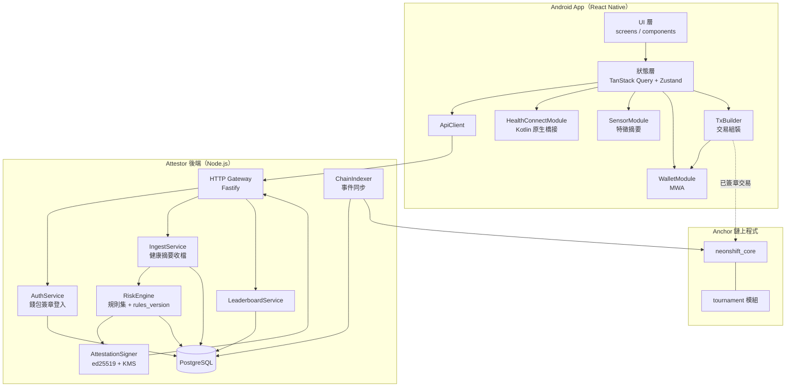
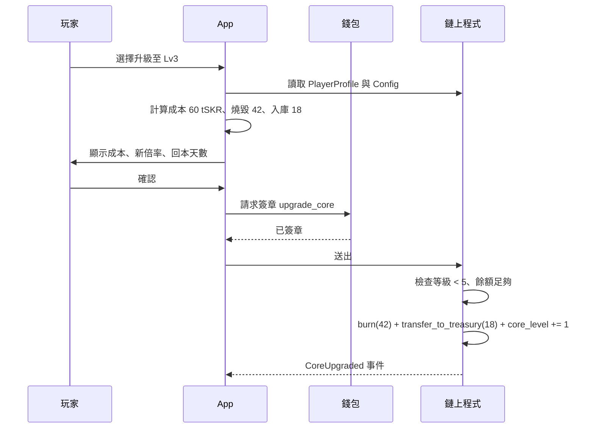
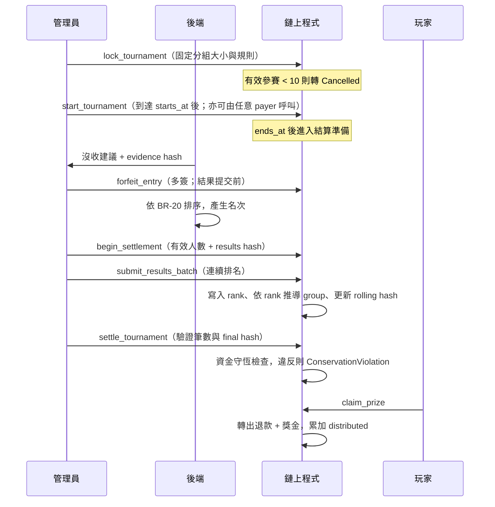

# NeonShift 系統設計文件（SD — System Design）

| 項目 | 內容 |
|---|---|
| 文件版本 | v0.4（新增合作活動設計） |
| 建立日期 | 2026-09-09 |
| 上游文件 | [BRD v0.6](./brd-detailed.md)、[SA v0.4](./sa.md)、[Style Guide v0.1](./style.md) |
| 目標平台 | Android only；最低 Android 14（API 34）；Solana Mobile Seeker 為主要裝置 |
| 網路 | Solana devnet |
| 代幣 | `tSKR`，devnet 測試 SPL Token，無金錢價值，非官方 SKR |
| 狀態標記 | 【定案】可直接實作；【草案】需 review；【待確認】對應 SA-Q 或 BRD Q |

---

## 1. 設計目標與約束

本文件把 SA 的業務規則轉為可實作規格：模組邊界、介面契約、資料結構、鏈上帳戶與指令、安全機制、測試與部署。

### 1.1 設計約束

| 編號 | 約束 | 來源 |
|---|---|---|
| C-01 | Android 單一平台，不建立 iOS 抽象層 | BRD 5.0 |
| C-02 | 影響獎勵金額的狀態必須在鏈上 | SA 6.2 |
| C-03 | 後端不得決定發放金額，也不得直接動用金庫 | BRD FR-03.4 |
| C-04 | 四週交付，M 級功能優先，C 級可砍 | BRD 13 |
| C-05 | 時間一律 UTC | SA 1.1 |
| C-06 | 不上傳原始感測器序列與 GPS 軌跡 | BRD NFR 隱私 |

### 1.2 設計取捨

| 議題 | 選項 | 決定 | 理由 |
|---|---|---|---|
| 獎勵發放 | 鏈上驗證 attestation vs 後端轉帳 | **鏈上驗證**【定案】 | 後端轉帳無法對評審展示去信任成分，且違反 C-03 |
| 跑鞋資產 | NFT（Metaplex Core）vs 純 PDA 狀態 | **純 PDA 狀態**【2026-09-14 定案】 | 不鑄造 NFT；Lv.1 跑鞋隨 `init_player` 直接贈與，外觀由 XP 推導的 `shoe_level` 決定，使用者不付費 |
| 獎勵狀態 | 寫入 NFT metadata vs 獨立 PDA | **獨立 PDA**【定案】 | metadata 更新需額外簽章且可能延遲，不適合作計算來源 |
| 排行榜 | 全程上鏈 vs 鏈下計算結算時上鏈 | **鏈下計算**【定案】 | 每小時更新全程上鏈成本過高 |
| 後端語言 | Node.js vs Rust | **Node.js（TypeScript）**【草案】 | 與前端共用型別，四週內迭代快 |
| tSKR token program | SPL Token vs Token-2022 | **經典 SPL Token、6 decimals、無 extensions**【定案】 | MVP 不需要 transfer hook／fee 等 extension，降低 CPI 與錢包相容風險 |

---

## 2. 系統架構

### 2.1 分層與模組



### 2.2 技術選型

| 層 | 技術 | 版本策略 |
|---|---|---|
| App 框架 | React Native + Expo custom development build | 不可使用 Expo Go，需原生模組 |
| 錢包 | `@solana-mobile/mobile-wallet-adapter-protocol-web3js` | 依 MWA 2.0 |
| 鏈上互動 | `@solana/web3.js` + Anchor client | 固定次版本 |
| 健康資料 | Health Connect Jetpack SDK，經自寫 Kotlin 橋接 | 需檢查 SDK extension 可用性 |
| 感測器 | Android SensorManager，原生取樣後回傳摘要 | 取樣 50 Hz，視窗 10 秒 |
| 狀態管理 | TanStack Query（伺服器狀態）+ Zustand（UI 狀態） | — |
| 後端 | Node.js 24 LTS + TypeScript + Fastify | 鎖定 major／minor、持續更新 patch；Node.js 20 已於 2026-03-24 EOL，不得使用 |
| 資料庫 | PostgreSQL 16 | — |
| 鏈上 | Anchor（Rust） | — |
| 金鑰 | 支援 Solana 相容 Ed25519 的 KMS／HSM；否則使用受管 secret + 隔離 signer service | 啟用版本化、存取稽核與輪替；禁止明文環境變數 |

---

## 3. 鏈上程式設計

### 3.1 帳戶結構

所有帳戶皆為 Anchor account，含 8 bytes discriminator。

**Config**（PDA seeds `["config"]`）

| 欄位 | 型別 | 說明 |
|---|---|---|
| `admin` | Pubkey | 多簽位址 |
| `cluster_id` | u8 | canonical attestation 的環境識別；devnet = 1 |
| `attestor_pubkey` | Pubkey | 目前有效的 attestor 驗簽公鑰 |
| `attestor_valid_from` | i64 | 輪替生效時間，支援新舊並行 |
| `prev_attestor_pubkey` | Pubkey | 輪替寬限期內的舊公鑰 |
| `prev_attestor_valid_until` | i64 | 舊公鑰失效時間 |
| `mint` | Pubkey | tSKR mint |
| `mint_decimals` | u8 | 初始化時要求等於 mint 的 6 decimals，後續金額皆使用最小單位 |
| `reward_vault` | Pubkey | 獎勵金庫 token account |
| `treasury_vault` | Pubkey | 國庫 token account |
| `daily_cap` | u64 | 單日上限，最小單位 |
| `base_steps_reward` | u64 | 步數任務基礎獎勵 |
| `base_sleep_reward` | u64 | 睡眠任務基礎獎勵 |
| `streak_enabled` | bool | FR-03.6 功能開關，MVP 預設 false |
| `streak_bonus_bps` | u16 | 啟用後加成，預設 11000；停用時一律使用 10000 |
| `burn_bps` | u16 | 保留（升級改為免費後不使用） |
| `core_multiplier_bps` | [u16; 5] | Core 1～5 倍率，預設 `[10000,12000,15000,18000,22000]` |
| `core_upgrade_costs` | [u64; 4] | 保留（升級改為免費後不使用） |
| `shoe_xp_thresholds` | [u64; 5] | 跑鞋 Lv1～5 的累積 XP 門檻 |
| `paused` | bool | 緊急停用 |
| `paused_at` | i64 | 最近一次進入 pause 的時間（實作期新增）；BR-24 以 `now - paused_at >= 600` 判斷有效 attestation 已全部過期 |
| `bump` | u8 | — |

**PlayerProfile**（PDA seeds `["player", wallet]`）

| 欄位 | 型別 | 說明 |
|---|---|---|
| `wallet` | Pubkey | 擁有者 |
| `core_level` | u8 | 1 至 5，控制獎勵倍率；2026-09-14 起與 `shoe_level` 同步由 XP 推導（免費升級） |
| `shoe_level` | u8 | 1 至 5，由 XP 門檻提升，控制外觀 |
| `xp` | u64 | 經驗值 |
| `last_task_date` | u32 | 最近完成任務的 UTC 日序 |
| `streak_days` | u16 | 連續天數 |
| `claimed_today` | u64 | 當日已領取量，`task_date` 變更時歸零 |
| `today_date` | u32 | `claimed_today` 對應的日序 |
| `bump` | u8 | — |

**ClaimReceipt**（PDA seeds `["claim", wallet, task_date_le, task_type]`）

帳戶存在本身即代表已領取，這是 BR-03 的實作方式。

| 欄位 | 型別 | 說明 |
|---|---|---|
| `wallet` | Pubkey | — |
| `task_date` | u32 | UTC 日序 |
| `task_type` | u8 | 1 = steps，2 = sleep |
| `amount` | u64 | 實發金額 |
| `nonce` | [u8; 16] | attestation nonce |
| `claimed_at` | i64 | — |
| `bump` | u8 | — |

**Tournament**（PDA seeds `["tournament", week_id_le]`）

| 欄位 | 型別 | 說明 |
|---|---|---|
| `week_id` | u32 | `ISO week-based year × 100 + ISO week`，例如 202641；不可只存 1～53 |
| `status` | u8 | 0 Draft、1 Registration、2 Locked、3 Running、4 Settling、5 Settled、6 Cancelled |
| `vault` | Pubkey | 本賽事專用 tSKR token account，由 Tournament PDA 控制 |
| `stake_amount` | u64 | 報名質押，建立時固定 |
| `total_staked` | u64 | — |
| `treasury_injection` | u64 | 國庫挹注，建立時固定並設上限 |
| `entrant_count` | u32 | — |
| `valid_entrant_count` | u32 | 報名截止時通過報名格式／資金檢查的人數，據此固定得獎組大小 |
| `forfeited_count` | u32 | 結果提交前已多簽沒收的人數 |
| `group_a_size` | u32 | 報名截止時依 BR-18 固定 |
| `group_b_size` | u32 | 同上 |
| `distributable_pool` | u64 | 結算時寫入 |
| `distributed` | u64 | 已發放累計，用於資金守恆檢查 |
| `total_refund` | u64 | 所有 entry 的應退款總額 |
| `total_prize` | u64 | 所有得獎者獎金總額 |
| `treasury_remainder` | u64 | 整數餘數與結算後歸庫額 |
| `results_submitted` | u32 | 已提交的連續排名筆數 |
| `results_hash` | [u8; 32] | 多簽在開始結算時承諾的最終 rolling hash |
| `results_rolling_hash` | [u8; 32] | 鏈上依排名順序逐筆更新的 rolling hash |
| `min_entrants` | u32 | 預設 10 |
| `registration_ends_at` / `starts_at` / `ends_at` | i64 | — |
| `rules_version` | u16 | 引用的判定規則版本 |
| `bump` | u8 | — |

**TournamentEntry**（PDA seeds `["entry", tournament, wallet]`）

| 欄位 | 型別 | 說明 |
|---|---|---|
| `tournament` | Pubkey | — |
| `wallet` | Pubkey | — |
| `stake` | u64 | — |
| `final_steps` | u64 | 結算時寫入 |
| `rank` | u32 | 0 表示未排名 |
| `group` | u8 | 0 無、1 A 組、2 B 組 |
| `forfeited` | bool | 是否沒收 |
| `settled` | bool | 是否已領取 |
| `evidence_hash` | [u8; 32] | 沒收時的證據摘要 |
| `bump` | u8 | — |

### 3.2 指令清單

| 指令 | 簽章者 | 主要檢查 | 事件 |
|---|---|---|---|
| `initialize_config` | 程式 upgrade authority | 僅可執行一次（Config PDA `init`）；簽章者必須等於 ProgramData 的 upgrade authority，`admin`（多簽）由參數指定。參數範圍：cluster_id ∈ {1,2}、基礎獎勵 > 0、daily_cap ≥ 最大基礎獎勵、streak_bonus 10000～20000、burn ≤ 10000、core 倍率 [0]=10000 且單調不減 ≤ 50000、升級成本 > 0、XP 門檻 [0]=0 且嚴格遞增、mint 為 6 decimals、reward vault owner = Config PDA | `ConfigInitialized` |
| `set_paused` | admin 多簽 | 進入 pause 時記錄 `paused_at`（重複 pause 不重設）。pause 範圍【2026-09-14 定案】：`clock_in`、`join_tournament` 拒絕（6000）；`claim_prize`、`refund_all` 與管理指令不受影響，使用者永遠能取回資金 | `PauseChanged` |
| `update_config` | admin 多簽 | 全欄位可選、整筆以 `initialize_config` 同一套規則驗證。`daily_cap`、`base_*_reward`、`streak_*`、`core_multiplier_bps` 為 BR-24 受控欄位，只能在 `paused && now - paused_at >= 600` 時更新（否則 6025）；`admin`、`burn_bps`、`core_upgrade_costs`、`shoe_xp_thresholds` 可即時更新。不影響已簽發證明或進行中賽事（賽事金額在建立時固定） | `ConfigUpdated` |
| `rotate_attestor` | admin 多簽 | `grace_seconds` 0～600：>0 時舊鑰保留至 `now + grace`，0 表示立即失效（外洩處置）；新鑰不得為 default 或與現行相同 | `AttestorRotated` |
| `init_player` | player | 帳戶未存在（PDA `init`）；需 Config 已初始化；不受 pause 影響（無資金流，onboarding 不中斷）；core／shoe level 起始 1、其餘欄位 0。**即為初階跑鞋的贈與**：不鑄造 NFT，事件含 `shoe_level` | `PlayerInitialized` |
| `clock_in` | player | 見 3.3。需 PlayerProfile 存在（跑鞋隨 profile 贈與，無獨立鑄鞋檢查）；`ClaimReceipt` 不用 Anchor `init`，於步驟 10 手動建立以回報 6009 並保證排在 attestation 驗證之後；步驟 9 的 mint／vault／收款帳戶／token program 約束由 Anchor 在進入 handler 前檢查 | `ClockedIn` |
| `open_tournament` | admin | 狀態為 Draft | `TournamentOpened` |
| `join_tournament` | player | 狀態為 Registration、未重複報名、mint 正確 | `TournamentJoined` |
| `lock_tournament` | admin | 報名截止、固定得獎組人數與規則、核對專用 vault；人數不足則轉 Cancelled，否則把受上限約束的國庫挹注轉入 vault | `TournamentLocked` / `TournamentCancelled` |
| `start_tournament` | 任意 payer | 已到 starts_at 且狀態為 Locked；只推進為 Running，不可改規則 | `TournamentStarted` |
| `begin_settlement` | admin 多簽 | 已過 ends_at、沒收處置完成、承諾最終有效人數與 results hash；轉為 Settling 後禁止新增沒收 | `SettlementBegan` |
| `submit_results_batch` | admin 多簽 | 狀態為 Settling、排名連續且不重複、符合預先承諾的 manifest hash | `ResultsBatchSubmitted` |
| `settle_tournament` | admin 多簽 | 所有合格 entry 已排名、資金守恆、轉為 Settled | `TournamentSettled` |
| `claim_prize` | player | 已 Settled、未領取 | `PrizeClaimed` |
| `forfeit_entry` | admin 多簽 | 只能在 `ends_at` 後、`begin_settlement` 前執行；需帶非零 `evidence_hash` 與 `rules_version` | `EntryForfeited` |
| `refund_all` | player | 賽事 Cancelled | `Refunded` |

### 3.3 `clock_in` 檢查順序【定案】

順序不可調換，前面的檢查較便宜且能擋掉多數攻擊。

1. `Config.paused == false`。
2. 由 `instructions` sysvar 取得目前 instruction index 並讀取緊鄰的前一道指令；index 為 0 時直接拒絕。確認前一道是 Ed25519 program、僅有一組簽章，signature／pubkey／message 的 instruction index 皆為該指令自身（其實際 index 或 `0xFFFF`）、message 長度恰為 164、三段 offset 落在合法邊界且不落在 header 區。任一不符為 6001。
3. 比對 ed25519 指令內的公鑰等於 `attestor_pubkey`，或在寬限期內等於 `prev_attestor_pubkey`。
4. 比對 ed25519 指令內的訊息 bytes 與本指令參數重建的 canonical bytes 完全一致。
5. 檢查 `program_id` 等於本程式、`cluster_id` 等於 Config 設定。
6. 檢查 `wallet` 等於簽章者。
7. 檢查 `issued_at <= not_before <= expiry`（否則 6027）、`expiry - issued_at <= 600`（checked，否則 6008）、`now >= not_before`（否則 6006）、`now <= expiry`（否則 6007）。
8. 計算 `current_task_date = floor(Clock.unix_timestamp / 86400)` 並要求 `task_date == current_task_date`；禁止前一日補領或讓 `today_date` 倒退。
9. 驗證 PlayerProfile、reward vault、收款 token account 的 wallet／mint／PDA seeds 與 token program 全部符合 Config。
10. 以 PDA 建立 `ClaimReceipt`，rent 由 player 支付；帳戶已存在則交易失敗（BR-03、BR-14 同時成立）。
11. 若 `PlayerProfile.today_date < task_date`，將 `claimed_today` 歸零並更新 `today_date`；若大於則拒絕為狀態錯誤。
12. 從 `Config.core_multiplier_bps[core_level - 1]` 取得倍率並計算 `amount`，再以 `min(amount, daily_cap - claimed_today)` 收斂（BR-04）。
13. `amount == 0` 時回傳錯誤 `DailyCapReached`。
14. 由 reward vault PDA 轉出 tSKR，更新 `claimed_today` 與 `xp`。streak 只在 `last_task_date < task_date` 時更新，同日第二項任務不重複增加。
15. 依 `shoe_xp_thresholds` 更新等級：`shoe_level` 與 `core_level` 一起設為推導值（2026-09-14 免費升級定案；本次獎勵已在步驟 12 以舊倍率計算，新倍率自下次打卡生效）。
16. 發出 `ClockedIn` 事件，包含 `shoe_level`、`core_level` 與實發金額。

### 3.4 獎勵計算（定點數）

```rust
// 全程 u128 運算後再收斂回 u64，避免中途溢位
let base: u64 = match task_type {
    TASK_STEPS => config.base_steps_reward,
    TASK_SLEEP => config.base_sleep_reward,
    _ => return err!(ErrorCode::InvalidTaskType),
};
let multiplier_index = profile.core_level
    .checked_sub(1)
    .ok_or(ErrorCode::InvalidCoreLevel)? as usize;
let multiplier_bps = config.core_multiplier_bps
    .get(multiplier_index)
    .ok_or(ErrorCode::InvalidCoreLevel)?;
let effective_streak_days = if profile.last_task_date == task_date {
    profile.streak_days
} else if profile.last_task_date.checked_add(1) == Some(task_date) {
    profile.streak_days.checked_add(1).ok_or(ErrorCode::MathOverflow)?
} else {
    1
};
let streak_bps: u64 = if config.streak_enabled && effective_streak_days >= 7 {
    config.streak_bonus_bps as u64
} else {
    10_000
};
let raw = (base as u128)
    .checked_mul(*multiplier_bps as u128).ok_or(ErrorCode::MathOverflow)?
    .checked_mul(streak_bps as u128).ok_or(ErrorCode::MathOverflow)?
    / 100_000_000u128;                       // 10_000 * 10_000
let amount = u64::try_from(raw).map_err(|_| ErrorCode::MathOverflow)?;
let remaining = config.daily_cap.saturating_sub(profile.claimed_today);
let amount = amount.min(remaining);         // BR-04
```

倍率索引對應 `core_level`；免費升級後它與 `shoe_level` 恆相等，皆由 XP 推導。預設 Lv1～5 分別為 10000、12000、15000、18000、22000 bps。
`effective_streak_days` 必須在計算第 7 個連續任務日的獎勵前先推導，再於成功轉帳後寫回；同日第二項任務沿用同一值，不可累加兩次。

所有 Config 金額與帳戶欄位皆使用 tSKR 最小單位；UI 才依固定 6 decimals 格式化。（升級分配公式因免費升級作廢；`split_upgrade_cost` 保留供未來付費功能。）

### 3.5 Attestation canonical bytes【定案】

固定 164 bytes，little-endian，無分隔符，避免欄位歧義造成的簽章重解讀攻擊。

| offset | 長度 | 欄位 | 說明 |
|---|---|---|---|
| 0 | 19 | domain | ASCII `NEONSHIFT_ATTEST_V1`，無零結尾 |
| 19 | 1 | `version` | 目前為 1 |
| 20 | 32 | `program_id` | 綁定程式（BR-14） |
| 52 | 1 | `cluster_id` | 1 = devnet |
| 53 | 32 | `wallet` | 領取者 |
| 85 | 4 | `task_date` | UTC 日序 u32 |
| 89 | 1 | `task_type` | 1 steps / 2 sleep |
| 90 | 2 | `rules_version` | u16 |
| 92 | 32 | `evidence_hash` | SHA-256(判定輸入摘要) |
| 124 | 8 | `issued_at` | i64 |
| 132 | 8 | `not_before` | i64 |
| 140 | 8 | `expiry` | i64 |
| 148 | 16 | `nonce` | 隨機 |

**刻意不包含金額**。金額由鏈上依 Config 與 PlayerProfile 計算，符合 C-03。

**2026-09-14 契約核對**：以 ASCII 編碼確認 domain 為 19 bytes，現有 164-byte layout 與 offsets 正確，不增加零結尾。時效須驗證 `issued_at <= not_before <= expiry`；Rust／TypeScript `validate` 已於 2026-09-14 補上第一個不等式並加入負向測試與向量（`invalid_issued_at_after_not_before` 等 5 組），鏈上以 6027 拒絕。

`evidence_hash` 的輸入只包含實際參與判定的欄位、資料來源摘要及 `rules_hash`，先依固定 schema 排序，再以 RFC 8785 JSON Canonicalization Scheme 產生 bytes 並做 SHA-256。伺服器保存相同 canonical bytes 的 hash，不保存一份不同排序的 request JSON 作為稽核依據。

### 3.6 錯誤碼

| 代碼 | 名稱 | 觸發 |
|---|---|---|
| 6000 | `ProgramPaused` | Config 停用中 |
| 6001 | `MissingEd25519Instruction` | 前置指令缺失或格式錯誤 |
| 6002 | `InvalidAttestorKey` | 公鑰不符且不在寬限期 |
| 6003 | `AttestationMismatch` | canonical bytes 不一致 |
| 6004 | `WrongProgramOrCluster` | 跨環境重用 |
| 6005 | `WalletMismatch` | 簽章者非 attestation 指定錢包 |
| 6006 | `AttestationNotYetValid` | 未到 `not_before` |
| 6007 | `AttestationExpired` | 已過 `expiry` |
| 6008 | `AttestationTtlTooLong` | 有效期超過 600 秒 |
| 6009 | `AlreadyClaimed` | ClaimReceipt 已存在 |
| 6010 | `DailyCapReached` | 剩餘額度為 0 |
| 6011 | `MathOverflow` | 定點數運算溢位 |
| 6012 | `Reserved6012` | 保留（原 ShoeAlreadyMinted，NFT 取消後不用） |
| 6013 | `MaxCoreLevel` | 保留（免費升級後不使用） |
| 6014 | `InvalidTournamentState` | 狀態機不允許 |
| 6015 | `AlreadyJoined` | 重複報名 |
| 6016 | `InsufficientEntrants` | 有效參賽 < min_entrants |
| 6017 | `ConservationViolation` | 結算後總出入不符 |
| 6018 | `MissingEvidence` | 沒收未附證據摘要 |
| 6019 | `InvalidTaskDate` | task_date 不是鏈上目前 UTC 日序 |
| 6020 | `InvalidCoreLevel` | Core level 超出 Config 陣列範圍 |
| 6021 | `InvalidTokenAccount` | mint、owner、vault PDA 或 token program 不符 |
| 6022 | `InvalidResultBatch` | 排名非連續、重複或與 manifest 不符 |
| 6023 | `InvalidConfigParam` | `initialize_config`／`update_config` 參數超出允許範圍（實作期新增） |
| 6024 | `NotUpgradeAuthority` | `initialize_config` 的簽章者不是程式 upgrade authority（實作期新增） |
| 6025 | `RewardParamsChangeRequiresPause` | BR-24：未 pause 或 pause 未滿 600 秒即更新影響獎勵金額的參數（實作期新增） |
| 6026 | `Unauthorized` | 管理指令簽章者不是 `Config.admin`（實作期新增） |
| 6027 | `InvalidAttestationWindow` | attestation 時間欄位不滿足 `issued_at <= not_before <= expiry`（實作期新增；步驟 7 的前半） |
| 6028 | `InvalidTaskType` | task_type 不是 1／2（實作期新增；SD 3.4 程式片段原引用此名稱） |

---

## 4. 後端設計

### 4.1 API 一覽

Base path `/v1`。除登入相關外皆需 Bearer JWT。錯誤回應統一為 `{ "error": { "code": "...", "message": "...", "rules_version": 3 } }`；`rules_version` 僅在風險判定相關錯誤出現，驗證、限流或系統錯誤不得填入虛構版本。

| Method | Path | 用途 | 對應 UC |
|---|---|---|---|
| POST | `/auth/nonce` | 取得登入 nonce | UC-01 |
| POST | `/auth/verify` | 驗證錢包簽章，發 15 分鐘 access JWT 與最長 24 小時 refresh session | UC-01 |
| POST | `/auth/refresh` | 以 refresh token 輪替 session；不要求尚未過期的 access JWT | UC-01 |
| POST | `/auth/logout` | 撤銷目前 session family，重複登出仍成功 | UC-01 |
| POST | `/auth/challenge` | 取得綁定 wallet、purpose 與 request hash 的單次敏感操作 challenge | UC-05、UC-08 |
| POST | `/attestation/claim` | 上傳單次任務的最小必要健康摘要並申請 attestation | UC-05 |
| GET | `/player/history?days=30` | 打卡歷史 | UC-11 |
| DELETE | `/player/data` | 刪除後端個資；無延後項目回 204，有進行中賽事需依 BR-25 延後時回 202 與 `deletion_due_at` | UC-12 |
| GET | `/tournament/current` | 目前賽事資訊 | UC-07 |
| POST | `/tournament/steps` | 賽事期間步數回報 | UC-08 |
| GET | `/tournament/{weekId}/leaderboard` | 排行榜（含 `generated_at`） | UC-08 |
| GET | `/rules/version` | 目前 rules_version 與公開說明 | 稽核 |

### 4.2 Wallet authentication

`POST /auth/nonce` 產生 32-byte CSPRNG nonce，保存雜湊、wallet、建立時間與 5 分鐘到期時間；nonce 僅能成功使用一次。`POST /auth/verify` 採 Sign In With Solana 格式，至少綁定 domain、URI、wallet、statement、nonce、issued-at、expiration-time、request-id 與 devnet chain id，並驗證簽章地址等於請求 wallet。

驗證成功後簽發短期 access JWT（最長 15 分鐘）及可撤銷 refresh session（最長 24 小時）。【實作 2026-09-14】SIWS `statement` 固定為「Sign in to NeonShift. This request will not trigger a blockchain transaction or cost any gas fees.」；`/auth/nonce` 回傳完整訊息供 App 直接簽；access JWT 以 HS256（`JWT_SECRET`）簽發，`sid` claim 指向 refresh session，Bearer 驗證同時檢查 session 未撤銷與玩家未刪除；驗簽先於 nonce 消耗，壞簽章不會燒掉 nonce。JWT 固定 `iss`、`aud`、`sub=wallet`、`jti`、`iat`、`nbf`、`exp`，API 嚴格限制允許的簽章演算法。refresh token 每次使用都輪替並偵測舊 token 重用，發現重用時撤銷該 session family。登出、刪除資料或 wallet 切換時撤銷 refresh session；高風險操作不得只依賴舊 JWT。

申請 attestation 前，App 先對 claim body（不含 `claim_authorization`）做與 3.5 相同的 canonicalization 及 SHA-256，再呼叫 `/auth/challenge`（`purpose=claim`）。後端回傳 32-byte 隨機 nonce 與 5 分鐘 expiry，並綁定 JWT wallet、purpose、task_date、task_type、request_hash。App 透過 MWA 簽署 `NEONSHIFT_CLAIM_V1 || nonce || request_hash || expiry_le`。`/attestation/claim` 必須驗證此簽章與單次 challenge，符合 BRD 9.2「以錢包簽署請求」；JWT 只負責 session，不可取代本次 claim 授權。

API 共通要求：TLS only、request body 上限、schema validation、wallet／IP rate limit、結構化 audit log；不得記錄 JWT、完整簽章或健康 request body。伺服器只信任驗證後 JWT 的 `sub`，不信任 body 內另傳的 wallet。

### 4.3 `POST /attestation/claim`

Header `Idempotency-Key` 為 client 產生的 UUID。相同 wallet、key 與 request hash 在 10 分鐘內重試時回傳相同結果；相同 key 搭配不同 payload 回 `409 IDEMPOTENCY_CONFLICT`。attestation 過期後重簽必須使用新 key，並受 wallet／task rate limit；鏈上 ClaimReceipt 仍是最終唯一性依據。

同 idempotency key 的重試應先查既有結果再檢查 challenge，因此網路中斷後可取得原回應；首次處理或使用新 key 時，challenge 必須有效、內容相符且未使用。

前述快取查詢仍須先驗證身分、session 未撤銷及玩家未刪除；不可繞過刪除或登出。首次處理須以資料庫交易／唯一約束原子消耗 challenge 並保留處理狀態；相同 key 的並發請求只允許一個處理者。保存完整成功回應（message、signature、key）及拒絕結果至重試期限，不能只存 nonce 再重新簽章。現有 4.5 SQL 尚缺 idempotency result／processing 狀態，PG-B-02／B-11 須以 migration 補齊，並測試 signer 成功後 process crash 的恢復。

Request

```json
{
  "task_type": "steps",
  "task_date": 20706,
  "claim_authorization": {
    "challenge_b64": "…32 bytes…",
    "expires_at": 1789000300,
    "signature_b64": "…64 bytes…"
  },
  "steps": 9420,
  "sleep_minutes": null,
  "step_rate_summary": {
    "bucket_minutes": 1,
    "buckets": [[412, 96], [413, 131], [414, 142]]
  },
  "data_origins": [
    {
      "package": "com.android.healthconnect.phone.<app-scoped-spn>",
      "source_kind": "current_device_spn",
      "steps": 9420
    }
  ],
  "sensor_summary": {
    "sample_rate_hz": 50,
    "window_count": 2,
    "window_seconds": 10,
    "step_delta": 34,
    "dominant_freq_hz": 1.87,
    "freq_variance": 0.31,
    "accel_rms": 1.24,
    "gyro_rms": 0.42,
    "zero_crossing_rate": 3.6
  },
  "motion_summary": { "displacement_m": 5120, "gps_available": true },
  "client": {
    "app_version": "0.4.1",
    "device_model": "Seeker",
    "os_api": 34,
    "sdk_extension": 20
  }
}
```

Response 200

```json
{
  "attestation": {
    "message_b64": "…164 bytes…",
    "signature_b64": "…64 bytes…",
    "attestor_pubkey": "…",
    "expires_at": 1789000600,
    "nonce": "…"
  },
  "rules_version": 3
}
```

Response 422（拒絕）

```json
{ "error": { "code": "SRC_UNATTRIBUTED", "message": "資料來源無法驗證", "rules_version": 3 } }
```

拒絕代碼沿用 SA 附錄 A。**回應不得包含風險分數與門檻數值**，避免被用來反推規則。

`source_kind` 與 package 皆為不可信 client input。後端只把它們當風險訊號；App 必須以 Android framework `getCurrentDeviceDataSource()` 動態取得目前 SPN，並兼容歷史 `android`，不得以 Google Fit 或其他第三方 package 冒充裝置來源。

`POST /tournament/steps` 涉及已質押資產，沿用 4.2 的 request-specific wallet signature、challenge、request hash 與 idempotency 規則，但使用獨立 domain `NEONSHIFT_TOURNAMENT_STEPS_V1`；僅有 Bearer JWT 不足以提交或覆寫賽事分數。更新後的 `verified_steps` 必須單調不減，且只能計入 `starts_at <= record interval <= ends_at` 的資料。

### 4.4 風險引擎

規則以設定檔宣告。`rules_version` 是單調遞增的 u16 識別碼；完整 canonicalized 設定另計算 SHA-256 `rules_hash`，兩者共同保存，不得把截斷雜湊直接當版本號。

```yaml
rules_version: 3
rules_hash: "sha256:<computed-from-canonical-config-without-this-field>"
hard_reject:
  - id: SRC_UNATTRIBUTED
    when: task_type == "steps" && attributed_steps == 0
  - id: SRC_MANUAL
    when: task_type == "steps" && accepted_steps_include_manual_origin
  - id: SLEEP_RANGE
    when: task_type == "sleep" && (sleep_minutes < 180 || sleep_minutes > 720)
  - id: NO_SENSOR
    when: task_type == "steps" && sensor == null
  - id: LIVE_MOTION_INCOMPLETE
    when: task_type == "steps" && sensor.step_delta < 10
clamp:
  - id: RATE_EXCEEDED
    max_steps_per_minute: 250
  - id: DAILY_CAP
    max_steps_per_day: 40000
score:
  - id: freq_variance_low        # 搖步機特徵：頻率過於規律
    weight: 35
    when: task_type == "steps" && sensor.step_delta >= 10 && sensor.freq_variance < 0.08
  - id: no_displacement_high_steps
    weight: 20
    when: motion.gps_available && motion.displacement_m < 200 && attributed_steps > 15000
  - id: stride_implausible
    weight: 25
    when: motion.gps_available && (stride < 0.3 || stride > 1.5)
  - id: sleep_overlap_stepping
    weight: 20
    when: task_type == "sleep" && overlap_minutes > 60
threshold: 60
```

設計要點。硬拒絕與夾限先執行，評分規則只在資料通過硬拒絕後計算。門檻 60 為初始保守值，第三週依 BRD 4.1 的資料集校準（SA-Q2）。每次判定寫入 `risk_decisions`，含輸入雜湊、命中規則、分數與版本，供誤判申訴查核。

**任務分流與達標檢查**：步數先排除不允許來源，再夾限速率與每日總量；排除資料的存在不應使其餘合格資料整筆被拒。後端必須自行檢查有效步數 ≥ 8,000 或合格睡眠 ≥ 420 分鐘，未達回 `TASK_NOT_MET`，不得只依賴 App 按鈕。睡眠不要求步數、SPN 或 live motion；其允許來源及重疊去重政策待 SA-Q6 定案。本 YAML 是規則示意，不能直接視為完整可部署規則。GPS 規則僅適用步數且有同時段位移資料時；夾限後仍達標可簽發。

**摘要可重算性【2026-09-14 定案】**：`step_rate_summary` 為分鐘桶 `buckets: [[minute_of_utc_day, steps], …]`（升冪、不重複、只含允許來源）。App 端把每筆 StepsRecord 的步數均勻攤到它涵蓋的分鐘（整數除法，餘數由前往後每分鐘 +1；裁到任務日區間），之後丟棄 records。後端 `attributeAndClampSteps`：桶總和必須等於允許來源步數總和（否則 400 VALIDATION，不簽發）；逐桶 `min(steps, 250)` 相加為有效步數（記 `RATE_EXCEEDED`），再夾單日 40,000（記 `DAILY_CAP`）；沒有桶時有效步數為 0，不假裝已夾限。`observed_minutes`／`max_steps_per_minute` 由桶推導，不再由 client 傳。

### 4.5 資料庫 schema

```sql
CREATE TABLE players (
  wallet            TEXT PRIMARY KEY,
  first_seen_at     TIMESTAMPTZ NOT NULL DEFAULT now(),
  last_seen_at      TIMESTAMPTZ NOT NULL DEFAULT now(),
  deleted_at        TIMESTAMPTZ
);

CREATE TABLE auth_challenges (
  nonce_hash        BYTEA PRIMARY KEY,
  wallet            TEXT NOT NULL,
  purpose           TEXT NOT NULL,                 -- login / claim / tournament_steps
  request_hash      BYTEA,                         -- claim 時必填
  task_date         INTEGER,
  task_type         SMALLINT,
  expires_at        TIMESTAMPTZ NOT NULL,
  used_at           TIMESTAMPTZ
);

CREATE TABLE auth_sessions (
  jti               UUID PRIMARY KEY,
  family_id         UUID NOT NULL,
  wallet            TEXT NOT NULL REFERENCES players(wallet),
  refresh_hash      BYTEA NOT NULL UNIQUE,
  expires_at        TIMESTAMPTZ NOT NULL,
  used_at           TIMESTAMPTZ,
  rotated_to        UUID,
  revoked_at        TIMESTAMPTZ
);
CREATE INDEX ON auth_sessions (family_id);

CREATE TABLE rule_sets (
  rules_version     INTEGER PRIMARY KEY CHECK (rules_version BETWEEN 0 AND 65535),
  rules_hash        BYTEA NOT NULL UNIQUE,
  config            JSONB NOT NULL,
  created_at        TIMESTAMPTZ NOT NULL DEFAULT now(),
  CHECK (octet_length(rules_hash) = 32)
);

CREATE TABLE health_snapshots (
  id                BIGSERIAL PRIMARY KEY,
  wallet            TEXT NOT NULL REFERENCES players(wallet),
  task_date         INTEGER NOT NULL,              -- UTC 日序
  task_type         SMALLINT NOT NULL,             -- 1 steps / 2 sleep
  attributed_steps  INTEGER,
  sleep_minutes     INTEGER,
  source_summary    JSONB NOT NULL,
  step_rate_summary JSONB,
  sleep_overlap_minutes INTEGER,
  sensor_summary    JSONB,                         -- steps 任務 live check；sleep 可為空
  motion_summary    JSONB,
  client_info       JSONB NOT NULL,
  input_hash        BYTEA NOT NULL,                -- evidence_hash 來源
  created_at        TIMESTAMPTZ NOT NULL DEFAULT now()
);
CREATE INDEX ON health_snapshots (wallet, task_date, task_type);
CREATE INDEX ON health_snapshots (created_at);      -- 30 天清理

CREATE TABLE risk_decisions (
  id                BIGSERIAL PRIMARY KEY,
  snapshot_id       BIGINT NOT NULL REFERENCES health_snapshots(id) ON DELETE CASCADE,
  rules_version     INTEGER NOT NULL CHECK (rules_version BETWEEN 0 AND 65535),
  risk_score        SMALLINT NOT NULL,
  matched_rules     TEXT[] NOT NULL,
  decision          TEXT NOT NULL,                 -- pass / reject
  reject_code       TEXT,
  created_at        TIMESTAMPTZ NOT NULL DEFAULT now()
);

CREATE TABLE attestations (
  nonce             BYTEA PRIMARY KEY,
  idempotency_key   UUID NOT NULL,
  request_hash      BYTEA NOT NULL,
  wallet            TEXT NOT NULL,
  task_date         INTEGER NOT NULL,
  task_type         SMALLINT NOT NULL,
  rules_version     INTEGER NOT NULL CHECK (rules_version BETWEEN 0 AND 65535),
  evidence_hash     BYTEA NOT NULL,
  issued_at         TIMESTAMPTZ NOT NULL,
  expires_at        TIMESTAMPTZ NOT NULL,
  redeemed_sig      TEXT,                          -- 由 indexer 回填
  UNIQUE (wallet, idempotency_key),
  CHECK (octet_length(nonce) = 16),
  CHECK (octet_length(evidence_hash) = 32),
  CHECK (octet_length(request_hash) = 32)
);

CREATE TABLE tournament_steps (
  week_id           INTEGER NOT NULL,
  wallet            TEXT NOT NULL,
  verified_steps    BIGINT NOT NULL DEFAULT 0,
  first_reached_at  TIMESTAMPTZ,                   -- BR-20 決勝用
  updated_at        TIMESTAMPTZ NOT NULL DEFAULT now(),
  PRIMARY KEY (week_id, wallet)
);

CREATE TABLE chain_events (
  signature         TEXT NOT NULL,
  event_index       INTEGER NOT NULL,
  slot              BIGINT NOT NULL,
  blockhash         TEXT NOT NULL,
  commitment        TEXT NOT NULL,                 -- confirmed / finalized
  orphaned_at       TIMESTAMPTZ,
  event_name        TEXT NOT NULL,
  payload           JSONB NOT NULL,
  ingested_at       TIMESTAMPTZ NOT NULL DEFAULT now(),
  PRIMARY KEY (signature, event_index)
);
```

保留政策：健康摘要與其衍生資料依 BR-25 最長保留 30 天，包括 `health_snapshots`、`risk_decisions`、`tournament_steps`、可關聯健康輸入的 attestation／idempotency 快取與稽核紀錄。每日批次只能作清理補強；查詢及處理路徑須拒用逾期資料，刪除工作須在期限內完成，不能額外多留一天。`risk_decisions` 以 CASCADE 刪除；其他表須有明確清理路徑。雜湊與 wallet 仍可關聯，不能以「不可逆」自動認定可永久保存。刪除請求同步撤銷 session、禁止新處理，依 BR-25 刪除或排定期限；SQL 尚須補入 deletion_due_at 與相關保留欄位。公開鏈上資料保留與後端健康資料刪除分開處理，不因重新索引復原已刪健康資料。

ChainIndexer 以 `(signature, event_index)` 冪等寫入，先記錄 `confirmed` 供 UI 快速顯示，再追蹤至 `finalized`。若交易在 finalization 前不再位於 canonical fork，標記 `orphaned_at` 並回滾其衍生 projection；不可刪除原 row 或把 `confirmed` 當永久事實。排行榜與結算輸入只採用已 `finalized` 且未 orphaned 的鏈上事件。

### 4.6 金鑰管理

| 金鑰 | 用途 | 保管 | 輪替 |
|---|---|---|---|
| attestor 私鑰 | 簽 attestation | 優先使用支援 raw Ed25519 且輸出與 Solana Ed25519 program 相容的 KMS／HSM；否則使用受管 secret + 隔離 signer，金鑰不得進入 API process 記憶體 | `rotate_attestor` + 寬限期 |
| admin 多簽 | Config、開賽、沒收 | 團隊成員各持一把 | 依需要 |
| 金庫 PDA | 轉出 tSKR | 程式持有，無私鑰 | 不適用 |
| mint authority | 初始鑄造後撤銷 | 撤銷後不存在 | 不適用 |
| APK signing key | 商店提交 | 離線保存 + 指紋登記 | 不適用 |

---

## 5. App 設計

### 5.1 模組職責

| 模組 | 職責 | 不負責 |
|---|---|---|
| `HealthConnectModule`（Kotlin） | 權限、`aggregate()`、session 讀取、dataOrigin | 達標判定 |
| `SensorModule`（Kotlin） | 步數任務當日首次領取前執行 20 秒引導式 live motion check，以前景 50 Hz、兩個 10 秒視窗產生統計摘要與同步步數增量 | 推論視窗外的歷史步數、背景持續錄製、保存或上傳原始序列 |
| `WalletModule` | MWA 授權、token 保存、簽章 | 交易內容組裝 |
| `TxBuilder` | 組 ed25519 + 程式指令、預估費用 | 送出與重試 |
| `ChainClient` | 送交易、確認、查帳戶 | UI 狀態 |
| `ApiClient` | 後端呼叫、JWT 續期 | 業務判定 |
| `TaskEngine` | 達標判定、任務狀態機（SA 6.3） | 資料讀取 |

`HealthConnectModule` 在 Android 14 啟動時先檢查 SDK extension：裝置內建步數需 extension 20 以上；目前裝置 SPN 透過 framework `HealthConnectManager.getCurrentDeviceDataSource()` 動態取得，並兼容歷史 `android`。總步數以對應 `DataOrigin` filter 呼叫 `aggregate()`；為執行每分鐘速率規則，可另讀允許來源的 StepsRecord intervals，在本機彙總成 `step_rate_summary` 後立即丟棄 records。不可先聚合所有來源後再把第三方來源標成裝置來源。

2026-09-14 依 [Android 官方讀取文件](https://developer.android.com/health-and-fitness/health-connect/read-data) 再核對：SPN 查詢 API 的門檻為 extension 11，內建計步則為 20，須分開檢查。所有分頁均須讀完，permission、API 不可用與無資料狀態分開呈現。

### 5.2 導航結構【對應 style.md 第 2 章】

```
Native Launch → Bootstrap Loading → Landing（未連線）
      └→ Onboarding：Wallet → Health → Activity → Shoe Mint
Tabs: Dashboard | Gear | Arena | Profile
```

### 5.3 關鍵前端邏輯

**交易冪等（對應 UC-05 例外 E6）**。送出交易前以 `(wallet, task_date, task_type)` 推導 ClaimReceipt PDA，並保存 transaction signature、blockhash 與 `lastValidBlockHeight`。RPC 逾時後先查 receipt 與原簽章；receipt 存在即成功。只有在原交易已確定失敗，或 block height 超過 `lastValidBlockHeight` 且 receipt 仍不存在時，才可取得新 attestation／blockhash 重建交易；不可盲目重送同一 signed transaction。

**UTC 日界線**。所有任務日以 `floor(unixSeconds / 86400)` 計算，UI 顯示時再轉裝置時區並標註 UTC 換日倒數，避免使用者以為跨日重置時間有誤。

**離線降級**。無網路時 Dashboard 顯示最後同步時間與快取值，打卡按鈕停用並說明原因，不進入驗證中狀態。

**設計 token**。色彩、間距、字級一律引用 style.md 第 18 章的 token mapping，不在元件內寫死色碼。

**本機敏感資料**。MWA authorization token、access／refresh token 使用 Android Keystore-backed encrypted storage，不得放入 AsyncStorage、log、crash report 或 analytics。健康快取只保存 UI 所需的最近摘要與同步時間，採加密儲存；登出或刪除資料時清除。App 不保存 attestor 私鑰、wallet seed phrase 或原始感測器序列。

---

## 6. 關鍵流程序列

### 6.1 升級數據核心（原子性）



三個動作在同一指令內完成，任一失敗整筆回滾，滿足 FR-05.1。

### 6.2 賽事結算



**資金守恆斷言**在 `settle_tournament` 與每次 `claim_prize` 都執行：

```
total_staked + treasury_injection
  == total_refund + total_prize + treasury_remainder
且 results_submitted == valid_entrant_count - forfeited_count
且 distributed <= total_refund + total_prize
```

每筆結果的 canonical encoding 至少包含 `tournament、wallet、final_steps、first_reached_at、rank、forfeited`；rolling hash 定義為 `H(previous_hash || canonical_entry)`，初始值為 32 bytes zero。`submit_results_batch` 只接受從 `results_submitted + 1` 開始的連續 rank，entry 不可重複，並逐筆累加應退款與應得獎金；group 必須由 rank 與鎖定時的 group size 在鏈上推導，不接受管理員自報。`settle_tournament` 要求提交筆數等於 `valid_entrant_count - forfeited_count` 且 rolling hash 等於 `begin_settlement` 承諾值，再把 `treasury_remainder` 轉回 treasury vault。這使管理員提交可稽核且不可在批次中途偷換，但健康分數與排序本身仍信任後端及管理員多簽，不得宣稱為去信任排行榜。

---

## 7. 測試策略

| 層級 | 範圍 | 工具 | 重點案例 |
|---|---|---|---|
| 鏈上單元 | 指令邏輯 | Anchor + LiteSVM | 檢查順序、錯誤碼、定點數邊界 |
| 鏈上 property | 資金守恆 | proptest | 隨機參賽人數與名次，驗證 BR-17 恆成立 |
| 鏈上安全 | 攻擊情境 | 手寫測試 | 重放同一 attestation、跨 cluster、竄改 bytes、偽造 ed25519 指令、缺少前置指令 |
| 鏈上狀態 | 任務日／等級 | Anchor + LiteSVM | 前一日補領、午夜前後亂序、同日雙任務 streak、XP 不得提升 Core、Core 升級不得改 Shoe level |
| 賽事結算 | 批次與金庫 | property test + 整合測試 | rank 缺號／重複、rolling hash 不符、forfeit 時序、專用 vault mint／owner、全額退款 |
| 後端單元 | 風險規則 | Vitest | 每條規則的正負案例、`rules_version` 綁定 |
| 後端整合 | API + DB | Testcontainers | 拒絕碼、JWT、刪除個資後不可查 |
| App 單元 | TaskEngine、UTC 換算 | Jest | 跨午夜、時區切換、夏令時間 |
| App 原生 | Health Connect 橋接 | Android instrumented | 四種 dataOrigin、權限撤銷 |
| E2E | 打卡全流程 | Maestro + devnet | 達標打卡、重複打卡、離線、取消簽章 |
| 實機驗收 | KPI | 人工 | 冷啟動 P95、端到端秒數、真人與搖步機資料集 |

**必測的攻擊案例清單**（對應 BR-14、BR-15）：同一 attestation 重送、他人 attestation 換自己錢包、把 devnet attestation 送到另一個 program id、修改 `task_date` 前 4 bytes、前一日證明在午夜後送出、把 expiry 改成一年後、`issued_at > expiry`、ed25519 指令帶兩組簽章、offset 指向其他 instruction、訊息與參數差一個 byte、替換 reward vault／mint／token program。

---

## 8. 部署與環境

| 環境 | 用途 | Solana | 後端 | 資料 |
|---|---|---|---|---|
| local | 開發 | localnet | docker compose | 可重置 |
| dev | 整合 | devnet，dev program id | Railway 或 Fly.io | 可重置 |
| demo | 錄影與評審 | devnet，demo program id | 與 dev 分離的後端實例及資料庫 | 保留 |

`demo` 與 `dev` 使用**不同的 program id、attestor 金鑰、資料庫與 App build configuration**，避免測試資料污染評審環境，同時驗證 BR-14 的跨環境隔離。API base URL、program id 與 cluster id 必須在 build-time 成組選擇，禁止各自以可被使用者修改的 production runtime flag 混搭；attestor key 則以鏈上 Config 為權威並支援輪替，後端啟動時必須比對自身 public key 與 Config。

**網域與識別（2026-09-14 定案）**：正式網域 `neonshift.cc`。

| 項目 | 值 | 說明 |
|---|---|---|
| Android applicationId | `cc.neonshift.app` | 反向網域；dApp Store 送審後不可更改 |
| API base URL（dev） | `https://api-dev.neonshift.cc/v1` | build-time 寫入 dev build |
| API base URL（demo） | `https://api.neonshift.cc/v1` | build-time 寫入 demo build |
| SIWS `domain`／JWT `iss` | `neonshift.cc` | 4.2 登入訊息綁定；後端拒絕其他 domain |
| App Links | `https://neonshift.cc/e/<slug>` | 11.4 NFC／App Links；`assetlinks.json` 需列 release 簽章指紋 |
| 隱私政策 | `https://neonshift.cc/privacy` | dApp Store 提交必填（BRD 14） |
| 深層連結 scheme | `neonshift://` | 保留給 MWA 回呼與 dev client |

部署順序：部署程式 → `initialize_config` → 鑄造 tSKR 固定供給 → 撤銷 mint authority → 撥款至獎勵金庫 → 設定 attestor 公鑰 → 後端上線 → 發佈 APK。

**回滾**。Config 具 `paused` 旗標可即時停止發放，不需重新部署。程式 upgrade authority 在未完成獨立安全審查前不建議撤銷；MVP 以團隊多簽持有、記錄部署 buffer／program data 位址與可重現 build hash。若日後撤銷，必須先確認程式無法再修補且由負責人接受不可逆風險。

---

## 9. 可觀測性

| 訊號 | 內容 | 告警 |
|---|---|---|
| 業務指標 | 每日 attestation 簽發數、拒絕率、各拒絕碼分佈 | 拒絕率單日變動超過 20 個百分點 |
| 金庫 | 獎勵金庫餘額 | 低於 7 日預估發放量 |
| 鏈上 | 交易失敗率、各錯誤碼次數 | `ConservationViolation` 出現任一次即最高等級 |
| 效能 | API P95、RPC 延遲 | P95 超過 800 毫秒 |
| 安全 | attestation 重放嘗試次數 | 單一錢包單日超過 10 次 |
| 安全 | attestation 簽發量與唯一錢包成長 | 15 分鐘簽發量超過移動基線 3 倍，或新錢包異常暴增時自動告警並可 pause |

---

## 10. 設計未決事項

**本版補充的實作前置條件**：賽事 Q-09／SA-Q7 尚未定案，6.2 不是完整結算協議。須固定 canonical entry 的欄位順序／位寬／endianness、名次權重與空組公式、`first_reached_at` 的可信時間來源、零人提交、錯誤 commitment 的恢復／退款流程及 vault 實際餘額對帳；不得只用帳面等式聲稱資金守恆。另需定義（`initialize_config` 首次授權已於 2026-09-14 定案為 upgrade authority；pause 範圍見 `set_paused`；跑鞋改為隨 `init_player` 贈與、不鑄 NFT，故「未鑄鞋拒絕」與「NFT 轉移後歸屬」兩題作廢，皆見 3.2）。這些需求分別列入 PG-C-01、C-05、C-02 與 C-13～C-16 的完成條件，未通過前不可標 DONE。

| 編號 | 問題 | 阻擋 | 建議 |
|---|---|---|---|
| SD-Q2 | 名次權重公式（承 SA-Q1） | `submit_results_batch`／`settle_tournament` | 線性遞減，建立賽事時寫入 |
| SD-Q4 | 何時撤銷 program upgrade authority | 部署治理 | MVP 不撤銷，以多簽和 build hash 控制；完成審查後另行決策 |
| SD-Q5 | 後端託管（承 BRD Q-07） | 第一週建置 | Railway |
| SD-Q6 | 風險門檻初始值與權重（承 SA-Q2） | 第三週校準 | 先用 60，資料集校準後定案 |

---

## 11. 合作活動模組設計【草案，對應 FR-09～FR-12】

### 11.1 模組與權限

沿用 Fastify／PostgreSQL，新增 PartnerService、EventService、CheckInService、RedemptionService、ResultService 與 CampaignService。Android Arena 增加「合作活動」入口，提供詳情／報名／報到／領取；Profile 增加成績冊。合作方以獨立管理介面操作活動、名單、庫存與成績，管理介面不要求 Health Connect。Style 頁面細節由 PG-E-02／03 補充，既有四 Tab 導航不增加第五 Tab。

所有非公開 API 沿用 wallet session，操作時查 DB 的有效組織／活動角色，不把 org_id 或 role 的 client input／過期 JWT 當授權。owner 管理合作成員；staff 僅限授權 event／checkpoint；result editor 匯入，publisher 發布。發布／更正／核銷／成員權限變更需近期登入及 audit log；停權立即生效。跨組織、資源枚舉、CSV 匯出都使用相同權限檢查。合作方無鏈上 admin 權限。

### 11.2 API 契約

下列路徑加 `/v1`。UUID 作資源 ID；寫入 API 使用 SD 4.3 的 idempotency 規則；時間為 UTC RFC 3339，數量及成績只接受有界非負整數。GET 公開投影不回傳內部名單、wallet、聯絡資料或核銷 token。

| Method／Path | 授權 | 行為 |
|---|---|---|
| GET `/events`、`/events/{id}` | 公開 | 分頁讀已發布活动及可公開規則／合作品牌 |
| POST `/partner/events`；PATCH `/partner/events/{id}` | owner | 建立／編輯草稿，採 revision 樂觀鎖避免互相覆寫 |
| POST `/partner/events/{id}/publish`、`/cancel` | publisher／owner | 發布規則版本或取消，原因必填 |
| POST `/events/{id}/registrations`；DELETE `/events/{id}/registration` | participant | 原子檢查容量、記錄規則同意，取消復用同一 participant |
| POST `/events/{id}/check-in-challenges` | participant | 回傳綁定 participant／event／checkpoint 的短期隨機 challenge，預設 120 秒 |
| POST `/partner/events/{id}/check-ins` | staff | 驗證 challenge、站點與名單後確認到場，原子消耗 challenge |
| GET `/events/{id}/benefits`；POST `/events/{id}/redemptions` | participant | 依資格預留一個品項，回傳 redemption_id 及期限 |
| POST `/partner/redemptions/{id}/fulfill` | staff | 實體交付確認；逾期／取消者不可交付，重試返回原結果 |
| POST `/partner/events/{id}/tags`、`/tags/{tagId}/revoke` | owner／staff 依授權 | 登記與停用 NFC 載具；補發沿用 participant 與額度 |
| POST `/partner/events/{id}/result-imports` | result editor | CSV staging、逐列錯誤及預覽，不直接發布 |
| POST `/partner/events/{id}/result-imports/{importId}/publish` | publisher | 原子發布有效版本；更正引用 previous_revision_id 並附原因 |
| GET `/events/{id}/results` | 公開 | 只讀同意公開者的最新發布成績，支援分頁與組別 |
| GET `/me/event-history` | participant | 本人報名、報到、權益及成績版本 |
| PATCH `/events/{id}/registration/privacy` | participant | 更新公開同意／顯示名稱；撤回後移出公開投影 |
| GET `/partner/events/{id}/campaign-summary` | owner | 去識別彙總來源及轉換，不匯出健康歷史 |

錯誤碼：`EVENT_NOT_OPEN`、`EVENT_FULL`、`EVENT_CANCELLED`、`ROLE_FORBIDDEN`、`CHECKIN_CHALLENGE_EXPIRED`、`NOT_ELIGIBLE`、`OUT_OF_STOCK`、`REDEMPTION_EXPIRED`、`RESULT_VALIDATION_FAILED`、`REVISION_CONFLICT`。未登入回 401，越權 403 或一致的 404，狀態／版本衝突 409，資料格式錯誤 422。重複成功請求回傳原結果，不當成再次交付。

### 11.3 資料結構與交易約束

以下是新增 migration 的契約，不代表 4.5 的既有 SQL 已包含活動功能。所有活動子表帶 event_id，以複合 FK 防止跨活動誤綁。

| Table | 主要欄位／約束 |
|---|---|
| `partner_organizations`、`partner_memberships` | org_id、wallet、role、revoked_at；唯一 org／wallet；活動層權限另存 event_roles |
| `events`、`event_partners`、`event_rule_revisions` | 主辦組織、協辦／贊助角色、state、timezone、各時間窗、capacity、registration_count、規則版本、可空 tournament_address；活動規則快照不可覆寫 |
| `event_participants` | event_id、wallet、status、accepted_rule_revision、display_name、public_consent_at、retention_due_at；唯一 event／wallet |
| `checkpoints`、`nfc_tags`、`checkin_challenges`、`event_checkins` | tag opaque_ref、用途、可空 participant、revoked_at；challenge 只存 hash、expires_at、used_at；唯一 participant／checkpoint |
| `event_benefits` | kind=`physical`／`digital_badge`、stock_total、reserved_count、fulfilled_count、per_person_limit、eligibility_rule_revision、claim_deadline |
| `event_redemptions` | participant、benefit、quantity、status、reserved_until、fulfilled_by／at、idempotency_key；唯一 participant／key；單人額度以鎖定統計列控制 |
| `event_badge_issues` | redemption_id 唯一、credential_id、issued_at、revoked_at；徽章是鏈下憑證，不稱為 NFT |
| `result_imports`、`result_revisions` | event、來源檔 hash、source_kind、import_version、published_at／by；participant、division、distance_m、elapsed_ms、rank、finish_status、previous_revision_id、reason；唯一 import／participant／discipline |
| `event_audit_logs`、`campaign_aggregates` | 事件、操作人、動作、revision／request ID、時間；來源計數不存核銷 token 或完整健康資料 |

庫存交易：先鎖 benefit 與 participant-benefit counter，檢查活動、資格、每人上限、`reserved + fulfilled + requested <= total`，同交易建立 Reserved 並加計預留量。交付與 expiry worker 都鎖同一 redemption，只有 Reserved 可轉移；Fulfilled 時由預留轉已交付，Expired／Cancelled 才釋放預留。數位徽章寫入與狀態轉移在同 DB 交易完成。實體品項 staff 先確認交易成功再交付，回應丟失時查詢原紀錄，禁止再次交付；誤操作用獨立更正流程，不無痕回滾已交付數。

容量、報到及取消使用同樣的行鎖／唯一性控制；取消活動與新預留需鎖同一 event，避免取消後仍發放。活動關聯 Tournament 不觸發任何鏈上寫入。未來鏈上權益需另設 EventClaim domain、預算／receipt 及確認補償協議，不能把 DB 預留成功當成鏈上完成。

### 11.4 NFC 與現場流程

第一階段使用 NDEF HTTPS URI 指向受控活動域名及 opaque tag reference；採 Android App Links，未安裝時落到活動網頁。標籤不存 JWT、私鑰、健康資料或可直接花用的兌換密碼。App 僅接受允許的 scheme／host／path，解析後向後端讀取目前 tag 狀態，不信任標籤提供的資格或金額。

參加者感應後選擇報到，取得短期 challenge；staff 掃描參加者畫面並依名單核驗，再於已登入的工作介面確認到場。領取時後端檢查到場資格並預留，staff 確認實體交付。QR／人工入口使用相同驗證，不降低權限。離線只可保留待處理 UI，回線重新核驗；不先顯示已報到／已領取。卡片／手環補發須停用舊 reference，但複製標籤仍不能靠 UID 自行證明身分或到場。

依 [Android NFC basics](https://developer.android.com/develop/connectivity/nfc/nfc) 與 [App Links 文件](https://developer.android.com/training/app-links)（2026-09-14 核對）：使用 NDEF 並處理不同 Android 版本的 URI dispatch，HTTPS NFC 在 Android 16 起可由 ACTION_VIEW 處理；實作以實機 OS／target SDK 驗證。NFC 可用性執行期檢查，未支援／關閉提供 QR；不以 NFC 硬體作整個 App 的安裝必要條件。

### 11.5 成績、隱私與測試

CSV schema v1：`participant_ref, discipline, division, finish_status, distance_m, elapsed_ms, rank`；來源、event、版本與更正原因由匯入 metadata 提供。FINISHED 要求可用成績；DNS／DNF／DSQ 不以零秒排進正常榜。欄位單位固定、缺值用 null、未知選手或重複列阻止發布；rank 若由主辦方提供即標記為來源排名，不跨不同組別／賽制混排。限制檔案大小、列數與欄位長度，CSV 匯出防試算表公式注入。發布以原子切換 current revision，並發更正以 revision 檢查；結果更正不自動追回已交付權益。

API／webhook 屬後續 S 級串接：每合作方獨立 secret、簽章與時間窗、event ID mapping、唯一 external_message_id 及來源版本，重放與過期版本不得覆寫已發布結果；需人工發布的活動不由 webhook 自動公開。

活動履歷、匯入原檔、核銷與公開同意需各有 retention_due_at；試辦前依 Q-13 定案並同步 DELETE /player/data。不得因合作方匯出繞過刪除與公開同意；公開榜只回同意的顯示名稱。原始健康摘要仍限 30 天；活動留存政策未配置則禁止發布正式活動。

驗收包含：跨租戶越權、容量並發、複製 NFC URL、停用／補發卡、過期 challenge 重放、無 NFC、離線後重試、庫存最後一件並發、交付／expiry 競態、活動取消競態、CSV 重複／錯誤單位、成績更正、撤回公開同意及資料到期刪除。端到端 Demo 使用一場合作活動完成報名至成績冊及品項對帳；測試數據標示為測試。

## 附錄 A：對應關係速查

| SD 章節 | 實作的 SA 規則 | 滿足的 BRD 需求 |
|---|---|---|
| 3.3 檢查順序 | BR-03、BR-14、BR-15 | FR-03.2、FR-03.3 |
| 3.4 獎勵計算 | BR-02、BR-04 | FR-03.4 |
| 3.5 canonical bytes | BR-14、BR-15 | FR-03.3、NFR 安全 |
| 4.4 風險引擎 | BR-07～BR-13 | FR-07.1～07.5 |
| 4.5 保留政策 | SA 7.3 | NFR 隱私 |
| 6.1 升級原子性 | BR-16 | FR-05.1、FR-05.3 |
| 6.2 資金守恆 | BR-17～BR-19 | FR-06.3 |
| 5.3 UTC 日界線 | BR-05 | FR-02.2 |

---

## 附錄 B：外部技術基準（2026-09-09 核對）

- [Node.js release schedule](https://nodejs.org/en/about/previous-releases)：Node.js 24 為 LTS；Node.js 20 已 EOL。
- [Android Developers：Read data from Health Connect](https://developer.android.com/health-and-fitness/health-connect/read-data)：裝置步數 SPN、SDK extension 與 `getCurrentDeviceDataSource()` 規則。
- [Solana Mobile：React Native installation](https://docs.solanamobile.com/get-started/react-native/installation)：MWA React Native 與 custom development build 基準。

外部套件版本應在建立 lockfile 時再次核對；文件不直接鎖死尚未實際安裝驗證的套件 patch 版本。

---

## 附錄 C：版本變更紀錄

| 版本 | 日期 | 變更摘要 |
|---|---|---|
| v0.1 | 2026-09-09 | 初版系統設計 |
| v0.2 | 2026-09-09 | 升級 Node.js 24 LTS；修正 UTC 額度回滾、streak 第 7 日、Shoe／Core 等級混用、attestation 重簽、登入防重放、SPN 範例、賽事專用 vault／批次結果 commitment 與 upgrade authority 策略 |
| v0.3 | 2026-09-14 | 核對 164-byte layout 並補時效驗證缺口、達標檢查與任務分流、refresh／logout、原子冪等與保留政策，列出尚缺的實作前置契約 |
| v0.4 | 2026-09-14 | 新增 SD 11：合作組織權限、活動 API／資料結構、NFC 報到與原子核銷、成績匯入與更正、隱私與驗收 |

## 12. 跑鞋成長與素材替換契約

設計預設詳 BRD 17；Config 新增 `steps_xp: u64 = 100`、`sleep_xp: u64 = 50`，`shoe_xp_thresholds = [0,450,1500,3600,7500]`。初始化要求首項為 0、其餘嚴格遞增，XP 加法 checked；`clock_in` 成功路徑以 task_type 決定 XP，不以 tSKR amount 換算。每日任務唯一性沿用 ClaimReceipt。Config 變更與既有玩家遷移依 BR-24／SA 12，不得默默降階。

App `config/shoeProgression.ts` 集中管理五階名稱、材質色、預覽門檻及純計算函式；僅用於 Demo。真實狀態接入後由鏈上資料提供 XP／等級／門檻。`ShoeHeroProps` 保持 level／size／active，預留以內部 renderer 替換 SVG；不让頁面依賴 SVG path。

素材優化時新增版本化 manifest，包含 level、revision、renderer、local asset、static fallback 及檔案 hash。先做靜態本機素材映射，再增 Lottie；載入失敗回退同階 SVG，減少動態／低效能裝置顯示同階靜態版。所有素材沿用 260×208 viewBox 的視覺錨點、鞋底及平台位置，切換不改容器尺寸。只預載當前階／下一階，不同時啟動五個動畫；Demo 圖鑑固定靜態。尚未加入未使用的 Lottie／3D runtime 或遠端素材下载。

驗收：各門檻前一點／等於門檻／滿階、無效 XP、重複 claim／失敗交易、Shoe／Core 分離、五階灰階辨識、Reduce Motion、素材失敗同階 fallback。正式動畫須在 Seeker 記錄 frame time／記憶體與耗電，確定預算後才啟用 3D。
