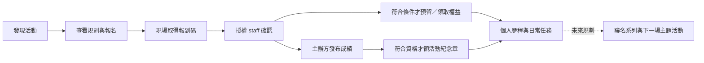

# NeonShift｜評審快速入口 / Reviewer guide

更新：2026-09-17。**準備中：APK、影片與測試活動尚未在本文件登錄可用版本。** 這是可隨提交版本補齊的入口，不代表現在已可完成所有操作。

## Start here (English)

NeonShift connects daily movement, Solana devnet clock-ins, conservation-inspired shoe progression, and event participation. Start with the three-minute product video, then install the matching Android APK. The six-minute event walkthrough explains registration, staff check-in, benefits and organizer-sourced results.

**Current scope:** event App/API code exists, but a complete device-tested event flow is still pending. Staff currently enters a code; NFC opens an event and is not proof of attendance. Shoe finishes are deterministic cosmetic App appearances, not randomized NFT traits. tSKR is a valueless devnet test token, not official SKR. No real partner event or donation is claimed.

If your device has no qualifying Health Connect records, use the public previews and event browsing path; do not expect fabricated health data to unlock a real claim. Published fixtures, test funding instructions and support hours will be listed below before submission. No seed phrase or private key is required by the team.

## 1. 交付連結

此表以 [提交追蹤第 9 節](clock-in-submission.md#9-最終交付登錄)為發版依據；發版人須同步兩處且用未登入瀏覽器測試。

| 項目 | 入口／狀態 |
|---|---|
| 提交 APK／版本／SHA-256 | 待發布、待驗收 |
| GitHub Release／Commit | 待登錄 |
| 主片 3:00 | 待錄製；[腳本](demo-video.md) |
| 活動詳解 6:00 | 待錄製；[活動手冊](event-demo-playbook.md) |
| 參賽 Pitch PDF | 待整理；現有 [26 頁募資工作稿](../../output/fundraising/NeonShift_募資簡報_中文草稿_v2.pptx)是參考材料，不等同精簡參賽版 |
| 測試活動 slug／有效日期／timezone | 待建立或核實；不能將範例 slug 當現存活動 |
| Demo API／Program ID／Explorer 證據 | 待依提交 APK 登錄 |
| Devnet SOL／必要測試資源取得方式 | 待提供評審可重現的方法；不依賴不穩定 faucet 的唯一入口 |
| 活動 staff 協助／可用時段／聯絡方式 | 待指派；不得公開管理憑證 |

## 2. 三種閱讀與體驗深度

| 可投入時間 | 建議路徑 | 能確認什麼 |
|---|---|---|
| 3 分鐘 | 看主片 | 手機體驗、一筆鏈上交易、保育鞋款與活動參與方向 |
| 5 分鐘 | 下方快速試用 | App 可啟動、鞋款內容、活動詳情與限制；不是保證能完成一天健康任務 |
| 10–15 分鐘 | 活動詳解＋手冊＋實機 | 雙角色報到、權益狀態、成績來源、鏈上／鏈下界線 |

### 五分鐘快速試用（時間為估計）

1. **0:00–1:00**：安裝提交 APK 並冷啟動。需 Android 14+；錢包交易另需相容 MWA 錢包與 Devnet SOL。首次安裝／錢包設定可能更久。
2. **1:00–2:00**：從歡迎頁 Demo 入口查看鞋款圖鑑與保育故事。這是系列展示，不表示已取得鞋款或 NFT。
3. **2:00–3:00**：若要操作個人資料，連自己的測試錢包並完成 App 所需登入；沒有錢包可先看公開內容。拒絕簽章不應顯示成功。
4. **3:00–4:00**：Arena → 合作活動 → 已登錄的測試活動，查看時區、名額、規則、權益與來源。需發布有效 fixture 才能測試。
5. **4:00–5:00**：有有效 session 時可報名並開啟報到碼；沒有 staff 協助就停在「待報到」，不可宣稱自行完成現場驗證。後續用六分鐘片與手冊查驗。

### 想驗證真正鏈上操作

- 每日打卡需合格 Health Connect 紀錄與尚未領取的任務日；GPS 運動紀錄、手動補登與預覽圖不自動等同合格資料。
- 沒有健康資料時，可在已具資格的測試情境查看 NFT 領取，**但新錢包不保證有資格**；準備團隊帳號的錄影證據不能冒充評審自己的資產。
- 使用指南登錄的 Explorer 連結比對錢包、cluster、成功狀態與 App 結果。不需交出私鑰或助記詞。

## 3. 一分鐘理解活動路線

報名／報到／庫存／主辦方成績屬後端紀錄；健康打卡與符合資格的 NFT 領取才是相應鏈上操作。成績來自主辦方，NFT 不使實際跑步過程自動變成鏈上可驗證。詳見 [活動流程與例外](event-demo-playbook.md)。

## 4. 已實作與未完成的界線

| 範圍 | 現況 |
|---|---|
| 保育鞋面、固定細節款、物種介紹 | App 已實作，實機美術待驗收；不承諾保育捐款 |
| 活動列表、報名、代碼報到、權益、成績 | App／API 有實作，PG-E-10 端到端驗收待完成 |
| 活動章 | PG-M-04 有實作；依主辦方章別、報名 Lv.2 快照與實際資格，registry／實機流程待驗收 |
| 主辦方網頁管理後台、staff 相機掃碼 | 未完成；目前分別使用 API 與輸入代碼 |
| NFC／release App Links | 有接線；需正式指紋與實機驗證；可從 App 內活動入口操作 |
| 自動活動回訪、主題任務綁權益、聯名系列、款式 NFT | 後續規劃，未宣稱已可用 |

## 5. 遇到問題與查證

- 活動已結束、額滿或無站點：記錄活動 slug／畫面，查看 fixture 是否仍有效；不要改手機時鐘或授予自己 staff。
- 報到碼過期：重新取得；NFC 不支援時走 App 內站點入口。staff 相機掃碼不是本版可用功能。
- 預留過期、沒庫存：依 App 顯示重新查詢，不把原領取碼視為永久權益。
- NFT 顯示 registry 待同步：由團隊依操作手冊處理；不能略過資格或用 UI 假成功。
- 回報附 APK 版本、裝置／OS、功能入口、時間與 request ID（若有）；不要傳 access token、私鑰或原始健康資料。

可查文件：[架構與建置](../../README.md)、[開發進度](../pg.md)、[活動展示手冊](event-demo-playbook.md)、[保育與系列設計](../design/wild-guardian-shoes.md)。
