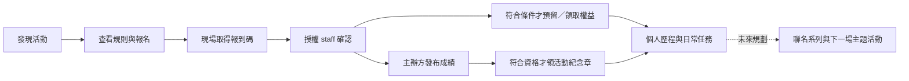

# NeonShift｜評審快速入口 / Reviewer guide

更新：2026-09-22。**準備中：APK、影片與測試活動尚未在本文件登錄可用版本。** 這是可隨提交版本補齊的入口，不代表現在已可完成所有操作。

## Start here (English)

NeonShift connects daily movement, Solana devnet clock-ins, conservation-inspired shoe progression, and event participation. Start with the English product video (target: 2 minutes 50 seconds; maximum: 3 minutes), then install the matching Android APK. The written event walkthrough explains registration, staff check-in, benefits and organizer-sourced results.

**Current scope:** event App/API code exists, but a complete device-tested event flow is still pending. Staff currently enters a code; NFC opens an event and is not proof of attendance. Shoe finishes are deterministic cosmetic App appearances, not randomized NFT traits. tSKR is a valueless devnet test token, not official SKR. No real partner event or donation is claimed.

If your device has no qualifying Health Connect records, use the public previews and event browsing path; do not expect fabricated health data to unlock a real claim. Published fixtures, test funding instructions and support hours will be listed below before submission. No seed phrase or private key is required by the team.

## 1. 交付連結

此表以 [提交追蹤第 9 節](clock-in-submission.md#9-最終交付登錄)為發版依據；發版人須同步兩處且用未登入瀏覽器測試。

| 項目 | 入口／狀態 |
|---|---|
| 提交 APK／版本／SHA-256 | 待發布、待驗收 |
| GitHub Release／Commit | 待登錄 |
| 英文主片 2:50，最多 3:00 | 待錄製／配音；[六段腳本](demo-video.md)／[英文旁白](demo-voiceover-en.txt)／[AI 配音建議](demo-ai-voice-guide.md) |
| 活動文字詳解 | [活動手冊](event-demo-playbook.md)；不再要求六分鐘補充影片 |
| 參賽 Pitch PDF | [6 頁英文 PDF](../../output/hackathon-flexclip-en/NeonShift_Hackathon_EN.pdf)／[可編輯 PPTX](../../output/hackathon-flexclip-en/NeonShift_Hackathon_EN.pptx) 已產出；含早期截圖與流程示意，最終實機素材待補。這是 Repo 相對連結，公開提交 URL 尚待登錄 |
| 測試活動 slug／有效日期／timezone | 待建立或核實；不能將範例 slug 當現存活動 |
| Demo API／Program ID／Explorer 證據 | 待依提交 APK 登錄 |
| Devnet SOL／必要測試資源取得方式 | 待提供評審可重現的方法；不依賴不穩定 faucet 的唯一入口 |
| 活動 staff 協助／可用時段／聯絡方式 | 待指派；不得公開管理憑證 |

## 2. 三種閱讀與體驗深度

| 可投入時間 | 建議路徑 | 能確認什麼 |
|---|---|---|
| 3 分鐘 | 看主片 | 手機體驗、一筆鏈上交易、保育鞋款與活動參與方向 |
| 5 分鐘 | 下方快速試用 | App 可啟動、鞋款內容、活動詳情與限制；不是保證能完成一天健康任務 |
| 10–15 分鐘 | 活動詳解＋手冊＋實機 | 雙角色報到、權益狀態、成績來源、鏈上／鏈下界線 |

### 五分鐘快速試用（時間為估計）

1. **0:00–1:00**：安裝提交 APK 並冷啟動。需 Android 14+；錢包交易另需相容 MWA 錢包與 Devnet SOL。首次安裝／錢包設定可能更久。
2. **1:00–2:00**：從歡迎頁 Demo 入口查看鞋款圖鑑與保育故事。這是系列展示，不表示已取得鞋款或 NFT。
3. **2:00–3:00**：若要操作個人資料，連自己的測試錢包並完成 App 所需登入；沒有錢包可先看公開內容。拒絕簽章不應顯示成功。
   - 錢包相容性以本次 APK、Seeker 與錢包版本的實測清單為準。2026-09-21 曾觀察 Phantom 26.6 在 Seeker 簽訊息後未回覆；不推論所有版本皆有此問題，也不將尚未測試的錢包列為通過。新版有等待階段、逾時與晚到回覆處理，需補實機驗收；若交易結果未知，先查結果再重試。
4. **3:00–4:00**：Arena → 合作活動 → 已登錄的測試活動，查看時區、名額、規則、權益與來源。需發布有效 fixture 才能測試。
5. **4:00–5:00**：有有效 session 時可報名並開啟報到碼；沒有 staff 協助就停在「待報到」，不可宣稱自行完成現場驗證。後續用活動手冊查驗。

### 想驗證真正鏈上操作

- 每日步數任務需合格 Health Connect 紀錄；GPS 運動任務需單次至少 1 km、移動 10 分鐘、已同步且審核通過，並且該任務日尚未領取。手動補登與預覽不構成資格。
- 沒有健康資料時，可在已具資格的測試情境查看 NFT 領取，**但新錢包不保證有資格**；準備團隊帳號的錄影證據不能冒充評審自己的資產。
- 使用指南登錄的 Explorer 連結比對錢包、cluster、成功狀態與 App 結果。不需交出私鑰或助記詞。

## 3. 一分鐘理解活動路線

報名／報到／庫存／主辦方成績屬後端紀錄；健康打卡與符合資格的 NFT 領取才是相應鏈上操作。成績來自主辦方，NFT 不使實際跑步過程自動變成鏈上可驗證。詳見 [活動流程與例外](event-demo-playbook.md)。

## 4. 已實作與未完成的界線

| 範圍 | 現況 |
|---|---|
| 保育鞋面、固定細節款、物種介紹 | App 已實作，實機美術待驗收；不承諾保育捐款 |
| 活動列表、報名、代碼報到、權益、成績 | App／API 有實作，PG-E-10 端到端驗收待完成 |
| 活動章 | PG-M-04 有實作；依主辦方章別、報名 Lv.2 快照與實際資格，registry／實機流程待驗收 |
| 主辦方網頁管理後台、staff 相機掃碼 | 未完成；目前分別使用 API 與輸入代碼 |
| NFC／release App Links | 有接線；需正式指紋與實機驗證；可從 App 內活動入口操作 |
| 自動活動回訪、主題任務綁權益、聯名系列、款式 NFT | 後續規劃，未宣稱已可用 |

## 5. 遇到問題與查證

- 活動已結束、額滿或無站點：記錄活動 slug／畫面，查看 fixture 是否仍有效；不要改手機時鐘或授予自己 staff。
- 報到碼過期：重新取得；NFC 不支援時走 App 內站點入口。staff 相機掃碼不是本版可用功能。
- 預留過期、沒庫存：依 App 顯示重新查詢，不把原領取碼視為永久權益。
- NFT 顯示 registry 待同步：由團隊依操作手冊處理；不能略過資格或用 UI 假成功。
- 回報附 APK 版本、裝置／OS、功能入口、時間與 request ID（若有）；不要傳 access token、私鑰或原始健康資料。

可查文件：[架構與建置](../../README.md)、[開發進度](../pg.md)、[活動展示手冊](event-demo-playbook.md)、[保育與系列設計](../design/wild-guardian-shoes.md)。

## 2026-09-19：跑鞋連動、同步與 Activity

三項功能已有程式：跑鞋／可關閉背景、有序自動同步、Activity 日誌；提交版本的完整實機驗收仍待完成。參賽簡報第 2、4 頁以 DESIGN PREVIEW 呈現。

完整需求、畫面、資料契約及驗收以 [整合設計](../shoe-sync-activity.md) 為準。

## 2026-09-22 提交版新增驗收重點

- [九頁英文評審 PPTX](../../output/hackathon-flexclip-en/NeonShift_Hackathon_EN_Judges.pptx)＝原六頁＋三頁 NFT 附錄；[NFT 圖樣與流程](../../output/achievement-nft/README.md)是設計／流程示意，不是真實 mint 證據。影片仍需控制三分鐘。
- Home 挑戰路線顯示每日任務、確認後 XP、下一雙鞋的剩餘 XP；里程成就與每日任務分開。
- Workouts：PB 基準是比較起點，NFT 資格依達成當時現役鞋階。每週回顧改為次數／天數／距離／時間四欄可換行；本版窄螢幕與放大字體需補拍，不能沿用破框截圖。
- 鞋款預覽支援側面 SVG 手動旋轉、放大、重設，並非完整 3D。任務／NFT／升鞋有不同動畫，Reduce Motion 與跳過需驗收。
- 錢包顯示連接／登入階段與不完整登入提示；目前另有 mwaGuard 逾時與晚到結果處理程式，但未據此宣稱所有錢包均已實測通過。上述 Phantom 記錄僅代表指定版本當次測試，不作所有版本的結論。
- 保存後路線外觀固定，改鞋或偏好只影響新運動。自動同步預設關閉，打開後依舊到新處理，不代表自動核准交易。
- SKR 收藏外觀付款（Genesis Mint 邊框）：Gear 里程碑區與 Gallery 本人頁的邊框卡。資格＝已核准的「首次 5 km」成就；未達標顯示 LOCKED，不可用 DEMO 或本機 GPS 解鎖。購買前確認框列出金額（2.5 SKR）、網路、收款人；簽署走 MWA `solana:mainnet` 獨立授權（與 devnet 任務／NFT 分開）；送出後只查詢確認、不重送；關 App 重開會恢復待確認訂單。目前部署為 **devnet 測試 mint**（`TEST SKR`，無價值），官方 SKR 主網小額測試待負責人核准——在此之前不可視為官方 SKR 整合證據；tSKR／.skr 名稱與本功能無關。依 [參賽開發計畫](competition-development-plan.md) 的 Go／No-go 更新最終文案。
- 可重建：`scripts/release/clean-build.sh` 從 Git HEAD 乾淨 clone 重建 release APK，紀錄於 `docs/evidence/<日期>-clean-build.md`；第三方授權見 [neonshift.cc/licenses](https://neonshift.cc/licenses/)（App Profile 亦有入口）。
